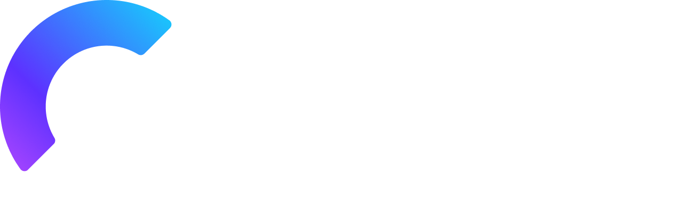

The resources that power <a href="https://devresourc.es/?ref=github-readme" target="_blank" rel="noopener">Dev Resources</a>

 <a>

</a>

 
Sponsored by
 

<a href="https://clerk.com?utm_source=public_apis&utm_content=dev_resources_repo"><picture><source media="(prefers-color-scheme: dark)" srcset="./assets/clerk-dark-mode.png" width="180px"><source media="(prefers-color-scheme: light)" srcset="./assets/clerk-light-mode.png" width="180px"></picture></a>
 

 ---
>❗️ This `README.md` file and the `/db` folder are auto-generated, so please ***do not*** edit them. Changes related to resources should happen within the `/resources` folder.
---

 To add a resource, check the [contributing guide](CONTRIBUTING.md).

Looking for public APIs? Visit [github.com/public-apis-dev/public-apis](https://github.com/public-apis-dev/public-apis).

 ### Total resources: 768

 ## Index
<li><a href="#accessibility">Accessibility</a></li><li><a href="#ai">AI</a></li><li><a href="#analytics">Analytics</a></li><li><a href="#animation">Animation</a></li><li><a href="#api-building">API Building</a></li><li><a href="#audio">Audio</a></li><li><a href="#authentication">Authentication</a></li><li><a href="#blog">Blog</a></li><li><a href="#book">Book</a></li><li><a href="#browser">Browser</a></li><li><a href="#cdn">CDN</a></li><li><a href="#cheatsheet">Cheatsheet</a></li><li><a href="#cloud-computing">Cloud Computing</a></li><li><a href="#code-challenge">Code Challenge</a></li><li><a href="#code-generator">Code Generator</a></li><li><a href="#code-snippet">Code Snippet</a></li><li><a href="#color">Color</a></li><li><a href="#database">Database</a></li><li><a href="#design">Design</a></li><li><a href="#documentation">Documentation</a></li><li><a href="#domain">Domain</a></li><li><a href="#editor">Editor</a></li><li><a href="#email">Email</a></li><li><a href="#extension">Extension</a></li><li><a href="#font">Font</a></li><li><a href="#forum">Forum</a></li><li><a href="#freelance">Freelance</a></li><li><a href="#hacktoberfest">Hacktoberfest</a></li><li><a href="#hosting">Hosting</a></li><li><a href="#icon">Icon</a></li><li><a href="#illustration">Illustration</a></li><li><a href="#image">Image</a></li><li><a href="#indie">Indie</a></li><li><a href="#inspiration">Inspiration</a></li><li><a href="#interview">Interview</a></li><li><a href="#job">Job</a></li><li><a href="#learn">Learn</a></li><li><a href="#legal">Legal</a></li><li><a href="#library">Library</a></li><li><a href="#logging">Logging</a></li><li><a href="#logo">Logo</a></li><li><a href="#marketing">Marketing</a></li><li><a href="#newsletter">Newsletter</a></li><li><a href="#open-source">Open Source</a></li><li><a href="#performance">Performance</a></li><li><a href="#personal-website">Personal Website</a></li><li><a href="#podcast">Podcast</a></li><li><a href="#productivity">Productivity</a></li><li><a href="#programming">Programming</a></li><li><a href="#prototyping">Prototyping</a></li><li><a href="#remote">Remote</a></li><li><a href="#resume">Resume</a></li><li><a href="#scraping">Scraping</a></li><li><a href="#screenshot">Screenshot</a></li><li><a href="#security">Security</a></li><li><a href="#seo">SEO</a></li><li><a href="#serverless">Serverless</a></li><li><a href="#startup">Startup</a></li><li><a href="#storage">Storage</a></li><li><a href="#template">Template</a></li><li><a href="#terminal">Terminal</a></li><li><a href="#testing">Testing</a></li><li><a href="#tooling">Tooling</a></li><li><a href="#twitter">Twitter</a></li><li><a href="#typing">Typing</a></li><li><a href="#ui">UI</a></li><li><a href="#ux">UX</a></li><li><a href="#video">Video</a></li><li><a href="#web3">Web3</a></li><li><a href="#website-builder">Website Builder</a></li><li><a href="#writing">Writing</a></li><li><a href="#youtube-channel">YouTube Channel</a></li> 

### <a name="accessibility">Accessibility</a>
| &nbsp;&nbsp;&nbsp;&nbsp; | Name | Description | Keywords |
|---|---|---|---|
  | [18F Accessibility Guide](https://accessibility.18f.gov/checklist/) | A simple checklist for determining if your site is accessible. |  |
  | [A11y Coffee](https://a11y.coffee) | The introduction on web accessibility for every single web developer. | Accessibility, a11y |
  | [A11Y Style Guide](https://a11y-style-guide.com/style-guide/) | Style guide and pattern library promoting accessible components and WCAG compliance criteria. |  |
  | [A11ygator](https://a11ygator.chialab.io/) | An application, a Twitter bot and a browser extension that bites websites to taste their accessibility. |  |
  | [A11yWeekly](https://a11yweekly.com/) | A weekly dose of web accessibility to help you bring it into your every day work. |  |
  | [Accessibility Engineer](https://a11yengineer.com/) | Accessibility Engineer · Web Checklist · Native App Checklist. Accessibility Acceptance Criteria. Web Accessibility Checklist · Native Accessibility Checklist. |  |
  | [Accessibility Resources](https://a11yresources.webflow.io/) | A growing list of accessibility tools and resources. |  |
  | [accessibilityjs](https://github.com/github/accessibilityjs) | Client side accessibility error scanner. Contribute to github/accessibilityjs development by creating an account on GitHub. |  |
  | [Accessible Color Generator](https://learnui.design/tools/accessible-color-generator.html) | A tool for creating color variations on a base color to meet WCAG AA or AAA color contrast ratio guidelines. |  |
  | [AChecker](https://achecker.ca/checker/index.php) | AChecker is a Web accessibility evalution tool designed to help Web content developers and Web application developers ensure their Web content is accessible to everyone regardless to the technology th... | achecker, free, open source, accessibility checker, accessibility reviewer, accessibility evaluator,... |
  | [ally.js](https://allyjs.io/) | JavaScript library to help modern web applications with accessibility concerns by making accessibility simpler. |  |
  | [Awesome a11y](https://github.com/brunopulis/awesome-a11y) | :wheelchair: A curate list about A11Y. Contribute to brunopulis/awesome-a11y development by creating an account on GitHub. |  |
  | [Checka11y.css](https://github.com/jackdomleo7/Checka11y.css) | A CSS stylesheet to quickly highlight a11y concerns. - jackdomleo7/Checka11y.css. |  |
 &nbsp; | [Color Contrast Checker](https://zarhasan.github.io/color-contrast-checker/) | Make sure your website has accessible colors. |  |
  | [Color.review](https://color.review/) | A modern tool for exploring and finding accessible colors. Make sure that everyone can see your creations. |  |
 &nbsp; | [Contrast Ratio](https://contrast-ratio.com/) | Easily calculate color contrast ratios. |  |
  | [HTML5 Accessibility](https://www.html5accessibility.com/) | Get the current accessibility support status of HTML5 features across major browsers |  |
  | [Inclusive Components](https://inclusive-components.design/) | A blog trying to be a pattern library. All about designing inclusive web interfaces, piece by piece. |  |
  | [Tenon](https://tenon.io/) | Accessibility as a Service. | accessibility, a11y, testing |
  | [Testing Accessibility](https://testingaccessibility.com/) | A self-paced workshop designed to teach you the principles and effective patterns of accessibility, from design to deployment. |  |
  | [The A11Y Project](https://www.a11yproject.com/) | The A11Y Project is a community-driven effort to make digital accessibility easier. |  |
  | [WAVE](https://wave.webaim.org/) | WAVE is a suite of evaluation tools that helps authors make their web content more accessible to individuals with disabilities. WAVE can identify many accessibility and Web Content Accessibility Guide... |  |

**[⬆ Back to Index](#index)**

### <a name="ai">AI</a>
| &nbsp;&nbsp;&nbsp;&nbsp; | Name | Description | Keywords |
|---|---|---|---|
  | [AI Jobs](https://aijobs.app) | Find all AI (Artificial Intelligence) jobs in one place. | ai, artificial intelligence, remote, jobs, developer |
  | [Brandie](https://brandie.app) | An AI-powered branding assistant. | branding, domain, product name, ai, artificial intelligence |
  | [CopyAI](https://www.copy.ai/) | We have created the world's most advanced artificial intelligence copywriter that enables you to create marketing copy in seconds! |  |
  | [Greip](https://greip.io/) | One of the must trusted Fraud Prevention services, which allows you to deploy AI-Powered modules to prevent fraud and abuse. | ai, fraud prevention, api, geoip, profanity detection |
  | [Lexica](https://lexica.art/) | The Stable Diffusion search engine. |  |
  | [PoweredbyAI](https://poweredbyai.app) | A directory with 100+ AI tools to help you with your daily tasks | ai, ai tools, copywriting, image generator |

**[⬆ Back to Index](#index)**

### <a name="analytics">Analytics</a>
| &nbsp;&nbsp;&nbsp;&nbsp; | Name | Description | Keywords |
|---|---|---|---|
  | [beampipe](https://beampipe.io/) | Beampipe is a simple, privacy-focussed alternative to Google Analytics with a free tier for small sites. |  |
  | [Fathom](https://usefathom.com/) | Fathom Analytics is simple, GDPR + CCPA + PECR compliant website analytics tool, no cookie notice required. No tracking or storing personal data of your users. |  |
  | [GoatCounter](https://www.goatcounter.com/) | GoatCounter is an open source web analytics platform available as a hosted service (free for non-commercial use) or self-hosted app. |  |
  | [Kindmetrics](https://kindmetrics.io/) | Kindmetrics is a strictly privacy-focused website analytics tool to help you find referrers and measure good content quickly. A more excellent way to dig into your visitors without the visitors giving... |  |
  | [Matomo](https://matomo.org/) | Matomo's the Google Analytics alternative that protects your data and your customer's privacy. A powerful web analytics platform with 100% data ownership. |  |
  | [Metrical](https://metrical.xyz/) | Metrical is web analytics tool that is easy to use, privacy oriented and where you don't have to have a marketing degree to know how to use it. |  |
  | [Offen](https://www.offen.dev/) | Offen is an open alternative to common web analytics tools. Gain insights while your users have full access to their data. Lightweight, self hosted and free. |  |
  | [Plausible](https://plausible.io/) | Plausible is a lightweight and open-source web analytics tool. Your website data is 100% yours and the privacy of your visitors is respected. |  |
  | [Simple Analytics](https://simpleanalytics.com/) | Simple Analytics gives you the analytics you need without invading the privacy of your users, with a clean interface, and simple integration. GDPR, CCPA and, PECR compliant because we don't handle PII... |  |
  | [Splitbee](https://splitbee.io) | Splitbee provides Analytics, Automation, User Funnel and A/B Testing. |  |
  | [Swetrix](https://swetrix.com) | Swetrix is a privacy-focused, fully cookieless and opensource web analytics service with a free tier for small websites. | analytics, marketing, web analytics, privacy, opensource |

**[⬆ Back to Index](#index)**

### <a name="animation">Animation</a>
| &nbsp;&nbsp;&nbsp;&nbsp; | Name | Description | Keywords |
|---|---|---|---|
  | [Animista](https://animista.net/) | Animista is a place where you can play with a collection of ready to use CSS animations, tweak them and download only those you will actually use. |  |

**[⬆ Back to Index](#index)**

### <a name="api-building">API Building</a>
| &nbsp;&nbsp;&nbsp;&nbsp; | Name | Description | Keywords |
|---|---|---|---|
  | [Apigee](https://cloud.google.com/apigee) | Apigee, part of Google Cloud, helps leading companies design, secure, and scale application programming interfaces (APIs). Try Apigee Edge for free. |  |
  | [Appwrite](https://appwrite.io/) | Appwrite provides web and mobile developers with a set of easy-to-use and integrate REST APIs to manage their core backend needs. |  |
  | [Encore](https://encore.dev) | The end-to-end backend development platform that automatically provisions all your cloud infrastructure, based on your business logic. | serverless, cloud, development, framework, backend |
  | [Hoppscotch](https://hoppscotch.io/) | Helps you create requests faster, saving precious time on development. | hoppscotch, hopp scotch, hoppscotch online, hoppscotch app, postwoman, postwoman chrome, postwoman o... |
  | [Insomnia](https://insomnia.rest/) | Design & Debug APIs like a human, not a robot. |  |
  | [Nitric](https://nitric.io) | A fun and productive framework for building serverless apps | serverless, cloud, development, framework |
  | [Paw](https://paw.cloud/) | Paw is a full-featured HTTP client that lets you test and describe the APIs you build or consume. It has a beautiful native macOS interface to compose requests, inspect server responses, generate clie... |  |
  | [Postman](https://www.postman.com/) | Postman makes API development easy. Our platform offers the tools to simplify each step of the API building process and streamlines collaboration so you can create better APIs faster. |  |
  | [RapidAPI](https://rapidapi.com/) | Use RapidAPI to Find, Connect, & Share 1000s of APIs using our Multi-cloud platform. Improve Developer Experience with API Design, Testing, Monitoring, & More! |  |
  | [Retool](https://retool.com/) | Retool is the fast way to build internal tools. Drag-and-drop our building blocks and connect them to your databases and APIs to build your own tools, instantly. Connects with Postgres, REST APIs, Gra... |  |
  | [Serverless Stack](https://serverless-stack.com/) | Serverless Stack (SST) is a framework that makes it easy to build serverless applications. |  |
  | [Swagger](https://swagger.io/) | Simplify API development for users, teams, and enterprises with our open source and professional toolset. Find out how Swagger can help you and get started today. |  |

**[⬆ Back to Index](#index)**

### <a name="audio">Audio</a>
| &nbsp;&nbsp;&nbsp;&nbsp; | Name | Description | Keywords |
|---|---|---|---|
  | [Icons8](https://icons8.com) | Download design elements for free: icons, photos, vector illustrations, and music for your videos. |  |
  | [Soundstripe](https://www.soundstripe.com/) | Every creator's one-stop shop for the best royalty free music, SFX, and stock video. Purchase a license for one file, or subscribe for unlimited access. |  |

**[⬆ Back to Index](#index)**

### <a name="authentication">Authentication</a>
| &nbsp;&nbsp;&nbsp;&nbsp; | Name | Description | Keywords |
|---|---|---|---|
  | [Clerk](https://clerk.com) | Drop-in React components for authentication and authorization. | react, next.js, auth,  user management, react auth, next.js auth, javascript auth |
  | [Firebase](https://firebase.google.com/) | Firebase is Google’s mobile platform that helps you quickly develop high-quality apps and grow your business. |  |
  | [Magic](https://magic.link) | Bring your Web3 strategy to life with Magic. Passwordless Auth + NFT wallet onboarding (without seed phrase) for your customers. | auth, authentication, passwordless |
  | [Warrant](https://warrant.dev/) | Hosted enterprise-grade authorization and access control service for your apps. | auth, authorization, authz, access control |

**[⬆ Back to Index](#index)**

### <a name="blog">Blog</a>
| &nbsp;&nbsp;&nbsp;&nbsp; | Name | Description | Keywords |
|---|---|---|---|
  | [Codeconia](https://codeconia.com/) | Learn programming with Codeconia. |  |
  | [CSS-Tricks](https://css-tricks.com) | CSS-Tricks is a website about websites. |  |
  | [daily.dev](https://daily.dev/) | Daily.dev is the easiest way to stay updated on the latest programming news. Get the hottest dev news from the best tech blogs on any topic you can think of. Stay updated daily, and unlock more time t... |  |
  | [DEV](https://dev.to/) | A constructive and inclusive social network for software developers. With you every step of your journey. | software development, engineering, rails, javascript, ruby |
  | [Hacker Noon](https://hackernoon.com/) | How hackers start their afternoons. | blockchain, bitcoin, tech, crypto, software-development, react, vue |
  | [Hashnode](https://hashnode.com/) | Hashnode is a free content creation platform and community that allows you to publish articles on your own domain and helps you stay connected with a growing developer community. |  |
  | [Medium](http://medium.com/) | Medium is an open platform where readers find dynamic thinking, and where expert and undiscovered voices can share their writing on any topic. |  |
  | [Smashing Magazine](https://www.smashingmagazine.com/) | Smashing Magazine is a website and eBook publisher that offers editorial content and professional resources for web developers and web designers. |  |
  | [Tech Blogs](https://tech-blogs.dev/) | This is a list of Awesome Tech Blogs. Add yourself. |  |
  | [TechCrunch](https://techcrunch.com/) | TechCrunch - Reporting on the business of technology, startups, venture capital funding, and Silicon Valley. |  |
  | [wweb.dev](https://wweb.dev/) | Stay up to date with weekly updates, get resources for your next projects abd read articles and tutorials about web development. |  |
  | [XDA-Developers](https://www.xda-developers.com/) | XDA Developers is a mobile software development community launched on 20 December 2002. Although discussion primarily revolves around Android, members also talk about many other operating systems and ... |  |

**[⬆ Back to Index](#index)**

### <a name="book">Book</a>
| &nbsp;&nbsp;&nbsp;&nbsp; | Name | Description | Keywords |
|---|---|---|---|
  | [Beginner's guide to web security](https://gokul.site/book/) | A 100+ page ebook that talks about the basics of web security, various types of web security attacks and how to avoid/fix them. |  |
  | [Eloquent JavaScript](https://eloquentjavascript.net/) | This is a book about JavaScript, programming, and the wonders of the digital. |  |
 &nbsp; | [JavaScript for impatient programmers](https://exploringjs.com/impatient-js/toc.html) | This book makes JavaScript less challenging to learn for newcomers, by offering a modern view that is as consistent as possible. |  |
  | [JSbooks](https://jsbooks.revolunet.com/) | Directory of free JavaScript ebooks. Contribute to revolunet/JSbooks development by creating an account on GitHub. |  |
  | [Landing Page Hot Tips](https://gumroad.com/a/124908659) | The Landing Page Hot Tips Ebook features 100 digestible lessons to implement into your Landing Pages. Each tip features a few paragraphs, visual references and related resources. Additional features i... |  |
  | [MAKE: Bootstrapper's Handbook](https://makebook.io/) | Learn to bootstrap profitable startups the indie way — $14.99. |  |
 &nbsp; | [The Ultimate Guide to React Native Optimization](https://www.callstack.com/campaigns/download-the-ultimate-guide-to-react-native-optimization) | This Guide is comprehensive source of knowledge on the best tools, tips, and tactics for optimizing your React Native app. | react-native, optimization, callstack, guide |
  | [Zero To Sold](https://thebootstrappedfounder.com/zero-to-sold/) | Zero to Sold is an actionable guide through all stages of a bootstrapped business: Preparation, Survival, Stability, and Growth. Sold on Amazon and Gumroad. |  |

**[⬆ Back to Index](#index)**

### <a name="browser">Browser</a>
| &nbsp;&nbsp;&nbsp;&nbsp; | Name | Description | Keywords |
|---|---|---|---|
  | [Angular DevTools](https://angular.io/guide/devtools) | Angular DevTools extends Chrome DevTools adding Angular specific debugging and profiling capabilities. You can use Angular DevTools to understand the structure of your application and preview the stat... | dev tools, angular, profiler, profiling |
  | [Blisk](https://blisk.io/) | Download Blisk - a browser for web developers. Blisk - is a developer oriented browser with devices, URL and scroll sync, auto-refresh, screenshots and screen recorder. | Blisk, browser, download, developer, actions synchronization, sync, devices, analytics, screenshots,... |
  | [Brave](https://brave.com/) | The Brave browser is a fast, private and secure web browser for PC, Mac and mobile. Download now to enjoy a faster ad-free browsing experience that saves data and battery life by blocking tracking sof... |  |
  | [Browserling](https://www.browserling.com/) | Try for free now! Cross browser test your website immediately in all web browsers - Internet Explorer, Edge, Chrome, Safari, Firefox, and Opera. |  |
  | [BrowserStack](https://www.browserstack.com/) | Instant access to 2000+ browsers and real iOS and Android devices for cross browser testing. Ship apps and websites that work for everyone, every time. Get Free Trial. |  |
  | [Check My Links](https://chrome.google.com/webstore/detail/check-my-links/ojkcdipcgfaekbeaelaapakgnjflfglf?hl=en) | Check My Links is a link checker that crawls through your webpage and looks for broken links. |  |
  | [Chrome](https://www.google.com/chrome/) | Get more done with the new Google Chrome. A more simple, secure, and faster web browser than ever, with Google’s smarts built-in. Download now. |  |
  | [Chrome Canary](https://www.google.com/chrome/canary/) | Get on the bleeding edge of the web with Chrome Canary designed for experienced developers and updated nightly. |  |
  | [Chrome Dev](https://www.google.com/chrome/dev/) | Google Chrome for developers was built for the open web. Test cutting-edge web platform APIs and developer tools that are updated weekly. |  |
  | [CSS Scan](https://getcssscan.com/) | Goodbye to "Inspect Element" — Visualize the CSS of any element you hover over, instantly, and copy its entire rules with a single click. |  |
  | [CSSViewer](https://chrome.google.com/webstore/detail/cssviewer/ggfgijbpiheegefliciemofobhmofgce) | A simple CSS property viewer. |  |
  | [Edge](https://www.microsoft.com/en-us/edge) | See what's new on the latest version of the Microsoft Edge browser. Explore features, rewards, and more before you download the new browser today. | internet browser, web browser, microsoft edge, download microsoft edge, new browser, new microsoft e... |
  | [Edge Canary](https://www.microsoftedgeinsider.com/en-us/welcome?channel=canary) | Want to see what we were working on yesterday? Canary will be released automatically almost every night to keep you up to date on our progress. |  |
  | [Edge Dev](https://www.microsoftedgeinsider.com/en-us/welcome?channel=dev) | Our dev builds are the best representation of our improvements in the past week. They have been tested by the Microsoft Edge team, and are generally more stable than Canary. |  |
  | [Firefox](https://www.mozilla.org/en-US/firefox/new/) | Faster page loading, less memory usage and packed with features, the new Firefox is here. |  |
  | [Firefox Developer](https://www.mozilla.org/en-US/firefox/developer/) | Firefox Developer Edition is the blazing fast browser that offers cutting edge developer tools and latest features like CSS Grid support and framework debugging. |  |
  | [Firefox Nightly](https://www.mozilla.org/en-US/firefox/69.0a1/releasenotes/) | Get a sneak peek at our next generation web browser, and help us make it the best browser it can be |  |
  | [Hackertab.dev](https://hackertab.dev/) | Get all your developer news in one place with Hackertab! Customize your feed and stay up-to-date on the latest tools, events, and more. Perfect for frontend, backend, full-stack, mobile, and data scie... |  |
  | [LambdaTest](https://www.lambdatest.com/) | Perform manual or automated cross browser testing on 2000+ browsers online. Deploy and scale faster with the most powerful cross browser testing tool online. | cross browser testing free, cross browser testing, cross browser testing tools, crossbrowser testing... |
  | [Mighty](https://www.mightyapp.com/) | Mighty is a new browser for work that loads pages faster, saves you time, and makes you more productive. | browser, productivity, fast |
  | [Octotree](https://www.octotree.io/) | GitHub on steroids. |  |
  | [Opera](https://www.opera.com/) | Get a faster, better browser. Opera's free VPN, Ad Blocker, integrated messengers and private mode help you browse securely and smoothly. Share files instantly between your desktop and mobile browsers... |  |
  | [Polypane](https://polypane.app/) | A browser for web developers and designers with all the tools you need to build responsive, accessible and fast sites five times faster. |  |
  | [React DevTools](https://chrome.google.com/webstore/detail/react-developer-tools/fmkadmapgofadopljbjfkapdkoienihi?hl=en) | Adds React debugging tools to the Chrome Developer Tools. Created from revision f160547f47 on 12/4/2020. |  |
  | [Responsively](https://responsively.app/) | A dev-tool that aids faster and precise responsive web development. |  |
  | [Safari Technology Preview](https://developer.apple.com/safari/technology-preview/) | Safari is the best way to see the sites on iPhone, iPad, and Mac. Safari Technology Preview gives you an early look at upcoming web technologies in macOS and iOS. |  |
  | [Sizzy](https://sizzy.co/) | Stop wasting time and speed up your development workflow. |  |
  | [toast.log](https://toastlog.com/) | See errors, warnings, and logs as they happen on your site — without having to open the browser’s console. Find bugs you didn't know were there via notifications in our unique toast format. |  |
  | [Vue.js devtools](https://devtools.vuejs.org/) | Browser devtools extension for debugging Vue.js applications | dev tools, Vue, debugging, extension, browser extension |
  | [Wappalyzer](https://www.wappalyzer.com/) | Find out the technology stack of any website. Create lists of websites and contacts by the technologies they use. |  |
  | [Web Developer](https://chrispederick.com/work/web-developer/) | Download the Web Developer extension for Chrome and Firefox. |  |
  | [Web Developer Checklist](https://chrome.google.com/webstore/detail/web-developer-checklist/iahamcpedabephpcgkeikbclmaljebjp?hl=en) | Analyses any web page for violations of best practices. |  |
  | [WhatFont](https://chrome.google.com/webstore/detail/whatfont/jabopobgcpjmedljpbcaablpmlmfcogm?hl=en) | The easiest way to identify fonts on web pages. |  |

**[⬆ Back to Index](#index)**

### <a name="cdn">CDN</a>
| &nbsp;&nbsp;&nbsp;&nbsp; | Name | Description | Keywords |
|---|---|---|---|
  | [Gcore CDN](https://gcore.com/cdn) | Make your app fast and responsive for a global audience with Gcore CDN. | gcore, cdn, content delivery network |
  | [Gcore Image Stack](https://gcore.com/image-stack) | An image CDN for convenient transformation, compression, and delivery of website images on the fly. | gcore, cdn, content delivery network, image cdn |

**[⬆ Back to Index](#index)**

### <a name="cheatsheet">Cheatsheet</a>
| &nbsp;&nbsp;&nbsp;&nbsp; | Name | Description | Keywords |
|---|---|---|---|
  | [Bootstrap 5 Cheatsheet](https://bootstrap-cheatsheet.themeselection.com/) | An interactive list of Bootstrap 5 classes, variables, and mixins. It also helps you easily find the differences between Bootstrap 4 and Bootstrap 5. | Bootstrap, Bootstrap cheatsheet, Bootstrap 5, Free cheatsheet, Opensource |
 &nbsp; | [Cheat Sheet Maker](https://cheatsheetmaker.com/) | Create and share cheat sheets to study and work with cheat sheet maker. |  |
  | [Cheatography](https://cheatography.com/) | Find thousands of incredible, original programming cheat sheets, all free to download. |  |
  | [CSS Reference](https://cssreference.io/) | CSS Reference is a free visual guide to CSS. It features the most popular properties, and explains them with illustrated and animated examples. |  |
  | [Dart Cheatsheet Codelab](https://dart.dev/codelabs/dart-cheatsheet) | Interactively learn (or relearn) some of Dart's unique features. |  |
  | [Devhints](https://devhints.io/) | A ridiculous collection of web development cheatsheets · One-page guide to. |  |
 &nbsp; | [Git Cheat Sheets](https://training.github.com/) | Reference sheets covering Git commands, features, SVN migrations, and bash. Available in multiple languages. |  |
  | [HTML Reference](https://htmlreference.io/) | A free guide to all HTML elements and attributes. |  |

**[⬆ Back to Index](#index)**

### <a name="cloud-computing">Cloud Computing</a>
| &nbsp;&nbsp;&nbsp;&nbsp; | Name | Description | Keywords |
|---|---|---|---|
  | [AWS](https://aws.amazon.com/) | Amazon Web Services offers reliable, scalable, and  inexpensive cloud computing services. Free to join, pay only for what you use. |  |
  | [Azure](https://azure.microsoft.com/) | Invent with purpose, realise cost savings and make your organisation more efficient with Microsoft Azure’s open and flexible cloud computing platform. | Azure, Windows Azure, Cloud Service, Cloud Computing Companies |
  | [Brainboard](https://www.brainboard.co/) | Visually Design, Deploy & Manage modern cloud infrastructures starting from any Cloud Provider - AWS, GCP, Azure | cloud, cloud designer, deploy, designer, terraform, visual designer |
  | [Gcore Cloud](https://gcore.com/cloud) | Scalable, secure, and reliable hybrid cloud services anywhere in the world. | gcore, cloud, edge computing |
  | [Kinsta](https://kinsta.com) | Kinsta is a Cloud Platform designed to help your company and dev teams ship web projects faster and more efficiently. You can host your apps, databases, and sites all in one place. Easily connect with... | hosting, cloud, javascript, php |
  | [Linode](https://www.linode.com/) | Simplify your infrastructure with Linode's cloud computing and hosting solutions and develop, deploy, and scale faster and easier. |  |
  | [Qoddi.com](https://qoddi.com) | Hosting Qoddi.com is a PaaS service similar to Heroku with a developer-centric approach and a free tier for developers and micro-services. |  |

**[⬆ Back to Index](#index)**

### <a name="code-challenge">Code Challenge</a>
| &nbsp;&nbsp;&nbsp;&nbsp; | Name | Description | Keywords |
|---|---|---|---|
  | [CodeChef](https://www.codechef.com/) | Learn competitive programming with the help of CodeChef's coding competitions. Take part in these online coding contests to level up your skills. | programming competition, programming contest, online programming, online computer programming |
  | [Coderbyte](https://coderbyte.com/) | Improve your coding skills with our library of 300+ challenges and prepare for coding interviews with content from leading technology companies. | coderbyte, coder byte, coding, coding, bootcamp, code school, programming challenges, practice codin... |
  | [Codewars](https://www.codewars.com/) | Codewars is where developers achieve code mastery through challenge. Train on kata in the dojo and reach your highest potential. | codewars, code kata, kata, code gym, coding, code practice, ruby, javascript, coffeescript, web deve... |
  | [CodinGame](https://www.codingame.com/) | CodinGame is a challenge-based training platform for programmers where you can improve your coding skills with fun exercises (25+ languages supported). |  |
  | [CSS Gradient](https://cssgradient.io/) | As a free css gradient generator tool, this website lets you create a colorful gradient background for your website, blog, or social media profile. |  |
  | [CSSBattle](https://cssbattle.dev/) | CSS Code Golfing is Here! |  |
  | [devChallenges](https://devchallenges.io/) | devChallenges.io is a community and a platform for anyone who wants to become a Software Engineer by building real-life projects and solving practical tasks. devChallenges.io is built with the goal of... |  |
  | [Edabit](https://edabit.com/) | Learn to code with fun, bite-sized challenges. Gain XP, unlock achievements and level up. It's like Duolingo for learning to code. | learn to code, learn programming, how to code |
  | [Exercism](https://exercism.io/) | Code Practice and Mentorship for Everyone. Level up your programming skills with 1,879 exercises across 38 languages, and insightful discussion with our dedicated team of welcoming mentors. Exercism i... |  |
  | [Frontend Mentor](https://www.frontendmentor.io/) | Improve your front-end skills by building real projects. Solve real-world HTML, CSS and JavaScript challenges whilst working to professional designs. | frontend, html, css, flexbox, grid, rwd, mobile-first, javascript |
  | [HackerRank](https://www.hackerrank.com/) | HackerRank is the market-leading technical assessment and remote interview solution for hiring developers. Learn how to hire technical talent from anywhere! |  |
  | [Learn JavaScript](https://learnjavascript.online) | Learn JavaScript in an interactive environment. Read short lessons, take notes, and complete challenges directly in your browser. | learn javascript, learn javascript online, interactive course |
  | [LeetCode](https://leetcode.com/) | Level up your coding skills and quickly land a job. This is the best place to expand your knowledge and get prepared for your next interview. |  |
  | [Project Euler](https://projecteuler.net/) | A website dedicated to the fascinating world of mathematics and programming. | programming, mathematics, problems, puzzles |
  | [React Tutorial](https://react-tutorial.app) | Learn React in an interactive environment. Understand how React works not just how to build with React. | react tutorial, interactive react course |

**[⬆ Back to Index](#index)**

### <a name="code-generator">Code Generator</a>
| &nbsp;&nbsp;&nbsp;&nbsp; | Name | Description | Keywords |
|---|---|---|---|
  | [Bootify](https://bootify.io/) | Generate Spring Boot prototypes in your browser - with custom database, REST API and best practices applied. |  |
  | [Layoutit Grid](https://grid.layoutit.com/) | Quickly design web layouts, and get HTML and CSS code. Learn CSS Grid visually and build web layouts with our interactive CSS Grid Generator. |  |
  | [Vemto](https://vemto.app/) | Design and generate Laravel/PHP applications in minutes with this desktop tool |  |

**[⬆ Back to Index](#index)**

### <a name="code-snippet">Code Snippet</a>
| &nbsp;&nbsp;&nbsp;&nbsp; | Name | Description | Keywords |
|---|---|---|---|
  | [1LOC](https://1loc.dev/) | Favorite JavaScript Utilities in single line of code! No more! | JavaScript, JavaScript Utilities, one-liner, one-liner javascript |
  | [30 seconds of code](https://www.30secondsofcode.org/) | Browse 1078 short code snippets for all your development needs on 30 seconds of code. |  |
  | [Beautiful CSS box-shadow examples](https://getcssscan.com/css-box-shadow-examples) | 🎨 Curated collection of 90+ free beautiful CSS box-shadow, ready-to-use for your next projects. Click to copy. |  |
  | [Beautiful CSS buttons examples](https://getcssscan.com/css-buttons-examples) | 🎨 Curated collection of 80+ free beautiful CSS box-shadow, ready-to-use for your next projects. Click to copy. |  |
  | [Bootsnipp](https://bootsnipp.com/) | A design element gallery for web designers and web developers. Find snippets using HTML, CSS, Javascript, jQuery, and Bootstrap. |  |
  | [Carbon](https://carbon.now.sh) | Carbon is the easiest way to create and share beautiful images of your source code. |  |
  | [Code to go](https://codetogo.io/) | Javascript code to go: Find updated snippets for common JavaScript use cases. |  |
  | [CodeMyUI](https://codemyui.com/) | Handpicked collection of Web Design & UI Inspiration with Code Snippets. ✅ GIF preview ✅ HTML CSS copy paste code. |  |
  | [Copy Paste CSS](https://copy-paste-css.com/) | Find inspiration with a collection of simple CSS elements to copy and paste ( button, box-shadow, text-input, color palette ) |  |
  | [CreativesFeed](https://creativesfeed.com/topics/code-snippets/) | CreativesFeed works to share the best free code snippets and web development resources online. We create free, downloadable code snippets and provide tutorials on web design and development to help ag... |  |
  | [CSS Layout](https://csslayout.io/) | A collection of popular layouts and patterns made with CSS | CSS layout, CSS pattern, CSS UI pattern |
  | [CSS-Tricks](https://css-tricks.com) | CSS-Tricks is a website about websites. |  |
  | [DevSamples](http://www.devsamples.com/) | DevSamples is a list of code samples for you to copy and paste into your projects as needed. The primary focus is on web development, but there are samples from a variety of languages. |  |
  | [Ray.so](https://ray.so/) | Turn your code into beautiful images. Choose from a range of syntax colors, hide or show the background, and toggle between a dark and light window. |  |
  | [snappify](https://snappify.io/) | Snappify helps you to create beautiful code snippets with ease. |  |
  | [Snipit](https://snipit.io/) | Save and organize your code snippets in the cloud. Share and collaborate with your team members. |  |
  | [Start Bootstrap](https://startbootstrap.com/snippets/) | Trusted by tens of millions of users worldwide since 2013, Start Bootstrap develops website themes, templates, snippets, and more to help you get started on your next project! |  |
  | [useHooks](https://usehooks.com/) | Easy to understand React Hook recipes. | react, javascript, hooks, useState, useEffect, tutorial, demo, code |
  | [XState Guide](https://bradwoods.io/guides/xstate) | Minimal code examples of XState concepts. |  |

**[⬆ Back to Index](#index)**

### <a name="color">Color</a>
| &nbsp;&nbsp;&nbsp;&nbsp; | Name | Description | Keywords |
|---|---|---|---|
  | [Accessible Color Generator](https://learnui.design/tools/accessible-color-generator.html) | A tool for creating color variations on a base color to meet WCAG AA or AAA color contrast ratio guidelines. |  |
  | [Adobe Color](https://color.adobe.com/create/color-wheel) | Create color palettes with the color wheel or image, browse thousands of color combinations from the Adobe Color community. |  |
  | [Branition Colors](https://branition.com/colors) | Hand-curated collection of color palettes best fitted for branding. |  |
  | [Color Hunt](https://colorhunt.co/) | Color Hunt is a free and open platform for color inspiration with thousands of trendy hand-picked color palettes. |  |
  | [Color-hex](https://www.color-hex.com/) | Color hex is a easy to use tool to get the color codes information including color models (RGB,HSL,HSV and CMYK), css and html color codes. |  |
  | [Color.review](https://color.review/) | A modern tool for exploring and finding accessible colors. Make sure that everyone can see your creations. |  |
  | [Colorffy](https://colorffy.com/) | Create many gradients and palettes or save one of many color schemes, for everyone who needs colors. |  |
  | [Colormind](http://colormind.io/) | Generate color combinations in one click. Colormind creates cohesive color schemes using a deep neural net. |  |
  | [colors.lol](https://colors.lol/) | A fun way to discover interesting color combinations. |  |
  | [Colorsinspo](https://colorsinspo.com/) | Colorsinspo is all in one resource to find everything about colors with extreme ease. Also, you will get Freebies, Inspirations, Color Tools, Gradients, and thousands of trendy hand-picked color palet... |  |
  | [ColorSpace](https://mycolor.space/) | Here you can find the perfect matching color scheme for your next project! Generate nice color palettes, color gradients and much more! Your space for everything that has to do with color! |  |
  | [ColorZilla](https://www.colorzilla.com/) | Advanced Eyedropper, Color Picker, Gradient Generator and more. |  |
 &nbsp; | [Contrast Ratio](https://contrast-ratio.com/) | Easily calculate color contrast ratios. |  |
  | [Coolors](https://coolors.co/) | Generate or browse beautiful color combinations for your designs. | color scheme, scheme color, color schemes, color theme, color palette, color themes, color palettes,... |
  | [CSS Gradient](https://cssgradient.io/) | As a free css gradient generator tool, this website lets you create a colorful gradient background for your website, blog, or social media profile. |  |
  | [Data Viz Color Picker](https://learnui.design/tools/data-color-picker.html) | A color palette generator for data visualizations. |  |
  | [Eggradients](https://www.eggradients.com/) | Ready to use gradient background colors. Cool Gradients are prepared according to the latest design trends. And it is served in the form of eggs. With hex and CSS codes. |  |
  | [Gradient](https://gradienthunt.com/) | Thousands of trendy color gradients in a curated collection that is updated daily. Get a fresh color gradient for your next design project and save all the gradients you like. |  |
  | [Gradientos](https://gradientos.app) | Find and test gradients easily. | color, UI, design, gradient |
  | [Happy Hues](https://www.happyhues.co/) | See color palette inspiration on a real example website. As you click on different palettes every color on this site updates to give you context of how that color could be used for your design or illu... |  |
  | [Material Design Palette](https://www.materialpalette.com/) | Choose your favorite colors and get your Material Design palette generated and downloadable. |  |
  | [Nord](https://www.nordtheme.com/) | A arctic, north-bluish color palette | nord, arctic, north, bluish, clean, minimal, flat, ui, syntax, website, documentation, react, arctic... |
  | [Palette List](https://www.palettelist.com/) | Palette List is a dynamic palette generator. | palette, colors, designer tools, developer tools, hex, rgb |
  | [uiGradient](https://uigradients.com/) | Library of dozens of Gradients ready to use with CSS class and also HEX color. |  |

**[⬆ Back to Index](#index)**

### <a name="database">Database</a>
| &nbsp;&nbsp;&nbsp;&nbsp; | Name | Description | Keywords |
|---|---|---|---|
  | [Airtable](https://airtable.com/) | Airtable is a low-code platform for building collaborative apps. Customize your workflow, collaborate, and achieve ambitious outcomes. Get started for free. |  |
  | [AWS](https://aws.amazon.com/) | Amazon Web Services offers reliable, scalable, and  inexpensive cloud computing services. Free to join, pay only for what you use. |  |
  | [Azure](https://azure.microsoft.com/) | Invent with purpose, realise cost savings and make your organisation more efficient with Microsoft Azure’s open and flexible cloud computing platform. | Azure, Windows Azure, Cloud Service, Cloud Computing Companies |
  | [Cassandra](http://cassandra.apache.org/) | Cassandra is a free tool which is designed to manage a large amount of data across a wide range of servers. The tool offers support for replicating across multiple datacenters. |  |
  | [CouchDB](https://couchdb.apache.org/) | CouchDB is open-source software that is based on the common standards to access your important data. It stores data on your server or with a leading service provider of your choice. |  |
  | [DynamoDB](https://aws.amazon.com/dynamodb/) | Amazon DynamoDB is a nonrelational database. This database system provides consistent latency and offers built-in security and in-memory caching. DynamoDB is a serverless database which scales automat... |  |
  | [Encore](https://encore.dev) | The end-to-end backend development platform that automatically provisions all your cloud infrastructure, based on your business logic. | serverless, cloud, development, framework, backend |
  | [Firebase](https://firebase.google.com/) | Firebase is Google’s mobile platform that helps you quickly develop high-quality apps and grow your business. |  |
  | [Firestore](https://firebase.google.com/docs/firestore) | Cloud Firestore is a flexible, scalable database for mobile, web, and server development from Firebase and Google Cloud. Like Firebase Realtime Database, it keeps your data in sync across client apps ... |  |
  | [Kinsta](https://kinsta.com) | Kinsta is a Cloud Platform designed to help your company and dev teams ship web projects faster and more efficiently. You can host your apps, databases, and sites all in one place. Easily connect with... | hosting, cloud, javascript, php |
  | [Microsoft SQL Server](https://www.microsoft.com/en-us/sql-server) | Get the flexibility you need to use integrated solutions, apps, and innovations in technology with your data—wherever it lives — in the cloud, on-premises, or at the edge. |  |
  | [MongoDB](https://www.mongodb.com/) | MongoDB is a source-available cross-platform document-oriented database program. Classified as a NoSQL database program, MongoDB uses JSON-like documents with optional schemas. |  |
  | [MySQL](https://www.mysql.com/) | MySQL Database Service is a fully managed database service to deploy cloud-native applications. |  |
  | [PostgreSQL](https://www.postgresql.org/) | PostgreSQL is an enterprise-class open source database management system. It supports both SQL for relational and JSON for non-relational queries. |  |
  | [SQLite](https://www.sqlite.org/index.html) | SQLite is an open-source, embedded, relational database management system, designed circa 2000. It is a database, with zero configuration, no requirements of a server or installation. Despite its simp... |  |
  | [Supabase](https://supabase.io/) | Create a backend in less than 2 minutes. Start your project with a Postgres Database, Authentication, instant APIs, and realtime subscriptions. |  |
  | [Upstash](https://upstash.com/) | Serverless database with Redis API and durable storage. Low latency data. Durable storage. Ease of use. | database, redis, serverless, durable storage, low latency |
  | [XServer](https://xserver.app/) | XServer - JSON-based backend for Mobile apps, Websites and Unity games. | iOS, Android, JavaScript, apps, backend, mobile, website, baas, parse, firebase, database, json, php... |

**[⬆ Back to Index](#index)**

### <a name="design">Design</a>
| &nbsp;&nbsp;&nbsp;&nbsp; | Name | Description | Keywords |
|---|---|---|---|
  | [Adobe XD](https://www.adobe.com/products/xd.html) | Adobe XD is a fast & powerful UI/UX design solution for websites, apps & more. Design, wireframe, animate, prototype, collaborate & share  — all in one place. |  |
  | [Adrian Twarog](https://www.youtube.com/channel/UCvM5YYWwfLwpcQgbRr68JLQ) | I'm Adrian from Australia, a designer and developer who makes websites and apps using platforms like React Native. I'm hoping to share some of the things I've learnt over the years about my career and... | HTML CSS JS UI UX WordPress "React Native" "User Interface Design" Website JavaScript "Graphics desi... |
  | [Awwwards](https://www.awwwards.com/) | Awwwards are the Website Awards that recognize and promote the talent and effort of the best developers, designers and web agencies in the world. | Website Awards, Web Design Inspiration, Webdesign Trends |
  | [Balsamiq](https://balsamiq.com/) | Balsamiq is the company behind Balsamiq Wireframes, the industry standard low-fidelity wireframing tool. |  |
  | [Canva](https://www.canva.com/) | Canva is a graphic design platform, used to create social media graphics, presentations, posters, documents and other visual content.  |  |
  | [Checklist Design](https://www.checklist.design/) | Checklist Design is a curated list of checklists ranging from website pages, to UI components, all the way to branding assets. |  |
  | [Compare pixels](https://usepastel.com/compare-pixels) | Use this tool to quickly check differences between design mockups and the live website. | feedback, website, share, link, live, visual, comment, sticky, note, pin, server, web |
  | [Design Resources](https://www.designresourc.es/) | A curated list of the best design resources handpicked from around the web. |  |
  | [DesignCourse](https://www.youtube.com/user/DesignCourse) | New videos weekly from Monday to Thursday @ 10:30 AM ET! Hi, I'm Gary. I've created close to 100 courses from graphic design to advanced frontend development. I've worked with Envato Network's TutsPlu... | "web design" "logo design" "illustrator tutorials" "website design" free ui ux "user experience desi... |
  | [DesignJoy](https://www.designjoy.co/) | The #1 unlimited product design subscription service for agencies, startups, and entrepreneurs. |  |
  | [Dribbble](https://dribbble.com/) | Dribbble is where designers gain inspiration, feedback, community, and jobs and is your best resource to discover and connect with designers worldwide. |  |
  | [Eagle App](https://en.eagle.cool/) | Unify your creative inspiration in one place. Store anything – inspiring images, design mockups, illustrations, screenshots and more. | file manager, image browser, color filter, designer tool, design file organization |
  | [ecomm.design](https://ecomm.design/) | Browse the most complete and up-to-date gallery for fantastic ecommerce websites design inspiration and the best ecommerce solutions and marketing tools. |  |
  | [Enhance UI](https://www.enhanceui.com/) | Learn Design for Developers wanting to know UI, UX and more. |  |
  | [Figma](https://www.figma.com/) | Build better products as a team. Design, prototype, and gather feedback all in one place with Figma. | design, design tools, ux, ui, user experience design, collaboration, design editor, constraints, vec... |
  | [FigmaCrush](https://www.figmacrush.com/) | FigmaCrush is a curated collection of Figma resources: UI kits, icons, website templates and all sorts of freebies created and shared by the Figma community. |  |
  | [Godly](https://godly.website/) | Godly is a curation of the best web design inspiration, every day. Browse the best e-commerce websites, portfolio websites, animation websites and more. | ui design, inspiration |
  | [Hack Design](https://hackdesign.org/) | An easy to follow design course for people who do amazing things. Receive a design lesson in your inbox each week, hand crafted by a design pro. Learn at your own pace, and apply it to your real life ... |  |
  | [Land-book](https://land-book.com/) | Design gallery with the best and most carefully collected websites. We help creatives find inspiration & motivation to do rad stuff. |  |
  | [Landingexam](https://landingexam.com) | Landing page examples to inspire your promo web page projects. Product, app, webinar and more categories to choose from. | landing page examples, landing page design inspiration, landing page design |
  | [Lapa Ninja](https://www.lapa.ninja/) | The best landing page design inspiration from around the web. Lapa Ninja is created to help designers find inspiration, learn and improve design skills. The contents are selected from the best designs... | landing page example, landing page design inspiration, landing page design 2020, landing page design... |
  | [Learn UI Design](https://learnui.design/) | Learn UI Design is a full-length online course on user interface and web design: color, typography, layout, design process, and more. Includes downloadable resources, homework, and a student community... |  |
  | [Learn UX Design](https://learnui.design/courses/learn-ux-design.html) | Learn UX Design is a full-length online video course on user experience design covering interaction design, user research, usability testing, and more. Includes downloadable resources, homework, and a... |  |
  | [Mobbin](https://mobbin.design/) | Check out the hand-picked collection of latest mobile design patterns from apps that reflect the best in design. | apps, mobbin, ios, ios ui inspiration, ios11, iphone, iphone X, ui, design, retina, screenshots, ins... |
  | [One Page Love](https://onepagelove.com/) | One Page Love is a One Page website design gallery showcasing the best Single Page websites, templates and resources. |  |
  | [Pttrns](https://pttrns.com/) | Check out the finest collection of design patterns, resources, mobile apps and inspiration. | apps, ios, ui, design, visual design, patterns, pttrns, iphone, retina, screenshots, inspiration, mo... |
  | [Refactoring UI](https://refactoringui.com/) | Tired of relying on Bootstrap? Learn how to design awesome UIs by yourself using specific tactics explained from a developer's point-of-view. |  |
  | [Refero](https://refero.design) | The biggest collection of design references from great web applications. Refero make design research easier and faster than ever before. Explore over then 8,000 pages and 40,000 searchable screens of ... |  |
  | [SaaS Design](https://www.saasdesign.io/free-figma-templates/) | For developers looking to create user-friendly designs in Figma: Free & open source Figma templates and UI kits to help kickstart your next project. | design, ui, figma, free-figma-templates, uiKitsAndLibraries |
  | [Shift Nudge](https://shiftnudge.com/) | Shift Nudge is the systematic process to learn the visual skills of interface design, even if you don't have a design background. Perfect for those wanting to enter or advance in the field. |  |
  | [siteInspire](https://www.siteinspire.com/) | A CSS gallery and showcase of the best web design inspiration, featuring over 2,500 websites searchable by type, subject, and style. |  |
  | [SiteSee](https://sitesee.co/) | A curated gallery of beautiful, modern websites meant to inspire web developers and designers. | website inspiration, website design inspiration, web design gallery, web design, webdesign, inspirat... |
  | [Sketch](https://www.sketch.com/) | Sketch is a design toolkit built to help you create your best work — from your earliest ideas, through to final artwork. |  |
  | [The Component Gallery](https://component.gallery) | The Component Gallery is a collection of components from the best design systems. |  |
  | [UI Design Daily](https://uidesigndaily.com/) | Weekly FREE UI resources straight to your inbox. | UI Resources, UI Design, Open-Source Design |
  | [UI Design for Developers](https://designcode.io/ui-design-for-developers) | Learn just enough visual design to be dangerous as a developer. |  |
  | [UI Garage](https://uigarage.net/) | Daily UI inspiration & patterns for designers, developers to find inspiration, tools and the best resources for your project. |  |
  | [UI HUT](https://www.uihut.com/) | Download thousands of templates, illustrations, icons, and ui design kits for web and mobile app design without paying designer prices. |  |
  | [UI Movement](https://uimovement.com/) | Only the best mobile and web UI design inspiration, right in your inbox. | ui, design, inspiration, ux, mobile, apps, screenshots |
  | [UpLabs](https://www.uplabs.com/) | UpLabs curates the best of design & development inspiration, resources and freebies. Every day! |  |
  | [Web Design Inspiration](https://www.webdesign-inspiration.com/) | Visit the #1 Inspiration Gallery. Everyday, we help Webdesigners, Agencies and Entrepreneurs to be inspired for their next web design project. |  |
  | [Webframe](https://webframe.xyz/) | A showcase of beautiful and well designed web app screens for design inspiration. Including screens from behind signup/paywalls! 😱. |  |

**[⬆ Back to Index](#index)**

### <a name="documentation">Documentation</a>
| &nbsp;&nbsp;&nbsp;&nbsp; | Name | Description | Keywords |
|---|---|---|---|
  | [DevDocs](https://devdocs.io) | Fast, offline, and free documentation browser for developers. Search 100+ docs in one web app including HTML, CSS, JavaScript, PHP, Ruby, Python, Go, C, C++, and many more. |  |
  | [MDN Web Docs](https://developer.mozilla.org/en-US/) | The MDN Web Docs site provides information about Open Web technologies including HTML, CSS, and APIs for both Web sites and progressive web apps. It also has some developer-oriented documentation for ... |  |

**[⬆ Back to Index](#index)**

### <a name="domain">Domain</a>
| &nbsp;&nbsp;&nbsp;&nbsp; | Name | Description | Keywords |
|---|---|---|---|
  | [Brandie](https://brandie.app) | An AI-powered branding assistant. | branding, domain, product name, ai, artificial intelligence |
  | [domain.garden](https://domain.garden/) | Instantly search across 1000+ new domain name extensions. Generate clever names, compare registry prices, and list popular examples per TLD. |  |
  | [Escrow](https://www.escrow.com/) | Secure online payment processing from the world’s largest online escrow service since 1999. Trusted by 1M+ users. Priced as low as 0.89%. For transactions $100 to $10M+. |  |

**[⬆ Back to Index](#index)**

### <a name="editor">Editor</a>
| &nbsp;&nbsp;&nbsp;&nbsp; | Name | Description | Keywords |
|---|---|---|---|
  | [AppCode](https://www.jetbrains.com/objc/) | An intelligent IDE for iOS/macOS development focused on code quality, efficient code navigation, smart code completion, on-the-fly code analysis with quick-fixes and superior code refactorings. |  |
  | [Atom](https://atom.io/) | At GitHub, we’re building the text editor we’ve always wanted: hackable to the core, but approachable on the first day without ever touching a config file. We can’t wait to see what you build with it. |  |
  | [Biteable](https://biteable.com/) | Make standout videos in a snap with the Biteable video maker. Sparkle with studio-quality animation, footage, and effects. Start now, share in minutes. |  |
  | [Brackets](http://brackets.io/) | Brackets is a lightweight, yet powerful, modern text editor. We blend visual tools into the editor so you get the right amount of help when you want it. With new features and extensions released every... |  |
  | [CapCut](https://www.capcut.com) | CapCut is an all-in-one online video editing software which makes creation, upload & share easier, with frame by frame track editor, cloud drive etc. | video editor |
  | [Clideo](https://clideo.com/video-maker) | Make a video by combining photos, videos, GIFs and music together — it's free & online. Use it as a Facebook or YouTube Cover, post it on Instagram or Twitter. | free video maker, youtube, video creator, how to make a video, online video maker, music, windows, d... |
  | [CLion](https://www.jetbrains.com/clion/) | A powerful IDE from JetBrains helps you develop in C and C++ on Linux, macOS and Windows. |  |
  | [CodePen](https://codepen.io/) | An online code editor, learning environment, and community for front-end web development using HTML, CSS and JavaScript code snippets, projects, and web applications. | javascript, css, editor, code, community, social, frontend, front, end, developer, designer, jobs, h... |
  | [CodeSandbox](https://codesandbox.io/) | CodeSandbox is an online code editor and prototyping tool that makes creating and sharing web apps faster. | react, codesandbox, editor, vue, angular, ide, code, javascript, playground, sharing, spa, single, p... |
  | [Codeshare](https://codeshare.io/) | Share code in real-time with developers in your browser. An online code editor for interviews, troubleshooting, teaching. |  |
  | [Codiga](https://www.codiga.io) | Codiga is a Coding Assistant that lets you create, share and import code snippets from your IDE. |  |
  | [ColorZilla](https://www.colorzilla.com/) | Advanced Eyedropper, Color Picker, Gradient Generator and more. |  |
  | [DataGrip](https://www.jetbrains.com/datagrip/) | A powerful IDE from JetBrains for SQL on macOS, Windows, and Linux. |  |
  | [Dracula theme](https://draculatheme.com/) | Dracula is a color scheme for code editors and terminal emulators such as Vim, Notepad++, iTerm, VSCode, Terminal.app, ZSH, and much more. |  |
  | [Eclipse](https://www.eclipse.org/) | The Eclipse Foundation - home to a global community, the Eclipse IDE, Jakarta EE and over 375 open source projects, including runtimes, tools and frameworks. | eclipse, project, plug-ins, plugins, java, ide, swt, refactoring, free java ide, tools, platform, op... |
  | [Emacs](https://www.gnu.org/software/emacs/) | Emacs or EMACS is a family of text editors that are characterized by their extensibility. The manual for the most widely used variant, GNU Emacs, describes it as "the extensible, customizable, self-do... |  |
  | [Fake Img](https://fakeimg.pl/) | A little tool that generates placeholder images with an URL. Choose the size, the colors, even the text.  |  |
  | [GoLand](https://www.jetbrains.com/go/) | GoLand is an IDE by JetBrains aimed at providing an ergonomic environment for Go development. |  |
  | [IntelliJ IDEA](https://www.jetbrains.com/idea/) | A Capable and Ergonomic Java IDE for Enterprise Java, Scala, Kotlin and much more... |  |
  | [Kite](https://www.kite.com/) | Code faster with Kite’s AI-powered autocomplete plugin for over 16 programming languages and 16 IDEs, featuring Multi-Line Completions. Works 100% locally. |  |
  | [Let's Enhance](https://letsenhance.io/) | Simple machine learning software to enlarge images with no quality loss, enhance colors and photo resolution, automatically retouch product photos. Free trial. |  |
  | [Notepad++](https://notepad-plus-plus.org/) | Notepad++ is a text and source code editor for use with Microsoft Windows. It supports tabbed editing, which allows working with multiple open files in a single window. |  |
  | [Optimizeimages](https://www.optimizeimages.com) | Optimize images online with this free tool, compress & convert images in PNG, JPEG, SVG, AVIF, WebP and GIF formats, and even get picture HTML tags for correct implementation. |  |
  | [PhpStorm](https://www.jetbrains.com/phpstorm/) | PhpStorm is a perfect PHP IDE for working with Symfony, Laravel, Drupal, WordPress, Laminas, Magento, Joomla!, CakePHP, Yii, and other frameworks. |  |
  | [PyCharm](https://www.jetbrains.com/pycharm/) | The Python & Django IDE with intelligent code completion, on-the-fly error checking, quick-fixes, and much more... |  |
  | [Quokka](https://quokkajs.com/docs/index.html) | Quokka.js: Introduction. |  |
  | [readme.so](https://readme.so/) | Use readme.so's markdown editor and ready made templates to easily create a simple README for your repositories |  |
  | [Rider](https://www.jetbrains.com/rider/) | Develop .NET, ASP.NET, .NET Core, Xamarin or Unity applications on Windows, Mac, Linux. |  |
  | [RunJS](https://runjs.app) | RunJS is a desktop JavaScript playground that evaluates your code as you type and gives instant feedback. Ideal for prototyping ideas or trying out new libraries. | javascript, typescript, playground, node, repl, sandbox, development |
  | [Spyder](https://www.spyder-ide.org/) | Spyder is a free and open source scientific environment written in Python, for Python, and designed by and for scientists, engineers and data analysts. It features a unique combination of the advanced... |  |
  | [Sublime Text](https://www.sublimetext.com/) | Sublime Text is a sophisticated text editor for code, markup and prose. You'll love the slick user interface, extraordinary features and amazing performance. |  |
  | [Unscreen](https://www.unscreen.com/) | Remove the background of any video - 100% automatically, online & free! Goodbye Greenscreen. Hello Unscreen. |  |
  | [Vectr](https://vectr.com/) | Free vector graphics editor. A simple yet powerful web and desktop cross-platform tool for everyone. |  |
  | [Vim](https://www.vim.org/) | Vim is a highly configurable text editor built to make creating and changing any kind of text very efficient. It is included as "vi" with most UNIX systems and with Apple OS X. | Vim, Vi IMproved, text editor, home, documentation, tips, scripts, news |
  | [Visual Studio Code](https://code.visualstudio.com/) | Visual Studio Code is a code editor redefined and optimized for building and debugging modern web and cloud applications.  Visual Studio Code is free and available on your favorite platform - Linux, m... |  |
  | [WebStorm](https://www.jetbrains.com/webstorm/) | A powerful IDE for modern JavaScript development with code completion and refactoring for JavaScript, TypeScript, and the most popular web frameworks. |  |

**[⬆ Back to Index](#index)**

### <a name="email">Email</a>
| &nbsp;&nbsp;&nbsp;&nbsp; | Name | Description | Keywords |
|---|---|---|---|
  | [Mailchimp](https://mailchimp.com/) | Mailchimp helps small businesses do big things, with the right tools and guidance every step of the way. |  |

**[⬆ Back to Index](#index)**

### <a name="extension">Extension</a>
| &nbsp;&nbsp;&nbsp;&nbsp; | Name | Description | Keywords |
|---|---|---|---|
  | [Angular DevTools](https://angular.io/guide/devtools) | Angular DevTools extends Chrome DevTools adding Angular specific debugging and profiling capabilities. You can use Angular DevTools to understand the structure of your application and preview the stat... | dev tools, angular, profiler, profiling |
  | [Brackets](http://brackets.io/) | Brackets is a lightweight, yet powerful, modern text editor. We blend visual tools into the editor so you get the right amount of help when you want it. With new features and extensions released every... |  |
  | [Check My Links](https://chrome.google.com/webstore/detail/check-my-links/ojkcdipcgfaekbeaelaapakgnjflfglf?hl=en) | Check My Links is a link checker that crawls through your webpage and looks for broken links. |  |
  | [Codiga](https://www.codiga.io) | Codiga is a Coding Assistant that lets you create, share and import code snippets from your IDE. |  |
  | [ColorZilla](https://www.colorzilla.com/) | Advanced Eyedropper, Color Picker, Gradient Generator and more. |  |
  | [CSS Scan](https://getcssscan.com/) | Goodbye to "Inspect Element" — Visualize the CSS of any element you hover over, instantly, and copy its entire rules with a single click. |  |
  | [CSSViewer](https://chrome.google.com/webstore/detail/cssviewer/ggfgijbpiheegefliciemofobhmofgce) | A simple CSS property viewer. |  |
  | [Dracula theme](https://draculatheme.com/) | Dracula is a color scheme for code editors and terminal emulators such as Vim, Notepad++, iTerm, VSCode, Terminal.app, ZSH, and much more. |  |
  | [Eclipse](https://www.eclipse.org/) | The Eclipse Foundation - home to a global community, the Eclipse IDE, Jakarta EE and over 375 open source projects, including runtimes, tools and frameworks. | eclipse, project, plug-ins, plugins, java, ide, swt, refactoring, free java ide, tools, platform, op... |
  | [Hackertab.dev](https://hackertab.dev/) | Get all your developer news in one place with Hackertab! Customize your feed and stay up-to-date on the latest tools, events, and more. Perfect for frontend, backend, full-stack, mobile, and data scie... |  |
  | [Kite](https://www.kite.com/) | Code faster with Kite’s AI-powered autocomplete plugin for over 16 programming languages and 16 IDEs, featuring Multi-Line Completions. Works 100% locally. |  |
  | [Octotree](https://www.octotree.io/) | GitHub on steroids. |  |
  | [Quokka](https://quokkajs.com/docs/index.html) | Quokka.js: Introduction. |  |
  | [React DevTools](https://chrome.google.com/webstore/detail/react-developer-tools/fmkadmapgofadopljbjfkapdkoienihi?hl=en) | Adds React debugging tools to the Chrome Developer Tools. Created from revision f160547f47 on 12/4/2020. |  |
  | [toast.log](https://toastlog.com/) | See errors, warnings, and logs as they happen on your site — without having to open the browser’s console. Find bugs you didn't know were there via notifications in our unique toast format. |  |
  | [Vue.js devtools](https://devtools.vuejs.org/) | Browser devtools extension for debugging Vue.js applications | dev tools, Vue, debugging, extension, browser extension |
  | [Wappalyzer](https://www.wappalyzer.com/) | Find out the technology stack of any website. Create lists of websites and contacts by the technologies they use. |  |
  | [Web Developer](https://chrispederick.com/work/web-developer/) | Download the Web Developer extension for Chrome and Firefox. |  |
  | [Web Developer Checklist](https://chrome.google.com/webstore/detail/web-developer-checklist/iahamcpedabephpcgkeikbclmaljebjp?hl=en) | Analyses any web page for violations of best practices. |  |
  | [WhatFont](https://chrome.google.com/webstore/detail/whatfont/jabopobgcpjmedljpbcaablpmlmfcogm?hl=en) | The easiest way to identify fonts on web pages. |  |

**[⬆ Back to Index](#index)**

### <a name="font">Font</a>
| &nbsp;&nbsp;&nbsp;&nbsp; | Name | Description | Keywords |
|---|---|---|---|
  | [1001 Fonts](https://www.1001fonts.com/) | 24,262 free fonts in 13,112 families · Free licenses for commercial use · Direct font downloads · Mac · Windows · Linux. |  |
  | [ByPeople](https://www.bypeople.com/) | ByPeople is a curated network of 10k ready-to-download resources for developers. |  |
  | [DaFont](https://www.dafont.com/) | Archive of freely downloadable fonts. Browse by alphabetical listing, by style, by author or by popularity. | font, download, ttf, freeware, typefaces, typography, typeface, fonts, free, true type, dingbats |
  | [Font Space](https://www.fontspace.com/) | Free downloads of legally licensed fonts that are perfect for your design projects. The best place in the universe to search for amazing fonts. |  |
  | [Font Squirrel](https://www.fontsquirrel.com/) | Handpicked free fonts for graphic designers with commercial-use licenses. | free fonts, handwriting fonts, calligraphy free fonts, designer fonts, serif  fonts, sans serif  fon... |
  | [Fontjoy](https://fontjoy.com/) | Fontjoy helps designers choose the best font combinations. Mix and match different fonts for the perfect pairing. |  |
  | [FontPair](https://fontpair.co/) | FontPair is a typography tool that inspires the creative community to design better. | FontPair, Font Pair, Google Fonts, Google Font combinations, Google Font pairs, beautiful Google Fon... |
  | [Fonts In Use](https://fontsinuse.com/) | A searchable archive of typographic design, indexed by typeface, format, and topic. |  |
  | [Fonts2u](https://fonts2u.com/) | Fonts2u offers a large collection of free fonts. Download free fonts for Windows and Macintosh. | free fonts, download fonts, fonts, free, font, typefaces, typography, typeface, true type, truetype ... |
  | [FontSpark](https://fontspark.com/) | Fontspark is the best place for you. We are providing all the latest and professional free fonts for download that you can use on your projects. |  |
  | [Google Fonts](https://fonts.google.com/) | Making the web more beautiful, fast, and open through great typography. |  |
  | [Lost Type Co-op](http://losttype.com/) | Lost Type is a collaborative digital type foundry. |  |
  | [OnlineWebFonts](https://www.onlinewebfonts.com) | Fonts and icons for your next project. | SVG icon, svg vector icons, png icon, psd vector icons, eps icon, pnm icon, free icons downloads, Be... |

**[⬆ Back to Index](#index)**

### <a name="forum">Forum</a>
| &nbsp;&nbsp;&nbsp;&nbsp; | Name | Description | Keywords |
|---|---|---|---|
  | [Hacker News](https://news.ycombinator.com/) | Hacker News is a social news website focusing on computer science and entrepreneurship. |  |
  | [Lobsters](https://lobste.rs/) | Lobsters is a computing-focused community centered around link aggregation and discussion. |  |
  | [reddit](https://www.reddit.com/) | Reddit is a network of communities based on people's interests. Find communities you're interested in, and become part of an online community! |  |

**[⬆ Back to Index](#index)**

### <a name="freelance">Freelance</a>
| &nbsp;&nbsp;&nbsp;&nbsp; | Name | Description | Keywords |
|---|---|---|---|
  | [99designs](https://99designs.com/) | The global creative platform for custom graphic design: logos, websites and more. Hire a talented designer or start a design contest. 500k+ happy customers have used 99designs to grow their business. | crowdsource, graphic design, design |
  | [Codementor](https://www.codementor.io/) | Codementor is the largest community for developer mentorship and an on-demand marketplace for software developers. Get instant coding help, build projects faster, and read programming tutorials from o... |  |
  | [Fiverr](https://www.fiverr.com/) | One marketplace, millions of professional services. Browse. Buy. Done. |  |
  | [Freelancer](https://www.freelancer.com/) | Find & hire top freelancers, web developers & designers inexpensively. World's largest marketplace of 48m. Receive quotes in seconds. Post your job online now. |  |
  | [Guru](https://www.guru.com/) | Guru is one of the best freelance websites to find & hire Freelancers online and get work done. Freelancers can also search jobs for freelance work and get hired. |  |
  | [PeoplePerHour](https://www.peopleperhour.com/) | Get any project done on PeoplePerHour - the #1 freelancing community. Post a project for free to find professional freelancers and find freelance jobs in minutes! |  |
  | [redditors for hire](https://www.reddit.com/r/forhire/) | Find employers and employees on Reddit. |  |
  | [Toptal](https://www.toptal.com/) | Toptal enables start-ups, businesses, and organizations to hire freelancers from a growing network of top talent in the world. Find quality talent to work full-time, part-time, or hourly who will seam... |  |
  | [Upwork](https://www.upwork.com/) | Upwork connects businesses of all sizes to freelancers, independent professionals, and agencies for all their hiring needs. Scale your workforce dynamically as business needs change. |  |

**[⬆ Back to Index](#index)**

### <a name="hacktoberfest">Hacktoberfest</a>
| &nbsp;&nbsp;&nbsp;&nbsp; | Name | Description | Keywords |
|---|---|---|---|
  | [Awesome for Beginners](https://github.com/mungell/awesome-for-beginners) | A list of awesome beginners-friendly projects. Contribute to MunGell/awesome-for-beginners development by creating an account on GitHub. |  |
  | [CodeTriage](https://www.codetriage.com/) | Discover the easiest way to get started contributing to open source. Over 62,317 devs are helping 6,584 projects with our free, community developed tools |  |
 &nbsp; | [First Timers Only](https://www.firsttimersonly.com/) | Find the best opportunities to create a pull request for the first time. |  |
  | [Hacktoberfest](https://hacktoberfest.digitalocean.com/) | Hacktoberfest is a month-long celebration of open source software run by DigitalOcean. During the month of October, we invite you to join open-source software enthusiasts, beginners, and the developer... |  |
  | [Hacktoberfest Finder](https://hacktoberfest-finder.netlify.app/) | Hacktoberfest Finder helps you find issues that you could help fix. |  |
  | [Hacktoberfest Swag List](https://hacktoberfestswaglist.com/) | There are many companies giving out free swag for Hacktoberfest and this list seeks to find them all! |  |
  | [Pull Request Roulette](http://www.pullrequestroulette.com/) | Web app to match up developers, with public pull requests (PRs) on Github, with people willing to comment on their PRs. |  |
  | [Up For Grabs](https://up-for-grabs.net/#/) | This is a list of projects which have curated tasks specifically for new contributors. These are a great way to get started with a project, or to help share the load of working on open source projects... |  |

**[⬆ Back to Index](#index)**

### <a name="hosting">Hosting</a>
| &nbsp;&nbsp;&nbsp;&nbsp; | Name | Description | Keywords |
|---|---|---|---|
  | [AWS](https://aws.amazon.com/) | Amazon Web Services offers reliable, scalable, and  inexpensive cloud computing services. Free to join, pay only for what you use. |  |
  | [Azure](https://azure.microsoft.com/) | Invent with purpose, realise cost savings and make your organisation more efficient with Microsoft Azure’s open and flexible cloud computing platform. | Azure, Windows Azure, Cloud Service, Cloud Computing Companies |
  | [Cloudflare Pages](https://pages.cloudflare.com/) | Cloudflare Pages is a JAMstack platform for frontend developers to collaborate and deploy websites. | jamstack, serverless, hosting, development |
  | [Firebase](https://firebase.google.com/) | Firebase is Google’s mobile platform that helps you quickly develop high-quality apps and grow your business. |  |
  | [Gcore Basic](https://gcore.com/cloud/basic-vm) | Virtual machines for various tasks: from hosting a cooking blog to making a backup server. | gcore, cloud, virtual machine, vm, hosting, server |
  | [GitHub Pages](https://pages.github.com/) | Websites for you and your projects, hosted directly from your GitHub repository. Just edit, push, and your changes are live. |  |
  | [Heroku](https://www.heroku.com/) | Heroku is a platform as a service (PaaS) that enables developers to build, run, and operate applications entirely in the cloud. |  |
  | [Hostman](https://hostman.com/) | Cloud hosting for startups and developers. |  |
  | [Kinsta](https://kinsta.com) | Kinsta is a Cloud Platform designed to help your company and dev teams ship web projects faster and more efficiently. You can host your apps, databases, and sites all in one place. Easily connect with... | hosting, cloud, javascript, php |
  | [Netlify](https://www.netlify.com/) | Deploy modern static websites with Netlify. Get CDN, Continuous deployment, 1-click HTTPS, and all the services you need. Get started for free. |  |
  | [Qoddi.com](https://qoddi.com) | Hosting Qoddi.com is a PaaS service similar to Heroku with a developer-centric approach and a free tier for developers and micro-services. |  |
  | [Render](https://render.com/) | Render is a unified platform to build and run all your apps and websites with free SSL, global CDN, private networks and auto deploys from Git. |  |
  | [Stormkit](https://www.stormkit.io/) | Stormkit integrates perfectly with your git flow. It builds, deploys and scales your javascript apps seamlessly. |  |
  | [Surge](https://surge.sh/) | Shipping web projects should be fast, easy, and low risk. Surge is static web publishing for Front-End Developers, right from the CLI. |  |
  | [Umbler](https://www.umbler.com/) | We are the website and applications hosting that you can trust. Perfect for the current needs of agencies, developers and entrepreneurs. |  |
  | [Vercel](https://vercel.com/) | Deploy web projects with the best frontend developer experience and highest end-user performance. |  |

**[⬆ Back to Index](#index)**

### <a name="icon">Icon</a>
| &nbsp;&nbsp;&nbsp;&nbsp; | Name | Description | Keywords |
|---|---|---|---|
  | [3dicons](https://www.3dicons.com/) | A collection of over 5000 3D icons and characters with 4k resolution, each icon delivered in 5 color palettes, front and perspective views. |  |
  | [Bootstrap](https://getbootstrap.com/) | Bootstrap is a free and open-source CSS framework directed at responsive, mobile-first front-end web development. It contains CSS- and JavaScript-based design templates for typography, forms, buttons,... |  |
  | [Boxicons](https://boxicons.com/) | Boxicons is a free collection of carefully crafted open source icons. Each icon is designed on a 24px grid with the material guidelines. | boxicons, free icons, open source icons, royalty free icons, google icons, icon, line icon, sharp ic... |
  | [CandyIcons](https://www.candyicons.com) | CandyIcons offers thousands of unique and amazing app icons that have not yet appeared elsewhere, saving you time in spotting the perfect icon for your product. |  |
  | [Circum Icons](https://circumicons.com/) | Consistent open source icons as SVG for React, Vue and Svelte. |  |
  | [css.gg](https://css.gg/) | Pure CSS icons library, Customizable & Retina-Ready built 100% in pure CSS, SVG, SVG Sprite, styled-components, Figma and Adobe XD. Easy integration: Embed, NPM & API. |  |
  | [Feather](https://feathericons.com/) | Feather is a collection of simply beautiful open source icons. Each icon is designed on a 24x24 grid with an emphasis on simplicity, consistency and readability. |  |
  | [Flaticon](https://www.flaticon.com) | Download all icons in SVG, PSD, PNG, EPS format or as webfonts. |  |
  | [Font Awesome](https://fontawesome.com) | The world’s most popular and easiest to use icon set just got an upgrade. More icons. More styles. More Options. | icons, vector icons, svg icons, free icons, icon font, webfont, desktop icons, svg, font awesome, fo... |
  | [Fontello](https://fontello.com) | Build custom fonts from icons. | icons, fonts |
  | [Freeicons](https://freeicons.io/) | Freeicons is  a free platform for download vector icons in SVG, PNG, EPS, AI and PSD format. Here You'll Find Wide Selection Of Icons In A Variety Of Different Styles, Sizes, Formats And Themes. All O... | vector icons, download free icons, free icons, free vector icons, free icons for commercial use, fre... |
  | [Heroicons](https://heroicons.com/) | Beautiful hand-crafted SVG icons, by the makers of Tailwind CSS. |  |
  | [Icon Horse](https://icon.horse) | Free, easy to use, highest resolution possible favicons for any web site – including fallbacks if none are found. | favicons, logo icons, web icons, logos, site logos |
  | [Iconfinder](https://www.iconfinder.com) | Millions of graphics for your design projects. Created by independent designers. |  |
  | [Iconic](https://iconic.app) | Free, “do wtf you want with” pixel-perfect icons. New icons added every week |  |
  | [iconmonstr](https://iconmonstr.com) | Free simple icons for your next project. |  |
  | [Icons8](https://icons8.com) | Download design elements for free: icons, photos, vector illustrations, and music for your videos. |  |
  | [Iconscout](https://iconscout.com/unicons) | Pixel-perfect vector icons and Icon Fonts available in Line, Monochrome, and Solid style for your next project. |  |
  | [Iconshock](https://www.iconshock.com/) | The biggest icon pack with over 2 million professional icons in +400 icon sets with more than 30 design styles: material, flat, 3d, realistic, iOS, and more. |  |
  | [Iconshock](https://www.iconshock.com/) | Free icons and premium icon packs.  Flat icons, Material icons, Glyph icons, iOS icons, Font icons, and more design styles. Vector files, including PNG and SVG icons. Ready for apps, web or social med... | web icons, web icon set, web icon, professional icons, software  web icons, web icons vista, xp web ... |
  | [IconSweets](https://www.designbombs.com/iconsweets2/) | IconSweets is a huge set containing over 1,000 custom designed icons. IconSweets 2 will quench your icon thirst for all your iPhone, iPad & Android apps or new web projects. |  |
  | [Icônes](https://icones.netlify.app/) | Icon Explorer with Instant searching, powered by Iconify |  |
  | [Jam](https://jam-icons.com/) | 890+ handcrafted SVG icons to make your web app awesome. |  |
  | [Line Icon Pack](https://www.petrbilek.com/products/line-icon-pack) | 320+ Line Icon Pack - Custom stroke edition is an icon-based system for your design tool. This is the version with editable strokes to fits more complex your needs. |  |
  | [LineIcons](https://lineicons.com/) | 2000+ Essential Line Icons, A Complete Yet Most Simplified Free Line Icon Pack of the Web - Available in WebFont, SVG, PNG, React, PNG, and PDF Files. |  |
  | [Material Design](https://material.io/resources/icons) | Get Material Icons. |  |
  | [Noun Project](https://thenounproject.com/) | Noun Project features the most diverse collection of icons and stock photos ever. Download SVG and PNG. Browse over 3 million art-quality icons and photos. |  |
  | [OnlineWebFonts](https://www.onlinewebfonts.com) | Fonts and icons for your next project. | SVG icon, svg vector icons, png icon, psd vector icons, eps icon, pnm icon, free icons downloads, Be... |
  | [Orion](https://orioniconlibrary.com/) | The best Icon Tool. 8613 Free SVG & PNG Icons. Search, organize, edit and download our highly flexible Icons. |  |
  | [Pixel Love](https://www.pixellove.com/) | Download 15,000 icons in 6 distictive styles made for professionals. | icons, line icons, vector icons, iOS icons, Android icons |
  | [Remix Icon](https://remixicon.com/) | Remix Icon is a set of open source neutral style system symbols elaborately crafted for designers and developers. All of the icons are free to use for both personal and commercial. | remix-icon, icon, svg, icon-font, icon-pack |
  | [Shape](https://shape.so/) | 26000+ Icons & Illustrations to SVG, Lottie, React. Shape lets you customize the style, colors and border of static & animated icons and illustrations. You can export to React, SVG and Lottie code. | icons, illustrations, library, animated icons, user interface, design, Figma, sketchapp, animated il... |
  | [Shutterstock](https://www.shutterstock.com/) | Download the best royalty free images from Shutterstock, including photos, vectors, and illustrations. Enjoy straightforward pricing and simple licensing. |  |
  | [Simple Icons](http://simpleicons.org/) | 1493 Free SVG icons for popular brands. |  |
  | [Smashicons](https://smashicons.com) | Download the world's largest and most complete icon set. Smashicons includes over 335,975 icons for Designers and Developers. | free icons, vector icon, SVG, png icon, free Ui kits, free fonts, illustrations, graphic resources, ... |
  | [Smplkit](https://www.smplkit.com/) | An open source, do-whatever-you-want icon font to use in your projects. |  |
  | [Streamline Icons](https://streamlineicons.com/) | Download 30,000 free PNG icons for website, web app, software, web design. Buy our SVG vector icon pack, the world’s largest icon library for professionals. | Free icons, Download icons, Web icons, Vector, SVG, Royalty free icons, Open source icons, Professio... |
  | [SVG Repo](https://www.svgrepo.com/) | Search, explore and edit the best-fitting free icons or vectors for your projects using a wide variety vector library. |  |
  | [SVGBox](https://svgbox.net/) | SVGBox allows you to add any of the 3,405 icons we have to your project by using simple tags. Instead of using downloading and uploading icons, simply copy tag and start using it. We are constantly ad... |  |
  | [Tabler Icons](https://tabler-icons.io/) | Over 3000 pixel-perfect, free and open source icons for web design. |  |
  | [UI HUT](https://www.uihut.com/) | Download thousands of templates, illustrations, icons, and ui design kits for web and mobile app design without paying designer prices. |  |
  | [UpLabs](https://www.uplabs.com/) | UpLabs curates the best of design & development inspiration, resources and freebies. Every day! |  |
  | [Visiwig](https://www.visiwig.com/) | We provide visuals for busy designers. Visiwig is a place to find design inspiration, explore creative tools, and shop for timesaving graphics. |  |

**[⬆ Back to Index](#index)**

### <a name="illustration">Illustration</a>
| &nbsp;&nbsp;&nbsp;&nbsp; | Name | Description | Keywords |
|---|---|---|---|
  | [Artify](https://www.artify.co/) | Artify is an online and easy-to-use design editor that features thousands of customizable illustrations and template packs. |  |
  | [Big Heads](https://bigheads.io/) | Combine expressions, clothing, hair styles and colors into billions of different unique characters. |  |
  | [Black Illustrations](https://www.blackillustrations.com/) | Black illustrations is a series of FREE digital designs of black people for your next online project. Free for commercial and personal use. |  |
  | [Blush](https://blush.design/) | Blush makes it easy to add free illustrations to your designs. Play with fully customizable graphics made by artists across the globe. |  |
  | [ByPeople](https://www.bypeople.com/) | ByPeople is a curated network of 10k ready-to-download resources for developers. |  |
  | [Control](https://control.rocks/) | Combo set of 108 customizable illustrations. |  |
  | [Delesign](https://delesign.com/free-designs/graphics.php) | We've created a collection of free illustrations and more. Fully customizable and completely free illustrations that you can use for your business. |  |
  | [DrawKit](https://www.drawkit.io/) | Free vector SVG illustrations for you to use on your next project, no attribution required! Vector illustrations, packs, icons and more. |  |
  | [Error 404 Illustrations](https://error404.fun/) | Make a unique journey through 404 error pages on your website. Use these illustrations that describe better than words. |  |
  | [Free Illustrations](https://freellustrations.com) | Collection of high-resolution vector or illustrations background images for modern websites and landing pages. Updated every week with new illustrations with different topics. You can contact us to su... |  |
  | [Freepik](https://www.freepik.com/) | All the assets you need, in one place. Find and download the best high-quality photos, designs, and mockups. | freepik, vectors, illustration, photos |
  | [Hero Patterns](http://www.heropatterns.com/) | Zondicons. |  |
  | [humaaans](https://www.humaaans.com/) | Mix-&-match illustrations of people with a design library for InVIsion Studio and Sketch. |  |
  | [Iconfinder](https://www.iconfinder.com) | Millions of graphics for your design projects. Created by independent designers. |  |
  | [Icons8](https://icons8.com) | Download design elements for free: icons, photos, vector illustrations, and music for your videos. |  |
  | [Illustrations-figma](https://www.artify.co/illustrations-figma) | More than 5000 vector illustrations you can use inside Figma. All the figma illustrations are in SVG & PNG formats and includes styles like flat, lined, abstract and more. |  |
  | [Interfacer](https://interfacer.xyz/) | Interfacer is a collection of 300+ free design resources found on the Web. | design resources, web design, freedesignresources, free design resources, fonts, free illustration, ... |
  | [IRA Design](https://iradesign.io/gallery/illustrations) | Open-source illustrations that fits perfectly for any project you desire. | illustration, app, website illustration, app illustration, design component, custom illustration, il... |
  | [Isometriclove](https://isometriclove.com/) | Cute isometric objects for your design. |  |
  | [Lukasz Adam](https://lukaszadam.com/illustrations) | Free Illustrations and Icons for everyone. Use them for anything you like. Free for commercial and personal use. |  |
  | [ManyPixels](https://www.manypixels.co/gallery/) | Each week, discover royalty-free illustrations to power up your projects. Use them in a commercial or non-commercial way. |  |
  | [Open Doodles](https://www.opendoodles.com/) | A library of sketchy illustrations of people free for personal and commercial use. |  |
  | [Open Peeps](https://www.openpeeps.com/) | Open Peeps is a hand-drawn illustration library to create scenes of people. You can use them in product illustration, marketing, comics, product states, user flows, personas, storyboarding, quinceañer... |  |
  | [Patterninja](https://patterninja.com/) | Combine images from our free library or use your own. Produced patterns can be downloaded in high resolution and used for printing and the web. |  |
  | [Pixabay](https://pixabay.com/) | Pixabay.com is a website for sharing photos, illustrations, vector graphics, film footage and music. |  |
  | [Scale](https://2.flexiple.com/scale/all-illustrations) | Top-quality illustrations, 100% free - no attribution, no IP-related restrictions. Pick an illustration and customize to your branding using our color picker. |  |
  | [Smash](https://usesmash.com/) | Changing and overlapping them, you can quickly illustrate an idea of your startup. |  |
  | [Storyset](https://storyset.com/) | Edit and animate all our customizable illustrations to enhance your projects totally free. Start now to be creative in our online editor. |  |
  | [UI HUT](https://www.uihut.com/) | Download thousands of templates, illustrations, icons, and ui design kits for web and mobile app design without paying designer prices. |  |
  | [unDraw](https://undraw.co/) | The design project with open-source illustrations for any idea you can imagine and create. Create beautiful websites, products and applications with your color, for free. |  |
  | [UpLabs](https://www.uplabs.com/) | UpLabs curates the best of design & development inspiration, resources and freebies. Every day! |  |
  | [Vector Illustrations](https://www.artify.co/vector-illustrations) | Search over 5000 vector illustrations and more than 70 design styles, with an integrated editor to adjust the design at you wish. |  |
  | [Visiwig](https://www.visiwig.com/) | We provide visuals for busy designers. Visiwig is a place to find design inspiration, explore creative tools, and shop for timesaving graphics. |  |

**[⬆ Back to Index](#index)**

### <a name="image">Image</a>
| &nbsp;&nbsp;&nbsp;&nbsp; | Name | Description | Keywords |
|---|---|---|---|
  | [CapCut](https://www.capcut.com) | CapCut is an all-in-one online video editing software which makes creation, upload & share easier, with frame by frame track editor, cloud drive etc. | video editor |
  | [Compressor](https://compressor.io/) | Optimize and compress your jpeg and png images online. Compressor is a lossy and lossless photo compression tool. |  |
  | [Envato Elements](https://elements.envato.com/) | Find stock video footages and photos for your next video project. |  |
  | [Fake Img](https://fakeimg.pl/) | A little tool that generates placeholder images with an URL. Choose the size, the colors, even the text.  |  |
  | [FreePhotos.cc](https://freephotos.cc/en) | Find free beautiful stock photos with Creative Commons (CC) licensing. Download royalty free images and use them on your website or print! |  |
  | [Freepik](https://www.freepik.com/) | All the assets you need, in one place. Find and download the best high-quality photos, designs, and mockups. | freepik, vectors, illustration, photos |
  | [FreeTools.site](https://freetools.site/) | Free online tools - convert or edit documents, images, audio, video and more. |  |
  | [Gcore Image Stack](https://gcore.com/image-stack) | An image CDN for convenient transformation, compression, and delivery of website images on the fly. | gcore, cdn, content delivery network, image cdn |
  | [High Compress](https://www.highcompress.com/) | HighCompress is an incredibly powerful tool that can compress images upto 95%. Make your website load faster, optimize your images and boost SEO. |  |
  | [Icons8](https://icons8.com) | Download design elements for free: icons, photos, vector illustrations, and music for your videos. |  |
  | [Image Optimizer](http://www.imageoptimizer.net/) | Compress and resize photos. |  |
  | [Let's Enhance](https://letsenhance.io/) | Simple machine learning software to enlarge images with no quality loss, enhance colors and photo resolution, automatically retouch product photos. Free trial. |  |
  | [Lexica](https://lexica.art/) | The Stable Diffusion search engine. |  |
  | [Librestock](https://librestock.com/) | We scan and index the best free photos from the top stock sites. All photos are free for personal and commercial. No attribution required. CC0. |  |
  | [Optimizeimages](https://www.optimizeimages.com) | Optimize images online with this free tool, compress & convert images in PNG, JPEG, SVG, AVIF, WebP and GIF formats, and even get picture HTML tags for correct implementation. |  |
  | [Pexels](https://www.pexels.com/) | Finding the perfect photo or video shouldn't take forever. | free stock videos, pexels, videos, design resource, footage, hd |
  | [Pixabay](https://pixabay.com/) | Pixabay.com is a website for sharing photos, illustrations, vector graphics, film footage and music. |  |
  | [Pxfuel](https://www.pxfuel.com/) | Millions of public domain stock photos released under creative common zero lincense, all are free for commercial use. | Royalty free, public domain, CC0, stock photos, commercial use, free download, unlimited download, f... |
  | [remove.bg](https://www.remove.bg/) | Remove Image Background: 100% automatically – in 5 seconds – without a single click – for free. |  |
  | [Reshot](https://www.reshot.com/) | Find tons of curated, non-stocky images for you to use in your next creative project, for free! Free for commercial use. No attribution required. |  |
  | [Shutterstock](https://www.shutterstock.com/) | Download the best royalty free images from Shutterstock, including photos, vectors, and illustrations. Enjoy straightforward pricing and simple licensing. |  |
  | [Squoosh](https://squoosh.app/) | Compress and compare images with different codecs, right in your browser. |  |
  | [SVG Backgrounds](https://www.svgbackgrounds.com/) | SVG Backgrounds hosts a collection of customizable SVG-based repeating patterns and backgrounds for websites and blogs. |  |
  | [SVG to JSX](https://svg-jsx.netlify.app/) | Web site created using create-react-app. |  |
  | [SVGX](https://svgx.app/) | SVGX is the desktop SVG asset manager designers and developers wished they had. |  |
  | [TinyPNG](https://tinypng.com/) | Make your website faster and save bandwidth. TinyPNG optimizes your PNG images by 50-80% while preserving full transparency! |  |
  | [Unsplash](https://unsplash.com/) | Beautiful, free images and photos that you can download and use for any project. Better than any royalty free or stock photos. |  |
  | [Vectr](https://vectr.com/) | Free vector graphics editor. A simple yet powerful web and desktop cross-platform tool for everyone. |  |
  | [VisualHunt](https://visualhunt.com/) | Visually search the best products and ideas. Curated by experts, powered by community. |  |

**[⬆ Back to Index](#index)**

### <a name="indie">Indie</a>
| &nbsp;&nbsp;&nbsp;&nbsp; | Name | Description | Keywords |
|---|---|---|---|
  | [BetaList](https://betalist.com/) | BetaList provides an overview of upcoming internet startups. Discover and get early access to the future. |  |
  | [Bootstrapped](https://bootstrapped.fm/) | Listen to 100+ helpful podcast episodes for software bootstrappers. Interviews with experts, open discussions between bootstrappers, and solo episodes, with one person digging deeply into a topic. |  |
  | [Bootstrapped Web](http://bootstrappedweb.com/) | The podcast for founders bootstrapping their startups online. |  |
  | [Build you SaaS](https://saas.transistor.fm/) | Can you bootstrap a profitable startup in 2021? Thousands of entrepreneurs, developers, designers, and product people have tried to launch their own web apps. But with so many venture-backed startups ... |  |
  | [Default Alive](https://podtail.com/en/podcast/default-alive/) | Two founders share an unedited look at what it's like to bootstrap a startup through weekly updates. Chris Spags is the founder of Jetboost, a suite of no-code plugins for Webflow. Corey Haines is the... |  |
  | [Indie Bits](https://indiebites.co/) | Short, bite-sized conversations (15 mins) with indie hackers that have started small, profitable and bootstrapped businesses. You'll learn how they come up with ideas, what they do to validate, find t... |  |
  | [Indie Hackers](https://www.indiehackers.com/) | Connect with developers who are sharing the strategies and revenue numbers behind their companies and side projects. |  |
  | [Indie Worldwide](https://indieworldwide.co/) | The worldwide virtual meetup of indie hackers, founders, and makers. |  |
  | [MAKE: Bootstrapper's Handbook](https://makebook.io/) | Learn to bootstrap profitable startups the indie way — $14.99. |  |
  | [MicroAcquire](https://microacquire.com/) | MicroAcquire helps startups find buyers. Simple as that. We’ll help you start conversations that lead to an acquisition in just 30 days – for free. |  |
  | [Product Hunt](https://www.producthunt.com/) | Product Hunt is a curation of the best new products, every day. Discover the latest mobile apps, websites, and technology products that everyone's talking about. |  |
  | [Slow & Steady](https://www.slowandsteadypodcast.com/) | Join us as we share what it's like to build and launch a bootstrapped startup while working for yourself full-time. Benedikt is working on Userlist with two other co-founders and Brian is running solo... |  |
  | [Software Social](https://softwaresocial.dev/) | Two bootstrapped software founders -- one transitioning from freelancing, and one with an established business -- invite you to join their weekly chats about their businesses. |  |
  | [Startups For the Rest of Us](https://www.startupsfortherestofus.com/) | The startup podcast with more than 500 episodes to help you launch and grow. 10 million+ downloads. 500+ five-star reviews. |  |
  | [The Art of Product](https://artofproductpodcast.com/) | Ben and Derrick chat weekly about building software companies. |  |
 &nbsp; | [The Hammerstone Podcast](https://hammerstone.dev/podcast) | Listen in on Sean's and Aaron's weekly conversation. No intro, no editing, no music. Proudly hosted on transistor.fm! |  |
  | [TinySeed](https://tinyseed.com/) | TinySeed is the first startup accelerator designed for founders who would traditionally bootstrap. |  |
  | [Zero To Sold](https://thebootstrappedfounder.com/zero-to-sold/) | Zero to Sold is an actionable guide through all stages of a bootstrapped business: Preparation, Survival, Stability, and Growth. Sold on Amazon and Gumroad. |  |

**[⬆ Back to Index](#index)**

### <a name="inspiration">Inspiration</a>
| &nbsp;&nbsp;&nbsp;&nbsp; | Name | Description | Keywords |
|---|---|---|---|
  | [Awwwards](https://www.awwwards.com/) | Awwwards are the Website Awards that recognize and promote the talent and effort of the best developers, designers and web agencies in the world. | Website Awards, Web Design Inspiration, Webdesign Trends |
  | [Behance](https://www.behance.net/) | Behance is the world's largest creative network for showcasing and discovering creative work. | online portfolio, online portfolio site, creative professional platform, creative network, creative ... |
  | [Codrops](https://tympanus.net/codrops/) | Codrops is a web design and development blog that publishes articles and tutorials about the latest web trends, techniques and new possibilities. |  |
  | [Collect UI](http://collectui.com/) | Daily inspiration collected from daily ui archive and beyond. Based on Dribbble shots, hand picked, updating daily. | dailyui, daily ui, ui challenge, daily inspiration, ui inspiration |
  | [CSS Nectar](https://cssnectar.com//) | CSS Nectar is a css website design showcase for web designers and developers. Every day we select the best of the web design and add it to our gallery. Submit or suggest a website. |  |
  | [Dribbble](https://dribbble.com/) | Dribbble is where designers gain inspiration, feedback, community, and jobs and is your best resource to discover and connect with designers worldwide. |  |
  | [Eagle App](https://en.eagle.cool/) | Unify your creative inspiration in one place. Store anything – inspiring images, design mockups, illustrations, screenshots and more. | file manager, image browser, color filter, designer tool, design file organization |
  | [ecomm.design](https://ecomm.design/) | Browse the most complete and up-to-date gallery for fantastic ecommerce websites design inspiration and the best ecommerce solutions and marketing tools. |  |
  | [FigmaCrush](https://www.figmacrush.com/) | FigmaCrush is a curated collection of Figma resources: UI kits, icons, website templates and all sorts of freebies created and shared by the Figma community. |  |
  | [Godly](https://godly.website/) | Godly is a curation of the best web design inspiration, every day. Browse the best e-commerce websites, portfolio websites, animation websites and more. | ui design, inspiration |
  | [Land-book](https://land-book.com/) | Design gallery with the best and most carefully collected websites. We help creatives find inspiration & motivation to do rad stuff. |  |
  | [Landingexam](https://landingexam.com) | Landing page examples to inspire your promo web page projects. Product, app, webinar and more categories to choose from. | landing page examples, landing page design inspiration, landing page design |
  | [Lapa Ninja](https://www.lapa.ninja/) | The best landing page design inspiration from around the web. Lapa Ninja is created to help designers find inspiration, learn and improve design skills. The contents are selected from the best designs... | landing page example, landing page design inspiration, landing page design 2020, landing page design... |
  | [Mobbin](https://mobbin.design/) | Check out the hand-picked collection of latest mobile design patterns from apps that reflect the best in design. | apps, mobbin, ios, ios ui inspiration, ios11, iphone, iphone X, ui, design, retina, screenshots, ins... |
  | [One Page Love](https://onepagelove.com/) | One Page Love is a One Page website design gallery showcasing the best Single Page websites, templates and resources. |  |
  | [Pttrns](https://pttrns.com/) | Check out the finest collection of design patterns, resources, mobile apps and inspiration. | apps, ios, ui, design, visual design, patterns, pttrns, iphone, retina, screenshots, inspiration, mo... |
  | [Refero](https://refero.design) | The biggest collection of design references from great web applications. Refero make design research easier and faster than ever before. Explore over then 8,000 pages and 40,000 searchable screens of ... |  |
  | [SaaS Design](https://www.saasdesign.io/free-figma-templates/) | For developers looking to create user-friendly designs in Figma: Free & open source Figma templates and UI kits to help kickstart your next project. | design, ui, figma, free-figma-templates, uiKitsAndLibraries |
  | [SaaSFrame](https://www.saasframe.io/) | Browse hundreds of SaaS marketing pages, product interfaces and email flows. Get inspired by the design and copywriting patterns used by top-class SaaS companies. |  |
  | [siteInspire](https://www.siteinspire.com/) | A CSS gallery and showcase of the best web design inspiration, featuring over 2,500 websites searchable by type, subject, and style. |  |
  | [SiteSee](https://sitesee.co/) | A curated gallery of beautiful, modern websites meant to inspire web developers and designers. | website inspiration, website design inspiration, web design gallery, web design, webdesign, inspirat... |
  | [The Component Gallery](https://component.gallery) | The Component Gallery is a collection of components from the best design systems. |  |
  | [UI Design Daily](https://uidesigndaily.com/) | Weekly FREE UI resources straight to your inbox. | UI Resources, UI Design, Open-Source Design |
  | [UI Garage](https://uigarage.net/) | Daily UI inspiration & patterns for designers, developers to find inspiration, tools and the best resources for your project. |  |
  | [UI HUT](https://www.uihut.com/) | Download thousands of templates, illustrations, icons, and ui design kits for web and mobile app design without paying designer prices. |  |
  | [UI Movement](https://uimovement.com/) | Only the best mobile and web UI design inspiration, right in your inbox. | ui, design, inspiration, ux, mobile, apps, screenshots |
  | [UpLabs](https://www.uplabs.com/) | UpLabs curates the best of design & development inspiration, resources and freebies. Every day! |  |
  | [Web Design Inspiration](https://www.webdesign-inspiration.com/) | Visit the #1 Inspiration Gallery. Everyday, we help Webdesigners, Agencies and Entrepreneurs to be inspired for their next web design project. |  |
  | [Webframe](https://webframe.xyz/) | A showcase of beautiful and well designed web app screens for design inspiration. Including screens from behind signup/paywalls! 😱. |  |

**[⬆ Back to Index](#index)**

### <a name="interview">Interview</a>
| &nbsp;&nbsp;&nbsp;&nbsp; | Name | Description | Keywords |
|---|---|---|---|
  | [JavaScript Interview Questions](https://iq.js.org/) | Collection of questions that can help you improve your JavaScript knowledge and prepare to an interview. |  |
  | [Madza Quizzes](https://quizzes.madza.dev/) | A great resource with 500 free interview questions |  |
  | [Tech Interview Pro](https://www.techseries.dev/) | Learn the secrets to getting a software engineering job at a big tech company. Using years of industry experience, I have condensed my knowledge to the material that is most important for passing the ... | algorithms, data structures |
  | [The Coding Interview](https://www.thecodinginterview.com/) | Everything you need to ace the coding interview all in one place. Crack the coding interview with just 5 minutes of preparation a day. |  |

**[⬆ Back to Index](#index)**

### <a name="job">Job</a>
| &nbsp;&nbsp;&nbsp;&nbsp; | Name | Description | Keywords |
|---|---|---|---|
  | [4 day week](https://4dayweek.io/) | Software jobs with a better work / life balance. |  |
  | [AI Jobs](https://aijobs.app) | Find all AI (Artificial Intelligence) jobs in one place. | ai, artificial intelligence, remote, jobs, developer |
  | [AngelList](https://angel.co/) | Apply privately to 130,000+ remote jobs and startup jobs near you with one application. See salary and equity upfront. |  |
  | [Authentic Jobs](https://authenticjobs.com/) | The leading job board for designers, developers, and creative pros. |  |
  | [DailyRemote](https://dailyremote.com/) | Find and apply for top remote jobs in Software Development, Design, Support, Sales, Writing, Product, and Others. Start telecommuting & working from home today! |  |
  | [Design Modo](https://designmodo.com/jobs/) | Remote and full time jobs for web designers and developers. |  |
  | [EMBERWORK](https://emberwork.com/) | Whether you're actively looking for a new job or just always open to new opportunities you'll always have access to the best Ember.js jobs- here at EMBERWORK. |  |
  | [FlexJobs](https://www.flexjobs.com/) | The #1 job site to find hand-screened, remote work from home & flexible jobs since 2007. Find a better way to work in 50+ career categories today! | remote jobs, remote work, telecommuting jobs, telecommute jobs, part-time jobs, freelance jobs, flex... |
  | [Flutter Jobs](https://flutterjobs.info/) | A job board dedicated to Flutter, the mobile cross platform SDK. We have jobs in Africa, the Americas, Asia, Europe, Oceania, and remote. |  |
  | [Golang Developer Jobs](https://golangjob.xyz/) | Find specific Golang Developer Jobs, including Remote Jobs. You are looking for Golang Developers? Submit your position for free. |  |
  | [Himalayas](https://himalayas.app) | Experience the remote ecosystem - find a remote job you love, research the fastest-growing remote companies, and hire experienced remote workers. | himalayas, remote, jobs, developer, sales |
  | [hire.AR](https://hire.ar/) | Search augmented reality jobs, AR Jobs, Virtual Reality Jobs, VR Jobs. Jobs in AR. The best AR jobs for engineers, developers, designers, artists, & more. |  |
  | [Hired](https://hired.com/) | With Hired your job search has never been easier! Simply create a profile & vetted companies compete for you, reaching out with salary & equity upfront. |  |
  | [iOS Dev Jobs](https://iosdevjobs.com/) | Browse the very best iOS development jobs available, or sign up and get a weekly digest delivered by email every Monday. |  |
  | [JavaScript Developer Jobs](https://javascriptjob.xyz/) | Find specific JavaScript Developer Jobs, including Remote Jobs. You are looking for JavaScript Developers? Submit your position for free. |  |
  | [Joblist.app](https://joblist.app/) | A Job Board for Tech Enthusiasts. |  |
  | [Jobspresso](https://jobspresso.co/) | Jobspresso is the easiest way to find remote jobs and careers at interesting and innovative companies. |  |
  | [Jobstache](https://jobstache.com) | Hand-picked jobs for developers. Find the best developer job opportunities in some of the best companies. | jobs, developers, software engineering, web development, javascript, typescript, html, css, python |
  | [JS Remotely](https://jsremotely.com/) | Welcome to JS Remotely, the job board with all JavaScript remote jobs in the world. More than 200 remote Node.js, Meteor, Angular, React and Electron jobs are waiting for you. Find your perfect remote... | javascript jobs, js jobs, remote jobs, remote, jobs, react jobs, angular jobs, vue jobs |
  | [JustRemote](https://justremote.co/) | Discover Remote Jobs from around the world. Give up the commute, work remotely and do what you love, daily, from anywhere. Find your perfect remote development, design, sales or marketing job today. |  |
  | [Larajobs](https://larajobs.com/) | Since 2014, the #1 Laravel job board connecting the best jobs with top talent. |  |
  | [Metaverse Jobs](https://www.themetaversejobs.com/) | Search for metaverse jobs in augmented reality, virtual reality, NFT, crypto, gaming, and more. |  |
  | [My Career List - Find Your Next Remote Job](https://mycareerlist.com/) | My Career List is the most advanced job search and job posting platform. Receive company insights and learn about interview experiences. | job board, remote, local, programming |
  | [Nextjs Devs](https://nextjsdevs.net/) | The reverse job board for Next.js developers | javascript, React.js, Next.js, jobs |
  | [Nomad List](https://nomadlist.com/) | Best places to live for a digital nomad |  |
  | [Python Developer Jobs](https://pythonjob.xyz/) | Find specific Python Developer Jobs, including Remote Jobs. You are looking for Python Developers? Submit your position for free. |  |
  | [React Jobs](https://reactjsjob.com/) | Find specific React Jobs, including Remote ReactJS Jobs. You are looking for React JS Developers? Submit your job ad |  |
  | [ReactJobsBoard](https://reactjobsboard.com/) | ReactJobsBoard helps you find React & React Native jobs at startups & tech companies. Browse our daily updated job board and find great React & React Native jobs. Find and hire the most talented React... |  |
  | [redditors for hire](https://www.reddit.com/r/forhire/) | Find employers and employees on Reddit. |  |
 &nbsp; | [Remote Impact](https://www.remoteimpact.io/) | Remote dev jobs to save the world. Find a job with social impact in a company tackling the UNs Sustainable Development Goals. We add jobs daily in 17 key impact areas such as climate change, poverty, ... |  |
  | [Remote Leaf](https://remoteleaf.com/) | Remote Leaf aggregates remote jobs in one organized place from 60+ remote job boards, company career pages, AngelList, Linkedin, Reddit, Twitter, Facebook groups and Hacker news hiring. |  |
  | [Remote.co](https://remote.co/) | Remote.co is a resource for companies that see remote work as an opportunity. |  |
  | [RemoteLeads](http://remoteleads.io/) | Freelancers get your next highly-qualified remote web development project lead sent to your inbox. We search 100s of sources daily to find your next freelance web development project. |  |
  | [RemoteOK](https://remoteok.io/) | Looking for a remote job? Remote OK® has 43,534+ remote jobs as a Developer, Designer, Copywriter, Customer Support Rep, Sales Professional, Project Manager and more! Find a career where you can work ... |  |
 &nbsp; | [Remotists.](https://remotists.com/) | Get Remote Dev Jobs in your mailbox. 35.000+ exciting remote jobs on file from 16000+ top remote companies. Segmented for USA, Europe or Worldwide. Personally selected for you by our experienced remot... |  |
  | [Remotive](https://remotive.io/) | Find the best remote job, working as a developer, customer support rep, product or sales professional... See openings in our categories. All jobs are hand curated and allow remote work. We serve the b... |  |
  | [Rocket Crew](https://rocketcrew.space/) | The biggest list of Space jobs from New space companies. |  |
  | [Rust Jobs](https://rustjob.xyz/) | Find specific Rust Jobs, including Remote Rust Jobs. You are looking for Rust Developers? Submit your job ad |  |
  | [Startup Jobs](https://startup.jobs/) | Looking for a startup job? Apply to 10,000+ jobs at the fastest growing startups. Programming jobs, design jobs, marketing jobs, sales jobs, and more. |  |
  | [Tech Jobs For Good](https://techjobsforgood.com/) | Tech Jobs for Good helps connect software engineers to jobs at organizations working on social and environmental issues. |  |
  | [VueJobs](https://vuejobs.com/) | Vue.js jobs is the best place to hire or get hired as Vue.js developer. Find Vue.js talent and reach to thousands of developers. |  |
  | [We Work Remotely](https://weworkremotely.com/) | Find the most qualified people in the most unexpected places: Hire remote! We Work Remotely is the best place to find and list remote jobs that aren't restricted by commutes or a particular geographic... |  |
  | [Working Nomads](https://www.workingnomads.co/jobs) | Remote jobs for digital working nomads. Start your telecommuting career and work remotely from home or places around the world. | remote jobs, telecommuting jobs, work from home jobs, remote, telecommuting, virtual, working nomads |

**[⬆ Back to Index](#index)**

### <a name="learn">Learn</a>
| &nbsp;&nbsp;&nbsp;&nbsp; | Name | Description | Keywords |
|---|---|---|---|
  | [A11y Coffee](https://a11y.coffee) | The introduction on web accessibility for every single web developer. | Accessibility, a11y |
  | [Awesome Courses](https://github.com/prakhar1989/awesome-courses) | List of awesome university courses for learning Computer Science. |  |
  | [BigsonDev](https://bigsondev.com/) | HTML, CSS, JS, React - blog articles, knowledge pills, projects with high-quality designs. Get out of tutorials hell and learn Frontend the right way. | Frontend Mentor, React Expert, React, Frontend Developer, Frontend projects, Frontend blog, Software... |
  | [Codecademy](https://www.codecademy.com/) | Learn the technical skills you need for the job you want. As leaders in online education and learning to code, we’ve taught over 45 million people using a tested curriculum and an interactive learning... |  |
  | [CodeCombat](https://www.codecombat.com/) | Learn programming languages by playing the Role Playing Game. Different languages, beginner-friendly learning curve. | Python, JavaScript, CoffeeScript, Lua, C++, Java |
  | [Codepip](https://codepip.com) | Learn to code by playing games. |  |
  | [Codewell](https://www.codewell.cc/) | Improve your HTML and CSS skills by practicing on real world design templates. | frontend, html, css, flexbox, grid, javascript |
 &nbsp; | [Codinn](https://www.codinn.dev/) | 30 Days of ReactJs challenge is a step by step tutorial to level up your React skills in 30 days by developing 30 projects. | frontend, html, css, reactjs, react, javascript, react projects, reactjs projects |
  | [Computer Science courses with video lectures](https://github.com/Developer-Y/cs-video-courses) | List of Computer Science courses with video lectures. |  |
  | [Coursera](https://www.coursera.org/) | Join Coursera for free and learn online. Build skills with courses from top universities like Yale, Michigan, Stanford, and leading companies like Google and IBM. Advance your career with degrees, cer... |  |
  | [CSS Diner](https://flukeout.github.io/) | A fun game to help you learn and practice CSS selectors. |  |
  | [CSSBattle](https://cssbattle.dev/) | CSS Code Golfing is Here! |  |
  | [DOM Events](https://domevents.dev/) | Learn how the DOM Event system works through exploration. |  |
  | [EASEOUT](https://www.easeout.co/) | Coding tutorials about CSS, HTML, JavaScript, and articles about design creativity & modern web development technology. |  |
  | [Enhance UI](https://www.enhanceui.com/) | Learn Design for Developers wanting to know UI, UX and more. |  |
  | [Epic React](https://epicreact.dev/) | Strap in and take your React applications to the next level. |  |
  | [Flexbox Adventure](https://codingfantasy.com/games/flexboxadventure) | Flexbox layout has a lot of properties and nuances that are hard to remember, learn it in the fun and interesting way that works – a CSS RPG game! |  |
  | [Flexbox Defense](http://www.flexboxdefense.com/) | Your job is to stop the incoming enemies from getting past your defenses. Unlike other tower defense games, you must position your towers using CSS! |  |
  | [Flexbox Froggy](http://flexboxfroggy.com/) | A game for learning CSS flexbox. |  |
  | [Free JavaScript Resources](https://www.java5cript.com/) | Learn JavaScript for free |  |
  | [freeCodeCamp](https://www.freecodecamp.org/) | Learn to code at home. Build projects. Earn certifications. Since 2014, more than 40,000 freeCodeCamp.org graduates have gotten jobs at tech companies including Google, Apple, Amazon, and Microsoft. | javascript, js, website, web, development, free, code, camp, course, courses, html, css, react, redu... |
  | [Frontend Masters](https://frontendmasters.com/) | Advance your skills with in-depth, modern JavaScript and front-end engineering courses. |  |
  | [Frontend Practice](https://www.frontendpractice.com/) | A collection of real websites for developers to recreate to improve and test their skills. |  |
  | [Frontend Tips](https://getfrontend.tips/) | Tiny tips, tricks & best practices for front-end development | Front-end tips, Front-end tricks, Best front-end practices |
  | [Grid Garden](https://cssgridgarden.com/) | A game for learning CSS grid layout. |  |
  | [Grid.Guide](http://grid.guide/) | Create pixel perfect grids for the web. |  |
  | [Hack Design](https://hackdesign.org/) | An easy to follow design course for people who do amazing things. Receive a design lesson in your inbox each week, hand crafted by a design pro. Learn at your own pace, and apply it to your real life ... |  |
  | [Hackr.io](https://hackr.io/) | Google search shows you hundreds of Programming courses/tutorials, but Hackr.io tells you which is the best one. Find the best online courses &amp; tutorials recommended by the Programming community. ... |  |
  | [IntersectionObserver Examples](https://intersectionobserver.io) | Practical, real world React examples of Intersection Observer | IntersectionObserver, IntersectionObserver API, IntersectionObserver examples, React, React Intersec... |
  | [JavaScript Info](https://javascript.info/) | Modern JavaScript Tutorial: simple, but detailed explanations with examples and tasks, including: closures, document and events, object oriented programming and more. |  |
  | [JavaScript30](https://javascript30.com/) | Build 30 things with vanilla JS in 30 days with 30 tutorials. |  |
  | [Khan Academy](https://www.khanacademy.org/) | Learn for free about math, art, computer programming, economics, physics, chemistry, biology, medicine, finance, history, and more. Khan Academy is a nonprofit with the mission of providing a free, wo... |  |
  | [Learn CSS](https://web.dev/learn/css/) | An evergreen CSS course and reference to level up your web styling expertise. |  |
  | [Learn Enough to Be Dangerous](https://www.learnenough.com/) | Learn Enough to Be Dangerous is designed to unleash your technical genius by teaching you technical sophistication. |  |
  | [Learn JavaScript](https://learnjavascript.online) | Learn JavaScript in an interactive environment. Read short lessons, take notes, and complete challenges directly in your browser. | learn javascript, learn javascript online, interactive course |
  | [Learn UI Design](https://learnui.design/) | Learn UI Design is a full-length online course on user interface and web design: color, typography, layout, design process, and more. Includes downloadable resources, homework, and a student community... |  |
  | [Learn UX Design](https://learnui.design/courses/learn-ux-design.html) | Learn UX Design is a full-length online video course on user experience design covering interaction design, user research, usability testing, and more. Includes downloadable resources, homework, and a... |  |
  | [Learn X in Y minutes](https://learnxinyminutes.com/) | Take a whirlwind tour of your next favorite language. Community-driven! |  |
  | [LearnWeb3](https://learnweb3.io/) | LearnWeb3 is the best place to turn you into a web3 developer for completely free. | web3, web3 developer, web3 developer course |
  | [Like I Am Five](https://www.likeiamfive.com/) | Learn to code through real-life projects in less than 4 hours. |  |
  | [LinkedIn Learning](https://www.linkedin.com/learning) | Learn business, creative, and technology skills to achieve your personal and professional goals. Join LinkedIn Learning today to get access to thousands of courses. |  |
  | [Mastery Games](https://mastery.games/) | Learn frontend development through play, repetition, and sleep. Each game builds up your skills from the ground up using the educational process of scaffolding. You learn one new concept at a time, an... |  |
  | [Patterns.dev](https://www.patterns.dev/) | Patterns.dev is a free book on design patterns and component patterns for building powerful web apps with vanilla JavaScript and React. | design patterns, component patterns, javascript, react, web development |
  | [Pluralsight](https://www.pluralsight.com/) | Build your IT toolkit with the skills you need to excel in your job, including security best practices, server infrastructure and virtualization. Explore our IT courses now. |  |
  | [Programiz](https://www.programiz.com/) | Learn to code in Python, C/C++, Java, and other popular programming languages with our easy to follow tutorials, examples, online compiler and references. |  |
  | [ProjectLearn](https://projectlearn.io/) | A project-based learning approach in web development, mobile development, game development, machine learning and artificial intelligence. Learn code the right way! | project, tutorial, learn code by doing, project based learning, learn code free, web development, ap... |
  | [React Resources](https://reactresources.com/) | Keep up with the growing React ecosystem! We cover the latest React learning resources, libraries and jobs. |  |
  | [React Tutorial](https://react-tutorial.app) | Learn React in an interactive environment. Understand how React works not just how to build with React. | react tutorial, interactive react course |
  | [Refactoring UI](https://refactoringui.com/) | Tired of relying on Bootstrap? Learn how to design awesome UIs by yourself using specific tactics explained from a developer's point-of-view. |  |
  | [Roadmap SH](https://roadmap.sh/) | Step by step guides and paths to learn different tools or technologies |  |
  | [Scrimba](https://scrimba.com/) | Scrimba is a fun and fast way of learning to code! Our interactive courses and tutorials will teach you React, Vue, Angular, JavaScript, HTML, CSS, and more. |  |
  | [Shift Nudge](https://shiftnudge.com/) | Shift Nudge is the systematic process to learn the visual skills of interface design, even if you don't have a design background. Perfect for those wanting to enter or advance in the field. |  |
  | [SoloLearn](https://www.sololearn.com/) | Join Now to learn the basics or advance your existing skills. | SoloLearn, Coding, Code, Learn how to code, Learn to code, Learn coding, C++, Java, Python, HTML, CS... |
  | [Test Automation University](https://testautomationu.applitools.com/) | Become a test automation superstar! 🌟. |  |
  | [Testing JavaScript](https://testingjavascript.com/) | This course will teach you the fundamentals of testing your JavaScript applications using ESlint, TypeScript, Jest, and Cypress. |  |
  | [The Net Ninja](https://www.thenetninja.co.uk/) | Black-belt your web skills. Learn JavaScript, CSS, Node.js, React, Vue.js, Firebase, HTML & more. | html css javascript tutorials "web design" "web development" development "front-end development" wor... |
  | [This VS That](https://thisthat.dev/) | What is the difference between ___ and ___ in the front-end development? | CSS, DOM, HTML, JavaScript, React, TypeScript |
  | [Treehouse](https://teamtreehouse.com/) | High-quality, affordable video courses for coding and design. Build a website, learn a new coding language, and more. |  |
  | [Udemy](https://www.udemy.com/) | Udemy is an online learning and teaching marketplace with over 130,000 courses and 35 million students. Learn programming, marketing, data science and more. |  |
  | [UI Design for Developers](https://designcode.io/ui-design-for-developers) | Learn just enough visual design to be dangerous as a developer. |  |
  | [ui.dev](https://ui.dev/) | Comprehensive learning resources for mastering the JavaScript ecosystem. |  |
  | [W3Schools](https://www.w3schools.com/) | W3Schools is a training website for learning web technologies online. Content includes tutorials and references relating to HTML, CSS, JavaScript, JSON, PHP, Python, AngularJS, React.js, SQL, Bootstra... | HTML, CSS, JavaScript, DOM, jQuery, PHP, SQL, XML, Python, Java, Bootstrap, Web, W3CSS, W3C, tutoria... |

**[⬆ Back to Index](#index)**

### <a name="legal">Legal</a>
| &nbsp;&nbsp;&nbsp;&nbsp; | Name | Description | Keywords |
|---|---|---|---|
  | [Avodocs](https://www.avodocs.com) | Free legal documents for startups. Get your company's legal documents in minutes. | legal, legal documents, legal templates, privacy policy, terms of service, terms and conditions |
  | [CookieYes](https://www.cookieyes.com/) | CookieYes is a cookie consent solution that helps your website achieve GDPR and CCPA compliance easily. Create a lifetime free account! | privacy, cookie, policy |
  | [GetTerms.io](https://getterms.io/) | Generate a simple Terms of Service and Privacy Policy statement for your website. |  |
  | [Greip](https://greip.io/) | One of the must trusted Fraud Prevention services, which allows you to deploy AI-Powered modules to prevent fraud and abuse. | ai, fraud prevention, api, geoip, profanity detection |
  | [Privacyboard](https://www.privacyboard.co) | Privacyboard helps you comply with GDPR in minutes so you can focus on what's really important for your business. | privacy, gdpr, compliance |

**[⬆ Back to Index](#index)**

### <a name="library">Library</a>
| &nbsp;&nbsp;&nbsp;&nbsp; | Name | Description | Keywords |
|---|---|---|---|
  | [ally.js](https://allyjs.io/) | JavaScript library to help modern web applications with accessibility concerns by making accessibility simpler. |  |
  | [CanvasJs](https://canvasjs.com/) | HTML5 JavaScript Charts built on top of HTML5 Canvas Element. Renders across devices & is 10x faster than JavaScript Charting libraries based on SVG. |  |
  | [Chakra](https://chakra-ui.com/) | Simple, Modular and Accessible UI Components for your React Applications. |  |
  | [Chart.js](https://www.chartjs.org/) | Simple, clean and engaging HTML5 based JavaScript charts. Chart.js is an easy way to include animated, interactive graphs on your website for free. |  |
  | [Chartist](https://gionkunz.github.io/chartist-js/) | Create responsive, scalable and good looking charts with chartist.js. |  |
  | [Choc UI](https://choc-ui.com/) | Choc UI is a set of accessible and reusable components that are commonly used in web applications. |  |
  | [Clerk](https://clerk.com) | Drop-in React components for authentication and authorization. | react, next.js, auth,  user management, react auth, next.js auth, javascript auth |
  | [Cytoscape.js](https://js.cytoscape.org/) | Graph theory / network library for analysis and visualisation - compatible with CommonJS/Node.js/Browserify/Webpack, AMD/Require.js, npm, Bower, jspm, Meteor/Atmosphere, jQuery, and plain JS/JavaScrip... |  |
  | [D3.js](https://d3js.org/) | D3 is a JavaScript library for visualizing data with HTML, SVG, and CSS. | d3, d3.js, visualization, dom, javascript |
  | [daisyUI](https://daisyui.com) | Tailwind CSS Components plugin — daisyUI tailwind component library | daisy, ui, daisyui, library |
  | [Flowbite](https://flowbite.com/) | Get started with an open-source library of over 450+ UI components, sections, and pages built with the utility classes from Tailwind CSS and designed in Figma. | tailwind, ui components, ui kits |
  | [Grommet](https://v2.grommet.io/) | Grommet documentation. | React, UI Kit, Grommet, Grommet Design, UI/UX Framework |
  | [Kometa UI Kit](https://kitwind.io/products/kometa) | A marketplace of fully responsive, multi-purpose UI kits, built with Tailwind CSS, for start-ups and products of any kind. |  |
  | [Mantine](https://mantine.dev) | React components and hooks library with native dark theme support and focus on usability, accessibility and developer experience. | react, hooks, dark theme, accessibility, components, hooks, ui, library |
  | [Material Design](https://material.io/) | Build beautiful, usable products faster. Material Design is an adaptable system—backed by open-source code—that helps teams build high quality digital experiences. |  |
  | [Material-UI](https://material-ui.com/) | React components for faster and easier web development. Build your own design system, or start with Material Design. |  |
  | [Materialize](https://materializecss.com/) | Materialize is a modern responsive CSS framework based on Material Design by Google. |  |
  | [morris.js](https://morrisjs.github.io/morris.js/) | Morris.js is the library that powers the graphs on http://howmanyleft.co.uk/. It's a very simple API for drawing line, bar, area and donut charts. |  |
  | [n3-charts](https://n3-charts.github.io/line-chart/#/home) | Awesome charts for Angular. |  |
  | [NextUI](https://nextui.org) | Beautiful, fast, modern React UI Library | next, ui, nextui, library |
  | [Plottable](http://plottablejs.org/) | Flexible, interactive, performant charts for the web made easy. |  |
  | [React Bootstrap](https://react-bootstrap.github.io/) | React-Bootstrap replaces the Bootstrap JavaScript. Each component has been built from scratch as a true React component, without unneeded dependencies like jQuery. |  |
  | [React Suite](https://rsuitejs.com/) | A suite of React components, sensible UI design, and a friendly development experience. |  |
  | [Semantic UI](https://semantic-ui.com/) | Semantic empowers designers and developers by creating a shared vocabulary for UI. | html5, ui, library, framework, javascript |
  | [Shards React](https://designrevision.com/downloads/shards-react/) | Download Shards React a High-Quality & FREE React UI Kit based on Bootstrap 4 Featuring a Modern Design System and Dozens of Components. |  |
  | [sigma.js](http://sigmajs.org/) | Sigma is a JavaScript library dedicated to graph drawing. It makes easy to publish networks on Web pages, and allows developers to integrate network exploration in rich Web applications. |  |
  | [Supabase UI](https://ui.supabase.io/) | An open-source UI component library inspired by Tailwind and AntDesign. |  |
  | [Tailwind CSS](https://tailwindcss.com/) | Documentation for the Tailwind CSS framework. |  |
  | [TailwindComponents](https://tailwindcomponents.com/) | Tailwind CSS examples from components by the community. Tailwind chart, grids, inputs, forms, templates and much more. |  |
  | [UIkit](https://getuikit.com/) | UIkit, a lightweight and modular front-end framework for developing fast and powerful web interfaces. |  |
  | [xstyled](https://xstyled.dev/) | A utility-first CSS-in-JS framework built for React. |  |

**[⬆ Back to Index](#index)**

### <a name="logging">Logging</a>
| &nbsp;&nbsp;&nbsp;&nbsp; | Name | Description | Keywords |
|---|---|---|---|
  | [Axiom](https://axiom.co/) | Serverless log management solution. | logging, logs |

**[⬆ Back to Index](#index)**

### <a name="logo">Logo</a>
| &nbsp;&nbsp;&nbsp;&nbsp; | Name | Description | Keywords |
|---|---|---|---|
  | [Artify](https://www.artify.co/) | Artify is an online and easy-to-use design editor that features thousands of customizable illustrations and template packs. |  |
  | [Clearbit](https://clearbit.com/logo) | Easily embed any company's logo in your project with this simple & free API. Quickly lookup company logos using their domain. It's as easy as typing in a URL. | company logos |
 &nbsp; | [Hatchful](https://hatchful.shopify.com/) | Create stunning logos in seconds - no design skills required! |  |
  | [Logology](https://www.logology.co/) | No random generation and no symbols from a free database. Everything was crafted from the ground-up! |  |
  | [LogoTaco](https://www.logotaco.com/) | Create or make your own logo design from our resource of free downloads and templates for businesses, companies, MVP's and startups. No online login required. |  |
  | [Looka](https://looka.com) | Make a logo and build a brand you love with Looka. |  |
  | [Tailor Brands](https://www.tailorbrands.com/logo-maker) | Tailor Brands AI logo maker allows you to create a logo design that's a perfect match for your business. No pre-made logo templates. Unique designs only. |  |
  | [Ucraft](https://www.ucraft.com/free-logo-maker) | Logo maker by Ucraft is the #1 free online logo creator, trusted by hundreds of thousands. Design a cool, professional logo and download it in a high resolution format. |  |

**[⬆ Back to Index](#index)**

### <a name="marketing">Marketing</a>
| &nbsp;&nbsp;&nbsp;&nbsp; | Name | Description | Keywords |
|---|---|---|---|
  | [BetaList](https://betalist.com/) | BetaList provides an overview of upcoming internet startups. Discover and get early access to the future. |  |
  | [Community List](https://getcommunitylist.com/) | Finding relevant communities takes hours and manual googling sucks. With Community List, quickly find relevant communities with all the data you need in one place. |  |
  | [Conversion Strategies Database](https://gumroad.com/a/399283315/WCKkj) | Join 881 smart founders and SaaS companies who are growing their sales with Swipe conversion strategies database. |  |
  | [Customer.io](https://customer.io/) | With Customer.io, send targeted emails, push notifications, and SMS to lower churn, create stronger relationships, and drive subscriptions. |  |
  | [Everyone Hates Marketers](https://www.everyonehatesmarketers.com/) | It's the antidote to marketing bullshit. Receive a free, 8-lesson video course + a super practical, no-bullshit essay in your inbox every Tuesday. |  |
  | [Get The Audience](https://gettheaudience.com/) | Get The Audience helps you grow your Twitter audience by analyzing what they care about, who they are, and when they can be reached. |  |
  | [Growth List](https://www.thegrowthlist.co/) | GrowthList is the go-to resource hub for tech-savvy marketers in fast-growing companies. Find hundred of Growth Hacks to boost your startup ! |  |
  | [Hive Index](https://thehiveindex.com/) | Find online communities, across all platforms, for any topic. |  |
  | [Landing Page Hot Tips](https://gumroad.com/a/124908659) | The Landing Page Hot Tips Ebook features 100 digestible lessons to implement into your Landing Pages. Each tip features a few paragraphs, visual references and related resources. Additional features i... |  |
  | [Mailchimp](https://mailchimp.com/) | Mailchimp helps small businesses do big things, with the right tools and guidance every step of the way. |  |
  | [Orbit](https://orbit.love/) | Orbit is the community experience platform for developers, helping organizations build enthusiastic communities of technology adopters. |  |
  | [Product Hunt](https://www.producthunt.com/) | Product Hunt is a curation of the best new products, every day. Discover the latest mobile apps, websites, and technology products that everyone's talking about. |  |
  | [UserBooster](https://userbooster.co) | UserBooster is a Notion template that helps startups to get their first users and build their launch strategy |  |

**[⬆ Back to Index](#index)**

### <a name="newsletter">Newsletter</a>
| &nbsp;&nbsp;&nbsp;&nbsp; | Name | Description | Keywords |
|---|---|---|---|
  | [A11yWeekly](https://a11yweekly.com/) | A weekly dose of web accessibility to help you bring it into your every day work. |  |
  | [CSS Layout News](https://csslayout.news/) | A weekly collection of tutorials, news and information on all things CSS Layout. |  |
  | [CSS Weekly](https://css-weekly.com/) | Weekly e-mail roundup of latest css articles, tutorials, tools and experiments. |  |
  | [CSS-Tricks](https://css-tricks.com) | CSS-Tricks is a website about websites. |  |
  | [Dev Weekly](https://mailchi.mp/f59beeac6b9b/devupdates) | A no nonsense newsletter delivered every Sunday with more than 50 resources ranging from mobile to web, UI/UX, Python, database, career, life, challenges and more without any ads or sponsors. It also ... | web, html, css, javascript, code, python, data, ai, mobile, apps, flutter, android, ios, design, wor... |
  | [Frontend Focus](https://frontendfoc.us/) | A once–weekly roundup of the best front-end news, articles and tutorials. HTML, CSS, WebGL, Canvas, browser tech, and more. |  |
  | [JAMstacked](https://jamstack.email/) | An email update on the evolving JAMstack ecosystem. |  |
  | [JavaScript Weekly](https://javascriptweekly.com/) | A newsletter of JavaScript articles, news and cool projects. |  |
  | [rendezvous with cassidoo](https://cassidoo.co/newsletter/) | Rendezvous with cassidoo, probably the best newsletter you'll ever read. |  |
  | [RWD Weekly Newsletter](https://responsivedesign.is/newsletter/) | A free, once–weekly round-up of responsive design articles, tools, tips, tutorials and inspirational links. I spend hours curating the best content,. |  |
  | [Sidebar](https://sidebar.io/) | The five best design links, every weekday. |  |
  | [Smashing Newsletter](https://www.smashingmagazine.com/the-smashing-newsletter/) | Every two weeks our editorial team works on short, relevant articles for the upcoming issue. The newsletter is sent out bi-weekly, on Tuesdays. |  |
  | [ui.dev](https://ui.dev/) | Comprehensive learning resources for mastering the JavaScript ecosystem. |  |

**[⬆ Back to Index](#index)**

### <a name="open-source">Open Source</a>
| &nbsp;&nbsp;&nbsp;&nbsp; | Name | Description | Keywords |
|---|---|---|---|
  | [CodeTriage](https://www.codetriage.com/) | Discover the easiest way to get started contributing to open source. Over 62,317 devs are helping 6,584 projects with our free, community developed tools |  |
 &nbsp; | [First Timers Only](https://www.firsttimersonly.com/) | Find the best opportunities to create a pull request for the first time. |  |
  | [Opensource.Builders](https://opensource.builders/) | Find open-source alternatives to popular software. |  |
  | [Pull Request Roulette](http://www.pullrequestroulette.com/) | Web app to match up developers, with public pull requests (PRs) on Github, with people willing to comment on their PRs. |  |
  | [Up For Grabs](https://up-for-grabs.net/#/) | This is a list of projects which have curated tasks specifically for new contributors. These are a great way to get started with a project, or to help share the load of working on open source projects... |  |

**[⬆ Back to Index](#index)**

### <a name="performance">Performance</a>
| &nbsp;&nbsp;&nbsp;&nbsp; | Name | Description | Keywords |
|---|---|---|---|
  | [DebugBear Speed Test](https://www.debugbear.com/test/website-speed) | Test the speed of your website and get recommendations on how to make it faster. |  |
  | [Gcore Speed Test](https://speedtest.gcore.com/) | Check your Internet speed and the quality of your broadband and mobile connection with our free speed testing tool. | gcore, speed test, internet speed, bandwidth |
  | [GTmetrix](https://gtmetrix.com/) | GTmetrix is a free tool that analyzes your page's speed performance.  Using PageSpeed and YSlow, GTmetrix generates scores for your pages and offers actionable recommendations on how to fix them. |  |
  | [Lightest](https://lightest.app) | Web performance visualization and comparison tool. Analyze website loading against competitors. | web performance, website performance, website speed, website loading, website optimization, website ... |
  | [PageSpeed Insights](https://developers.google.com/speed/pagespeed/insights/) | PageSpeed Insights analyzes the content of a web page, then generates suggestions to make that page faster. |  |
  | [Pingdom](https://tools.pingdom.com/) | Full Page Test Analysis. |  |
  | [Sitespeed](https://www.sitespeed.io/) | Sitespeed.io is an open source tool that helps you analyse and optimise your website speed and performance, based on performance best practices. | sitespeed.io, wpo, webperf, perfmatters, fast, site, speed, web performance optimisation, analyse, b... |
  | [web.dev - Lighthouse](https://web.dev/measure) | See how well your website performs. Then, get tips to improve your user experience. |  |
  | [WebPagetest](https://www.webpagetest.org/) | Run a free website speed test from around the globe using real browsers at consumer connection speeds with detailed optimization recommendations. | WebPageTest, Website Speed Test, Page Speed |

**[⬆ Back to Index](#index)**

### <a name="personal-website">Personal Website</a>
| &nbsp;&nbsp;&nbsp;&nbsp; | Name | Description | Keywords |
|---|---|---|---|
  | [Kevin Powell](https://www.kevinpowell.co/) | Helping you learn how to make the web, and make it look good while you're at it. With videos every Tuesday and Thursday, I'll be bringing you How Tos and Tutorials, as well as simple tips and tricks, ... |  |
  | [Marko Denic](https://markodenic.com/) | Web Developer, Public speaker, IT trainer and consultant. |  |
  | [Mouad Essalim](https://mouadessalim.xyz/) | Site Personnel de Mouad Essalim ! - WorkSpace - Publication de mes application réalisé avec Python, Compilation avec Cx_Freeze et Pyinstaller |  |
  | [Rene Rehme](https://renerehme.dev/) | A web developer blog by Rene Rehme. This blog is about front- and backend techniques. |  |
  | [Rick Blyth](https://rickblyth.com/) | Rick Blyth is a Micro SaaS Founder who shares tips on getting started with Micro SaaS, Passive Income, Quit Your Job and Chrome Extensions. Home of the free 12 chapter Micro SaaS Handbook. |  |
 &nbsp; | [W3Bits](https://w3bits.com) | Tips about frontend web development. | frontend, web development tips |

**[⬆ Back to Index](#index)**

### <a name="podcast">Podcast</a>
| &nbsp;&nbsp;&nbsp;&nbsp; | Name | Description | Keywords |
|---|---|---|---|
  | [Bootstrapped](https://bootstrapped.fm/) | Listen to 100+ helpful podcast episodes for software bootstrappers. Interviews with experts, open discussions between bootstrappers, and solo episodes, with one person digging deeply into a topic. |  |
  | [Bootstrapped Web](http://bootstrappedweb.com/) | The podcast for founders bootstrapping their startups online. |  |
  | [Build you SaaS](https://saas.transistor.fm/) | Can you bootstrap a profitable startup in 2021? Thousands of entrepreneurs, developers, designers, and product people have tried to launch their own web apps. But with so many venture-backed startups ... |  |
  | [Code Winds](http://codewinds.com/podcast.html) | CodeWinds - Leading edge live and online developer training - in-person, public or private classes, webinars, video courses, resources, tutorials for fullstack web developers. Featuring javascript, Re... | web, developer, training, fullstack, live classes, private classes, custom classes, webinars, screen... |
  | [CodeNewbie](https://www.codenewbie.org/podcast/) | Stories from people on their coding journey. | careers, development, jobs |
  | [CodePen Radio](https://blog.codepen.io/radio/) | A podcast all about what it's like running a small web software business. The good, the bad, and the ugly. |  |
  | [Commit Your Code!](https://anchor.fm/commityourcode) | Commit Your Code is about motivating and inspiring developers of all levels to reach their goals in tech. We will be sharing stories and interviewing developers that have gone through this and made it... | podcast hosting, free podcast hosting, make a podcast, making a podcast, create a podcast, creating ... |
  | [Default Alive](https://podtail.com/en/podcast/default-alive/) | Two founders share an unedited look at what it's like to bootstrap a startup through weekly updates. Chris Spags is the founder of Jetboost, a suite of no-code plugins for Webflow. Corey Haines is the... |  |
  | [Developer tea](https://spec.fm/podcasts/developer-tea) | A podcast for developers designed to fit inside your tea break |  |
  | [DevNews](https://dev.to/devnews) | DevNews is the news show for developers by developers, hosted by Saron Yitbarek, founder of CodeNewbie, and DEV senior engineers Josh Puetz and Vaidehi Joshi. Each season these experienced devs cover ... | software development, engineering, rails, javascript, ruby |
  | [Front End Happy Hour](https://frontendhappyhour.com/) | A podcast featuring a panel of Software Engineers from Netflix, Twitch, & Atlassian talking over drinks about all things Front End development. |  |
  | [Full Stack Radio](https://fullstackradio.com/) | A podcast for developers interested in building great software products. Hosted by Adam Wathan. | technology, software, web, development, product, startup |
  | [Indie Bits](https://indiebites.co/) | Short, bite-sized conversations (15 mins) with indie hackers that have started small, profitable and bootstrapped businesses. You'll learn how they come up with ideas, what they do to validate, find t... |  |
  | [Indie Hackers](https://www.indiehackers.com/) | Connect with developers who are sharing the strategies and revenue numbers behind their companies and side projects. |  |
  | [JAMStack Radio](https://www.heavybit.com/library/podcasts/jamstack-radio/) | A show all about the JAMstack, a new way to build fast & secure apps or websites. Brought to you by Heavybit. |  |
  | [JavaScript Air](https://javascriptair.com/) | The live JavaScript podcast all about JavaScript and the web platform. Available on YouTube, iTunes, and an RSS audio feed. |  |
  | [JavaScript Jabber](https://devchat.tv/podcasts/js-jabber/) | A podcast about JavaScript. |  |
  | [Ladybug](https://www.ladybug.dev/) | We’re debugging the tech industry. Every Monday. |  |
  | [Modern Web](https://www.thisdot.co/modern-web) | We host podcasts and events in Raleigh and the Bay Area on various topics across the web platform. Learn from others building modern web applications. |  |
  | [Programming podcast](https://podcast.mgechev.com/) | The "Programming" podcast with Minko Gechev is a weekly show that aims to make us better software engineers! With each new episode, you'll get exposed to a new idea in a brief and accessible way |  |
  | [React 30](https://react30.com/) | A podcast about React. |  |
  | [React Native Radio](https://devchat.tv/react-native-radio/) | Exploring React Native Together. |  |
  | [React Podcast](https://reactpodcast.simplecast.com/) | Conversations about React with your favorite developers. |  |
  | [ShopTalkShow](https://shoptalkshow.com/) | A weekly podcast about just building websites from Dave Rupert and Chris Coyier. | product, apps |
  | [Slow & Steady](https://www.slowandsteadypodcast.com/) | Join us as we share what it's like to build and launch a bootstrapped startup while working for yourself full-time. Benedikt is working on Userlist with two other co-founders and Brian is running solo... |  |
  | [Soft Skills Engineering](https://softskills.audio/) | It takes more than great code to be a great engineer. Soft Skills Engineering is a weekly advice podcast for software developers about the non-technical stuff that goes into being a great software dev... |  |
  | [Software Social](https://softwaresocial.dev/) | Two bootstrapped software founders -- one transitioning from freelancing, and one with an established business -- invite you to join their weekly chats about their businesses. |  |
  | [Startups For the Rest of Us](https://www.startupsfortherestofus.com/) | The startup podcast with more than 500 episodes to help you launch and grow. 10 million+ downloads. 500+ five-star reviews. |  |
  | [Syntax](https://syntax.fm) | Full Stack Developers Wes Bos and Scott Tolinski dive deep into web development topics, explaining how they work and talking about their own experiences. They cover from JavaScript frameworks like Rea... |  |
  | [The Art of Product](https://artofproductpodcast.com/) | Ben and Derrick chat weekly about building software companies. |  |
  | [The Changelog](https://changelog.com/) | News and podcasts for developers. |  |
 &nbsp; | [The Hammerstone Podcast](https://hammerstone.dev/podcast) | Listen in on Sean's and Aaron's weekly conversation. No intro, no editing, no music. Proudly hosted on transistor.fm! |  |
  | [Undefined](https://undefined.fm/) | The only engineering podcast with a 2 drink minimum. Hosted by Jared Palmer and Ken Wheeler. |  |

**[⬆ Back to Index](#index)**

### <a name="productivity">Productivity</a>
| &nbsp;&nbsp;&nbsp;&nbsp; | Name | Description | Keywords |
|---|---|---|---|
  | [daily.place](https://daily.place/) | Create your perfect space to focus on your daily tasks with ambient sounds, pomodoro timer and to-do list. | pomodoro, to-do, lofi, productivity |
  | [EASEOUT](https://www.easeout.co/) | Coding tutorials about CSS, HTML, JavaScript, and articles about design creativity & modern web development technology. |  |
  | [Frontend Toolkit](https://www.fetoolkit.io/) | Frontend Toolkit is a customizable dashboard for your recurring Frontend tasks. Base64 encoder/decoder, SVG optimizations, SVG to JSX and many more! |  |
  | [Gramara](https://gramara.com/) | Write fluent English in a snap! |  |
  | [Grammarly](https://grammarly.com) | Grammarly makes sure everything you type is easy to read, effective, and mistake-free. Try it today:. |  |
  | [Hackertab.dev](https://hackertab.dev/) | Get all your developer news in one place with Hackertab! Customize your feed and stay up-to-date on the latest tools, events, and more. Perfect for frontend, backend, full-stack, mobile, and data scie... |  |
  | [Mighty](https://www.mightyapp.com/) | Mighty is a new browser for work that loads pages faster, saves you time, and makes you more productive. | browser, productivity, fast |
  | [Retool](https://retool.com/) | Retool is the fast way to build internal tools. Drag-and-drop our building blocks and connect them to your databases and APIs to build your own tools, instantly. Connects with Postgres, REST APIs, Gra... |  |
  | [Untools](https://untools.co/) | Collection of thinking tools and frameworks to help you solve problems, make decisions and understand systems. |  |
  | [Use The Keyboard](https://usethekeyboard.com/) | A collection of keyboard shortcuts for Mac apps, Windows programs, and a variety of websites. |  |

**[⬆ Back to Index](#index)**

### <a name="programming">Programming</a>
| &nbsp;&nbsp;&nbsp;&nbsp; | Name | Description | Keywords |
|---|---|---|---|
  | [Adrian Twarog](https://www.youtube.com/channel/UCvM5YYWwfLwpcQgbRr68JLQ) | I'm Adrian from Australia, a designer and developer who makes websites and apps using platforms like React Native. I'm hoping to share some of the things I've learnt over the years about my career and... | HTML CSS JS UI UX WordPress "React Native" "User Interface Design" Website JavaScript "Graphics desi... |
  | [Angular DevTools](https://angular.io/guide/devtools) | Angular DevTools extends Chrome DevTools adding Angular specific debugging and profiling capabilities. You can use Angular DevTools to understand the structure of your application and preview the stat... | dev tools, angular, profiler, profiling |
  | [Animista](https://animista.net/) | Animista is a place where you can play with a collection of ready to use CSS animations, tweak them and download only those you will actually use. |  |
  | [AppCode](https://www.jetbrains.com/objc/) | An intelligent IDE for iOS/macOS development focused on code quality, efficient code navigation, smart code completion, on-the-fly code analysis with quick-fixes and superior code refactorings. |  |
  | [Atom](https://atom.io/) | At GitHub, we’re building the text editor we’ve always wanted: hackable to the core, but approachable on the first day without ever touching a config file. We can’t wait to see what you build with it. |  |
  | [Awesome Courses](https://github.com/prakhar1989/awesome-courses) | List of awesome university courses for learning Computer Science. |  |
  | [Beautiful CSS box-shadow examples](https://getcssscan.com/css-box-shadow-examples) | 🎨 Curated collection of 90+ free beautiful CSS box-shadow, ready-to-use for your next projects. Click to copy. |  |
  | [Beautiful CSS buttons examples](https://getcssscan.com/css-buttons-examples) | 🎨 Curated collection of 80+ free beautiful CSS box-shadow, ready-to-use for your next projects. Click to copy. |  |
  | [Ben Awad](https://www.youtube.com/channel/UC-8QAzbLcRglXeN_MY9blyw) | I'm a software developer who makes videos about React, React Native, GraphQL, Typescript, Node.js, PostgreSQL, Python, and all things coding. | react graphql typescript |
  | [Berry Free React Material Admin Template](https://github.com/codedthemes/berry-free-react-admin-template/) | Berry is a creative free React admin template build using the Material-UI. It is meant to be the best User Experience with highly customizable feature-riched pages. It is a complete game-changer React... |  |
  | [Better Coding Academy](https://www.youtube.com/channel/UCTD_PLq3KAUwkIIs9fk3pAA) | Learn to code. Get a job. No longwinded lectures, no tantalising tutorials. Fast and efficient, for the impulsive millennial. | programming "web development" javascript react node.js |
  | [BigsonDev](https://bigsondev.com/) | HTML, CSS, JS, React - blog articles, knowledge pills, projects with high-quality designs. Get out of tutorials hell and learn Frontend the right way. | Frontend Mentor, React Expert, React, Frontend Developer, Frontend projects, Frontend blog, Software... |
  | [Bitfumes](https://www.youtube.com/bitfumes) | Hey, Friends, I am a web developer and have knowledge of many languages. I made this channel to share my knowledge with you all and want to learn from you also. |  |
  | [Blisk](https://blisk.io/) | Download Blisk - a browser for web developers. Blisk - is a developer oriented browser with devices, URL and scroll sync, auto-refresh, screenshots and screen recorder. | Blisk, browser, download, developer, actions synchronization, sync, devices, analytics, screenshots,... |
  | [Bootstrap](https://getbootstrap.com/) | Bootstrap is a free and open-source CSS framework directed at responsive, mobile-first front-end web development. It contains CSS- and JavaScript-based design templates for typography, forms, buttons,... |  |
  | [Bulma](https://bulma.io/) | Bulma is a free, open source CSS framework based on Flexbox and built with Sass. It's 100% responsive, fully modular, and available for free. |  |
  | [CanvasJs](https://canvasjs.com/) | HTML5 JavaScript Charts built on top of HTML5 Canvas Element. Renders across devices & is 10x faster than JavaScript Charting libraries based on SVG. |  |
  | [Chakra](https://chakra-ui.com/) | Simple, Modular and Accessible UI Components for your React Applications. |  |
  | [Chart.js](https://www.chartjs.org/) | Simple, clean and engaging HTML5 based JavaScript charts. Chart.js is an easy way to include animated, interactive graphs on your website for free. |  |
  | [Chartist](https://gionkunz.github.io/chartist-js/) | Create responsive, scalable and good looking charts with chartist.js. |  |
  | [Checka11y.css](https://github.com/jackdomleo7/Checka11y.css) | A CSS stylesheet to quickly highlight a11y concerns. - jackdomleo7/Checka11y.css. |  |
  | [Choc UI](https://choc-ui.com/) | Choc UI is a set of accessible and reusable components that are commonly used in web applications. |  |
  | [Clerk](https://clerk.com) | Drop-in React components for authentication and authorization. | react, next.js, auth,  user management, react auth, next.js auth, javascript auth |
  | [CLion](https://www.jetbrains.com/clion/) | A powerful IDE from JetBrains helps you develop in C and C++ on Linux, macOS and Windows. |  |
  | [Code to go](https://codetogo.io/) | Javascript code to go: Find updated snippets for common JavaScript use cases. |  |
  | [Code Winds](http://codewinds.com/podcast.html) | CodeWinds - Leading edge live and online developer training - in-person, public or private classes, webinars, video courses, resources, tutorials for fullstack web developers. Featuring javascript, Re... | web, developer, training, fullstack, live classes, private classes, custom classes, webinars, screen... |
  | [Codecademy](https://www.codecademy.com/) | Learn the technical skills you need for the job you want. As leaders in online education and learning to code, we’ve taught over 45 million people using a tested curriculum and an interactive learning... |  |
  | [CodeCombat](https://www.codecombat.com/) | Learn programming languages by playing the Role Playing Game. Different languages, beginner-friendly learning curve. | Python, JavaScript, CoffeeScript, Lua, C++, Java |
  | [Codeconia](https://codeconia.com/) | Learn programming with Codeconia. |  |
  | [CodeKit](https://codekitapp.com/) | CodeKit is a Mac app that makes it easy to use modern web development tools like npm, Babel, Sass, JavaScript bundling, image optimization, and ESLint. |  |
  | [CodeNewbie](https://www.codenewbie.org/podcast/) | Stories from people on their coding journey. | careers, development, jobs |
  | [CodePen](https://codepen.io/) | An online code editor, learning environment, and community for front-end web development using HTML, CSS and JavaScript code snippets, projects, and web applications. | javascript, css, editor, code, community, social, frontend, front, end, developer, designer, jobs, h... |
  | [CodePen Radio](https://blog.codepen.io/radio/) | A podcast all about what it's like running a small web software business. The good, the bad, and the ugly. |  |
  | [Codepip](https://codepip.com) | Learn to code by playing games. |  |
  | [CodeSandbox](https://codesandbox.io/) | CodeSandbox is an online code editor and prototyping tool that makes creating and sharing web apps faster. | react, codesandbox, editor, vue, angular, ide, code, javascript, playground, sharing, spa, single, p... |
  | [Codeshare](https://codeshare.io/) | Share code in real-time with developers in your browser. An online code editor for interviews, troubleshooting, teaching. |  |
  | [Codewell](https://www.codewell.cc/) | Improve your HTML and CSS skills by practicing on real world design templates. | frontend, html, css, flexbox, grid, javascript |
  | [Coding Tech](https://www.youtube.com/channel/UCtxCXg-UvSnTKPOzLH4wJaQ) | Coding Tech partners with the tech conferences around the world that provided Coding Tech with their EXPLICIT permissions to republish videos on this channel. Here's the list of Conferences that provi... | javascript python css html "machine learning" "artificial intelligence" "software development" progr... |
 &nbsp; | [Codinn](https://www.codinn.dev/) | 30 Days of ReactJs challenge is a step by step tutorial to level up your React skills in 30 days by developing 30 projects. | frontend, html, css, reactjs, react, javascript, react projects, reactjs projects |
  | [Commit Your Code!](https://anchor.fm/commityourcode) | Commit Your Code is about motivating and inspiring developers of all levels to reach their goals in tech. We will be sharing stories and interviewing developers that have gone through this and made it... | podcast hosting, free podcast hosting, make a podcast, making a podcast, create a podcast, creating ... |
  | [Computer Science courses with video lectures](https://github.com/Developer-Y/cs-video-courses) | List of Computer Science courses with video lectures. |  |
  | [Copy Paste CSS](https://copy-paste-css.com/) | Find inspiration with a collection of simple CSS elements to copy and paste ( button, box-shadow, text-input, color palette ) |  |
  | [Coursera](https://www.coursera.org/) | Join Coursera for free and learn online. Build skills with courses from top universities like Yale, Michigan, Stanford, and leading companies like Google and IBM. Advance your career with degrees, cer... |  |
  | [Cruip](https://cruip.com/) | Cruip is a gallery of premium and free HTML, Vue.js and React landing page templates for startups and SaaS. |  |
  | [CS50](https://www.youtube.com/user/cs50tv) | This is CS50, Harvard University's introduction to the intellectual enterprises of computer science and the art of programming. Demanding, but definitely doable. Social, but educational. A focused top... | cs50 harvard computer science david j. malan |
  | [CSS Diner](https://flukeout.github.io/) | A fun game to help you learn and practice CSS selectors. |  |
  | [CSS Gradient](https://cssgradient.io/) | As a free css gradient generator tool, this website lets you create a colorful gradient background for your website, blog, or social media profile. |  |
  | [CSS Layout](https://csslayout.io/) | A collection of popular layouts and patterns made with CSS | CSS layout, CSS pattern, CSS UI pattern |
  | [CSS Layout News](https://csslayout.news/) | A weekly collection of tutorials, news and information on all things CSS Layout. |  |
  | [CSS Scan](https://getcssscan.com/) | Goodbye to "Inspect Element" — Visualize the CSS of any element you hover over, instantly, and copy its entire rules with a single click. |  |
  | [CSS Weekly](https://css-weekly.com/) | Weekly e-mail roundup of latest css articles, tutorials, tools and experiments. |  |
  | [CSS-Tricks](https://css-tricks.com) | CSS-Tricks is a website about websites. |  |
  | [css.gg](https://css.gg/) | Pure CSS icons library, Customizable & Retina-Ready built 100% in pure CSS, SVG, SVG Sprite, styled-components, Figma and Adobe XD. Easy integration: Embed, NPM & API. |  |
  | [CSSBattle](https://cssbattle.dev/) | CSS Code Golfing is Here! |  |
  | [Cytoscape.js](https://js.cytoscape.org/) | Graph theory / network library for analysis and visualisation - compatible with CommonJS/Node.js/Browserify/Webpack, AMD/Require.js, npm, Bower, jspm, Meteor/Atmosphere, jQuery, and plain JS/JavaScrip... |  |
  | [D3.js](https://d3js.org/) | D3 is a JavaScript library for visualizing data with HTML, SVG, and CSS. | d3, d3.js, visualization, dom, javascript |
  | [daisyUI](https://daisyui.com) | Tailwind CSS Components plugin — daisyUI tailwind component library | daisy, ui, daisyui, library |
  | [DataGrip](https://www.jetbrains.com/datagrip/) | A powerful IDE from JetBrains for SQL on macOS, Windows, and Linux. |  |
  | [Decoded Frontend](https://www.youtube.com/c/DecodedFrontend/featured) | Decoded Frontend is a source of advanced & pragmatic video tutorials about Angular, GraphQL and Web Development in particular. My name is Dmytro Mezhenskyi. I am an author of this channel and I have b... | Angular, GraphQL, Web Development, tutorials |
  | [Dev Ed](https://www.youtube.com/c/DevEd/) | Learn web development, web design, 3d modelling, tools like figma and more without getting bored! The goes of this channel is to get you to become as creative you can be! So if you like to create vide... | web development design javascript tutorials |
  | [Dev Weekly](https://mailchi.mp/f59beeac6b9b/devupdates) | A no nonsense newsletter delivered every Sunday with more than 50 resources ranging from mobile to web, UI/UX, Python, database, career, life, challenges and more without any ads or sponsors. It also ... | web, html, css, javascript, code, python, data, ai, mobile, apps, flutter, android, ios, design, wor... |
  | [Developer tea](https://spec.fm/podcasts/developer-tea) | A podcast for developers designed to fit inside your tea break |  |
  | [DevNews](https://dev.to/devnews) | DevNews is the news show for developers by developers, hosted by Saron Yitbarek, founder of CodeNewbie, and DEV senior engineers Josh Puetz and Vaidehi Joshi. Each season these experienced devs cover ... | software development, engineering, rails, javascript, ruby |
  | [DevTips](https://www.youtube.com/channel/UCyIe-61Y8C4_o-zZCtO4ETQ) | DevTips is slowly opening back up! We're excited to start working with a long-time community member, Jay of iEatWebsites, on bringing back top-tier, front-end development content with designers in min... | HTML CSS Javascript "Web Development" Coding Design |
  | [Divjoy](https://divjoy.com/) | The React codebase generator. Divjoy handles all the integration details. From routing to React hooks, you'll have everything you need to build something great. |  |
  | [DOM Events](https://domevents.dev/) | Learn how the DOM Event system works through exploration. |  |
  | [dygraphs](https://dygraphs.com/) | dygraphs is a fast, flexible open source JavaScript charting library. It allows users to explore and interpret dense data sets. |  |
  | [Eloquent JavaScript](https://eloquentjavascript.net/) | This is a book about JavaScript, programming, and the wonders of the digital. |  |
  | [Epic React](https://epicreact.dev/) | Strap in and take your React applications to the next level. |  |
  | [Fireship](https://www.youtube.com/c/Fireship/featured) | High-intensity ⚡ code tutorials to help you build & ship your app faster. Subscribe for new videos every week covering intermediate to advanced lessons about JavaScript, Flutter, Firebase, and modern ... | #CodeThisNotThat, #100SecondsOfCode, javaScript, flutter, firebase, coding tutorials, Jeff Delaney, ... |
  | [Flexbox Adventure](https://codingfantasy.com/games/flexboxadventure) | Flexbox layout has a lot of properties and nuances that are hard to remember, learn it in the fun and interesting way that works – a CSS RPG game! |  |
  | [Flexbox Defense](http://www.flexboxdefense.com/) | Your job is to stop the incoming enemies from getting past your defenses. Unlike other tower defense games, you must position your towers using CSS! |  |
  | [Flexbox Froggy](http://flexboxfroggy.com/) | A game for learning CSS flexbox. |  |
  | [Free JavaScript Resources](https://www.java5cript.com/) | Learn JavaScript for free |  |
  | [freeCodeCamp](https://www.freecodecamp.org/) | Learn to code at home. Build projects. Earn certifications. Since 2014, more than 40,000 freeCodeCamp.org graduates have gotten jobs at tech companies including Google, Apple, Amazon, and Microsoft. | javascript, js, website, web, development, free, code, camp, course, courses, html, css, react, redu... |
  | [Front End Happy Hour](https://frontendhappyhour.com/) | A podcast featuring a panel of Software Engineers from Netflix, Twitch, & Atlassian talking over drinks about all things Front End development. |  |
  | [Frontend Focus](https://frontendfoc.us/) | A once–weekly roundup of the best front-end news, articles and tutorials. HTML, CSS, WebGL, Canvas, browser tech, and more. |  |
  | [Frontend Masters](https://frontendmasters.com/) | Advance your skills with in-depth, modern JavaScript and front-end engineering courses. |  |
  | [Frontend Practice](https://www.frontendpractice.com/) | A collection of real websites for developers to recreate to improve and test their skills. |  |
  | [Frontend Tips](https://getfrontend.tips/) | Tiny tips, tricks & best practices for front-end development | Front-end tips, Front-end tricks, Best front-end practices |
  | [Frontend Toolkit](https://www.fetoolkit.io/) | Frontend Toolkit is a customizable dashboard for your recurring Frontend tasks. Base64 encoder/decoder, SVG optimizations, SVG to JSX and many more! |  |
  | [Full Stack Radio](https://fullstackradio.com/) | A podcast for developers interested in building great software products. Hosted by Adam Wathan. | technology, software, web, development, product, startup |
  | [Fun Fun Function](https://www.youtube.com/channel/UCO1cgjhGzsSYb1rsB4bFe4Q) | I’m Mattias Petter Johansson, mpj for short. I’ve been a full-time programmer for about ten years. Among others, I've worked for Absolut Vodka, Blackberry and Spotify.   Videos are released on MONDAYS... | javascript "web development" programming software development technology computer science engineerin... |
  | [FusionCharts](https://www.fusioncharts.com/) | JavaScript charts for web and mobile apps. 95+ chart types, 1400+ maps and 20+ business dashboards with pre-built themes for any business use-case. Build fast, responsive and highly customizable data ... |  |
  | [Gatsby](https://www.gatsbyjs.com/) | Gatsby is a React-based open source framework with performance, scalability and security built-in. Collaborate, build and deploy 1000x faster with Gatsby Cloud. | gatsby, javascript, react, graphql, fast |
  | [GoLand](https://www.jetbrains.com/go/) | GoLand is an IDE by JetBrains aimed at providing an ergonomic environment for Go development. |  |
  | [Google Chrome Developers](https://www.youtube.com/channel/UCnUYZLuoy1rq1aVMwx4aTzw) | Making the web more awesome. | Google Chrome Developers Web CSS Framweorks |
  | [Google Developers](https://www.youtube.com/channel/UC_x5XG1OV2P6uZZ5FSM9Ttw) | The Google Developers channel features talks from events, educational series, best practices, tips, and the latest updates across our products and platforms. | "google developers" developers "Google developers videos" "google developer tutorials" "developer tu... |
  | [Grid Garden](https://cssgridgarden.com/) | A game for learning CSS grid layout. |  |
  | [Grid.Guide](http://grid.guide/) | Create pixel perfect grids for the web. |  |
  | [Grommet](https://v2.grommet.io/) | Grommet documentation. | React, UI Kit, Grommet, Grommet Design, UI/UX Framework |
  | [Hackr.io](https://hackr.io/) | Google search shows you hundreds of Programming courses/tutorials, but Hackr.io tells you which is the best one. Find the best online courses &amp; tutorials recommended by the Programming community. ... |  |
  | [Highcharts](https://www.highcharts.com/) | Highcharts - Interactive JavaScript charts for your web pages. | highcharts, charts, javascript charts, ajax charts, plots, line charts, bar charts, pie charts, java... |
  | [IntelliJ IDEA](https://www.jetbrains.com/idea/) | A Capable and Ergonomic Java IDE for Enterprise Java, Scala, Kotlin and much more... |  |
  | [IntersectionObserver Examples](https://intersectionobserver.io) | Practical, real world React examples of Intersection Observer | IntersectionObserver, IntersectionObserver API, IntersectionObserver examples, React, React Intersec... |
  | [JAMStack Radio](https://www.heavybit.com/library/podcasts/jamstack-radio/) | A show all about the JAMstack, a new way to build fast & secure apps or websites. Brought to you by Heavybit. |  |
  | [JAMstacked](https://jamstack.email/) | An email update on the evolving JAMstack ecosystem. |  |
  | [JavaScript Air](https://javascriptair.com/) | The live JavaScript podcast all about JavaScript and the web platform. Available on YouTube, iTunes, and an RSS audio feed. |  |
 &nbsp; | [JavaScript for impatient programmers](https://exploringjs.com/impatient-js/toc.html) | This book makes JavaScript less challenging to learn for newcomers, by offering a modern view that is as consistent as possible. |  |
  | [JavaScript Info](https://javascript.info/) | Modern JavaScript Tutorial: simple, but detailed explanations with examples and tasks, including: closures, document and events, object oriented programming and more. |  |
  | [JavaScript Jabber](https://devchat.tv/podcasts/js-jabber/) | A podcast about JavaScript. |  |
  | [JavaScript Weekly](https://javascriptweekly.com/) | A newsletter of JavaScript articles, news and cool projects. |  |
  | [JavaScript30](https://javascript30.com/) | Build 30 things with vanilla JS in 30 days with 30 tutorials. |  |
  | [JSbooks](https://jsbooks.revolunet.com/) | Directory of free JavaScript ebooks. Contribute to revolunet/JSbooks development by creating an account on GitHub. |  |
  | [Kent C. Dodds](https://www.youtube.com/user/kentdoddsfamily) | Hi, I'm Kent C. Dodds. I help people make the world better through quality software. | JavaScript Programming |
  | [Kevin Powell](https://www.kevinpowell.co/) | Helping you learn how to make the web, and make it look good while you're at it. With videos every Tuesday and Thursday, I'll be bringing you How Tos and Tutorials, as well as simple tips and tricks, ... |  |
  | [keyframers](https://www.youtube.com/channel/UCtmYk7H-NNYLEe_LgBRYomA) | An animated, collaborative coding live stream by David Khourshid (@davidkpiano) & Stephen Shaw (@shshaw). We bring imaginative user interfaces to life every Monday @ 17:00 EST/21:00 GMT at https://twi... | code "live stream" css html javascript animation |
  | [Khan Academy](https://www.khanacademy.org/) | Learn for free about math, art, computer programming, economics, physics, chemistry, biology, medicine, finance, history, and more. Khan Academy is a nonprofit with the mission of providing a free, wo... |  |
  | [Ladybug](https://www.ladybug.dev/) | We’re debugging the tech industry. Every Monday. |  |
  | [Learn CSS](https://web.dev/learn/css/) | An evergreen CSS course and reference to level up your web styling expertise. |  |
  | [Learn Enough to Be Dangerous](https://www.learnenough.com/) | Learn Enough to Be Dangerous is designed to unleash your technical genius by teaching you technical sophistication. |  |
  | [Learn JavaScript](https://learnjavascript.online) | Learn JavaScript in an interactive environment. Read short lessons, take notes, and complete challenges directly in your browser. | learn javascript, learn javascript online, interactive course |
  | [Learn X in Y minutes](https://learnxinyminutes.com/) | Take a whirlwind tour of your next favorite language. Community-driven! |  |
  | [LearnCode.academy](https://www.youtube.com/channel/UCVTlvUkGslCV_h-nSAId8Sw) | 100% FREE Web Development tutorials, web site design tutorials and more. Including, but not limited to: HTML, CSS, JavaScript, CSS Layouts, Responsive Design, React.js, Node.js, Angular.js, Docker, De... | "web development" "web design" tutorials web development tutorial learn html css javascript |
  | [LevelUpTuts](https://www.youtube.com/channel/UCyU5wkjgQYGRB0hIHMwm2Sg) | TLDR; 840+ free video tutorials created, recorded, edited, published and maintained by Scott Tolinski. The Story: Level Up Tutorials was created in March of 2012 by Scott Tolinski & Ben Schaaf while w... | meteor angularjs angular drupal wordpress expression engine sass compass css cms drupal7 tutorials e... |
  | [Like I Am Five](https://www.likeiamfive.com/) | Learn to code through real-life projects in less than 4 hours. |  |
  | [LinkedIn Learning](https://www.linkedin.com/learning) | Learn business, creative, and technology skills to achieve your personal and professional goals. Join LinkedIn Learning today to get access to thousands of courses. |  |
  | [Mantine](https://mantine.dev) | React components and hooks library with native dark theme support and focus on usability, accessibility and developer experience. | react, hooks, dark theme, accessibility, components, hooks, ui, library |
  | [Mastery Games](https://mastery.games/) | Learn frontend development through play, repetition, and sleep. Each game builds up your skills from the ground up using the educational process of scaffolding. You learn one new concept at a time, an... |  |
  | [Material Design](https://material.io/) | Build beautiful, usable products faster. Material Design is an adaptable system—backed by open-source code—that helps teams build high quality digital experiences. |  |
  | [Material-UI](https://material-ui.com/) | React components for faster and easier web development. Build your own design system, or start with Material Design. |  |
  | [Materialize](https://materializecss.com/) | Materialize is a modern responsive CSS framework based on Material Design by Google. |  |
  | [MIT OpenCourseWare](https://ocw.mit.edu) | Whether you’re a student, a teacher, or simply a curious person that wants to learn, MIT OpenCourseWare (OCW) offers a wealth of insight and inspiration. There are videos, and a whole lot more! | MIT OpenCourseWare Free Courses Computer Science Academics Univesity Courses |
  | [Modern Web](https://www.thisdot.co/modern-web) | We host podcasts and events in Raleigh and the Bay Area on various topics across the web platform. Learn from others building modern web applications. |  |
  | [morris.js](https://morrisjs.github.io/morris.js/) | Morris.js is the library that powers the graphs on http://howmanyleft.co.uk/. It's a very simple API for drawing line, bar, area and donut charts. |  |
  | [n3-charts](https://n3-charts.github.io/line-chart/#/home) | Awesome charts for Angular. |  |
  | [Next.js](https://nextjs.org/) | Production grade React applications that scale. The world’s leading companies use Next.js by Vercel to build static and dynamic websites and web applications. |  |
  | [NextUI](https://nextui.org) | Beautiful, fast, modern React UI Library | next, ui, nextui, library |
  | [Notepad++](https://notepad-plus-plus.org/) | Notepad++ is a text and source code editor for use with Microsoft Windows. It supports tabbed editing, which allows working with multiple open files in a single window. |  |
  | [Onsen UI](https://onsen.io/) | Make beautiful hybrid mobile apps using HTML5, CSS and JavaScript. Works with or without any framework including Angular, Meteor, React and Vue. iOS and Android. |  |
  | [Patterns.dev](https://www.patterns.dev/) | Patterns.dev is a free book on design patterns and component patterns for building powerful web apps with vanilla JavaScript and React. | design patterns, component patterns, javascript, react, web development |
  | [PhpStorm](https://www.jetbrains.com/phpstorm/) | PhpStorm is a perfect PHP IDE for working with Symfony, Laravel, Drupal, WordPress, Laminas, Magento, Joomla!, CakePHP, Yii, and other frameworks. |  |
  | [Plottable](http://plottablejs.org/) | Flexible, interactive, performant charts for the web made easy. |  |
  | [Pluralsight](https://www.pluralsight.com/) | Build your IT toolkit with the skills you need to excel in your job, including security best practices, server infrastructure and virtualization. Explore our IT courses now. |  |
  | [Programiz](https://www.programiz.com/) | Learn to code in Python, C/C++, Java, and other popular programming languages with our easy to follow tutorials, examples, online compiler and references. |  |
  | [Programming podcast](https://podcast.mgechev.com/) | The "Programming" podcast with Minko Gechev is a weekly show that aims to make us better software engineers! With each new episode, you'll get exposed to a new idea in a brief and accessible way |  |
  | [ProjectLearn](https://projectlearn.io/) | A project-based learning approach in web development, mobile development, game development, machine learning and artificial intelligence. Learn code the right way! | project, tutorial, learn code by doing, project based learning, learn code free, web development, ap... |
  | [PyCharm](https://www.jetbrains.com/pycharm/) | The Python & Django IDE with intelligent code completion, on-the-fly error checking, quick-fixes, and much more... |  |
  | [React 30](https://react30.com/) | A podcast about React. |  |
  | [React Bootstrap](https://react-bootstrap.github.io/) | React-Bootstrap replaces the Bootstrap JavaScript. Each component has been built from scratch as a true React component, without unneeded dependencies like jQuery. |  |
  | [React Native Radio](https://devchat.tv/react-native-radio/) | Exploring React Native Together. |  |
  | [React Podcast](https://reactpodcast.simplecast.com/) | Conversations about React with your favorite developers. |  |
  | [React Resources](https://reactresources.com/) | Keep up with the growing React ecosystem! We cover the latest React learning resources, libraries and jobs. |  |
  | [React Suite](https://rsuitejs.com/) | A suite of React components, sensible UI design, and a friendly development experience. |  |
  | [React Tutorial](https://react-tutorial.app) | Learn React in an interactive environment. Understand how React works not just how to build with React. | react tutorial, interactive react course |
  | [readme.so](https://readme.so/) | Use readme.so's markdown editor and ready made templates to easily create a simple README for your repositories |  |
  | [rendezvous with cassidoo](https://cassidoo.co/newsletter/) | Rendezvous with cassidoo, probably the best newsletter you'll ever read. |  |
  | [Responsively](https://responsively.app/) | A dev-tool that aids faster and precise responsive web development. |  |
  | [Rider](https://www.jetbrains.com/rider/) | Develop .NET, ASP.NET, .NET Core, Xamarin or Unity applications on Windows, Mac, Linux. |  |
  | [Roadmap SH](https://roadmap.sh/) | Step by step guides and paths to learn different tools or technologies |  |
  | [Rome](https://rome.tools/) | Rome is a linter, compiler, bundler, and more for JavaScript, TypeScript, JSON, HTML, Markdown, and CSS. |  |
  | [RunJS](https://runjs.app) | RunJS is a desktop JavaScript playground that evaluates your code as you type and gives instant feedback. Ideal for prototyping ideas or trying out new libraries. | javascript, typescript, playground, node, repl, sandbox, development |
  | [RWD Weekly Newsletter](https://responsivedesign.is/newsletter/) | A free, once–weekly round-up of responsive design articles, tools, tips, tutorials and inspirational links. I spend hours curating the best content,. |  |
  | [Scrimba](https://scrimba.com/) | Scrimba is a fun and fast way of learning to code! Our interactive courses and tutorials will teach you React, Vue, Angular, JavaScript, HTML, CSS, and more. |  |
  | [Semantic UI](https://semantic-ui.com/) | Semantic empowers designers and developers by creating a shared vocabulary for UI. | html5, ui, library, framework, javascript |
  | [Shards React](https://designrevision.com/downloads/shards-react/) | Download Shards React a High-Quality & FREE React UI Kit based on Bootstrap 4 Featuring a Modern Design System and Dozens of Components. |  |
  | [ShopTalkShow](https://shoptalkshow.com/) | A weekly podcast about just building websites from Dave Rupert and Chris Coyier. | product, apps |
  | [Sidebar](https://sidebar.io/) | The five best design links, every weekday. |  |
  | [sigma.js](http://sigmajs.org/) | Sigma is a JavaScript library dedicated to graph drawing. It makes easy to publish networks on Web pages, and allows developers to integrate network exploration in rich Web applications. |  |
  | [Sizzy](https://sizzy.co/) | Stop wasting time and speed up your development workflow. |  |
  | [Smashing Newsletter](https://www.smashingmagazine.com/the-smashing-newsletter/) | Every two weeks our editorial team works on short, relevant articles for the upcoming issue. The newsletter is sent out bi-weekly, on Tuesdays. |  |
  | [Soft Skills Engineering](https://softskills.audio/) | It takes more than great code to be a great engineer. Soft Skills Engineering is a weekly advice podcast for software developers about the non-technical stuff that goes into being a great software dev... |  |
  | [SoloLearn](https://www.sololearn.com/) | Join Now to learn the basics or advance your existing skills. | SoloLearn, Coding, Code, Learn how to code, Learn to code, Learn coding, C++, Java, Python, HTML, CS... |
  | [Spyder](https://www.spyder-ide.org/) | Spyder is a free and open source scientific environment written in Python, for Python, and designed by and for scientists, engineers and data analysts. It features a unique combination of the advanced... |  |
  | [Stack Overflow](http://stackoverflow.com/) | Stack Overflow is the largest, most trusted online community for developers to learn, share​ ​their programming ​knowledge, and build their careers. |  |
  | [Sublime Text](https://www.sublimetext.com/) | Sublime Text is a sophisticated text editor for code, markup and prose. You'll love the slick user interface, extraordinary features and amazing performance. |  |
  | [Supabase UI](https://ui.supabase.io/) | An open-source UI component library inspired by Tailwind and AntDesign. |  |
  | [SVG to JSX](https://svg-jsx.netlify.app/) | Web site created using create-react-app. |  |
  | [SVGX](https://svgx.app/) | SVGX is the desktop SVG asset manager designers and developers wished they had. |  |
  | [Syntax](https://syntax.fm) | Full Stack Developers Wes Bos and Scott Tolinski dive deep into web development topics, explaining how they work and talking about their own experiences. They cover from JavaScript frameworks like Rea... |  |
  | [Tailwind CSS](https://tailwindcss.com/) | Documentation for the Tailwind CSS framework. |  |
  | [TailwindComponents](https://tailwindcomponents.com/) | Tailwind CSS examples from components by the community. Tailwind chart, grids, inputs, forms, templates and much more. |  |
  | [Test Automation University](https://testautomationu.applitools.com/) | Become a test automation superstar! 🌟. |  |
  | [Testing JavaScript](https://testingjavascript.com/) | This course will teach you the fundamentals of testing your JavaScript applications using ESlint, TypeScript, Jest, and Cypress. |  |
  | [The Changelog](https://changelog.com/) | News and podcasts for developers. |  |
  | [The Coding Train](https://www.youtube.com/channel/UCvjgXvBlbQiydffZU7m1_aw) | All aboard! The Coding Train is on its way with creative coding video tutorials on subjects ranging from the basics of programming languages like JavaScript to algorithmic art, machine learning, simul... | java javascript processing teaching programming beginner tutorial coding challenges art |
  | [The Future of Programming Languages at the Confluence of Paradigms](https://www.youtube.com/watch?v=ya1xDCCMh7g) | Talk on The Future of Programming Languages at the Confluence of Paradigms by Robert "Uncle Bob" Martin |  |
  | [The Net Ninja](https://www.thenetninja.co.uk/) | Black-belt your web skills. Learn JavaScript, CSS, Node.js, React, Vue.js, Firebase, HTML & more. | html css javascript tutorials "web design" "web development" development "front-end development" wor... |
 &nbsp; | [The Ultimate Guide to React Native Optimization](https://www.callstack.com/campaigns/download-the-ultimate-guide-to-react-native-optimization) | This Guide is comprehensive source of knowledge on the best tools, tips, and tactics for optimizing your React Native app. | react-native, optimization, callstack, guide |
  | [Thirus](https://www.youtube.com/channel/UCDQTzZ871T7uJpx9yeMPhAw) | Thirus (pronounced "thigh-rus") is an effort to bring hundreds of simple web development tips and tutorials together that you can consume regularly on your coding journey. I am Shruti Balasa - the own... |  |
  | [This VS That](https://thisthat.dev/) | What is the difference between ___ and ___ in the front-end development? | CSS, DOM, HTML, JavaScript, React, TypeScript |
 &nbsp; | [Transform Tools](https://transform.tools) | A polyglot web converter. | Big Query, Flow, Go Bson, Go, GraphQL, HTML, JSDoc, JSON Schema, JSON, Kotlin, MobX-State-Tree Model... |
  | [Traversy Media](https://www.youtube.com/channel/UC29ju8bIPH5as8OGnQzwJyA) | Traversy Media features the best online web development and programming tutorials for all of the latest web technologies including Node.js, Angular 2, React.js, PHP, Rails, HTML, CSS and much more. | "Programming Tutorials" "Web Development Tutorials" "Web Development Videos" "Web Design Tutorials" ... |
  | [Treehouse](https://teamtreehouse.com/) | High-quality, affordable video courses for coding and design. Build a website, learn a new coding language, and more. |  |
  | [Udemy](https://www.udemy.com/) | Udemy is an online learning and teaching marketplace with over 130,000 courses and 35 million students. Learn programming, marketing, data science and more. |  |
  | [ui.dev](https://ui.dev/) | Comprehensive learning resources for mastering the JavaScript ecosystem. |  |
  | [UIkit](https://getuikit.com/) | UIkit, a lightweight and modular front-end framework for developing fast and powerful web interfaces. |  |
  | [Undefined](https://undefined.fm/) | The only engineering podcast with a 2 drink minimum. Hosted by Jared Palmer and Ken Wheeler. |  |
  | [useHooks](https://usehooks.com/) | Easy to understand React Hook recipes. | react, javascript, hooks, useState, useEffect, tutorial, demo, code |
  | [Vim](https://www.vim.org/) | Vim is a highly configurable text editor built to make creating and changing any kind of text very efficient. It is included as "vi" with most UNIX systems and with Apple OS X. | Vim, Vi IMproved, text editor, home, documentation, tips, scripts, news |
  | [Visual Studio Code](https://code.visualstudio.com/) | Visual Studio Code is a code editor redefined and optimized for building and debugging modern web and cloud applications.  Visual Studio Code is free and available on your favorite platform - Linux, m... |  |
  | [W3Schools](https://www.w3schools.com/) | W3Schools is a training website for learning web technologies online. Content includes tutorials and references relating to HTML, CSS, JavaScript, JSON, PHP, Python, AngularJS, React.js, SQL, Bootstra... | HTML, CSS, JavaScript, DOM, jQuery, PHP, SQL, XML, Python, Java, Bootstrap, Web, W3CSS, W3C, tutoria... |
  | [WebStorm](https://www.jetbrains.com/webstorm/) | A powerful IDE for modern JavaScript development with code completion and refactoring for JavaScript, TypeScript, and the most popular web frameworks. |  |
  | [Wes Bos](https://www.youtube.com/channel/UCoebwHSTvwalADTJhps0emA) | HTML, CSS, JavaScript and WordPress web development tutorials! | JavaScript jQuery HTML5 CSS3 development web design css php wordpress |
  | [xstyled](https://xstyled.dev/) | A utility-first CSS-in-JS framework built for React. |  |

**[⬆ Back to Index](#index)**

### <a name="prototyping">Prototyping</a>
| &nbsp;&nbsp;&nbsp;&nbsp; | Name | Description | Keywords |
|---|---|---|---|
  | [Adobe XD](https://www.adobe.com/products/xd.html) | Adobe XD is a fast & powerful UI/UX design solution for websites, apps & more. Design, wireframe, animate, prototype, collaborate & share  — all in one place. |  |
  | [AppMockUp](https://app-mockup.com/) | Use AppMockUp, the world's most powerful screenshot builder to create the most compelling screenshots for your app. |  |
  | [Balsamiq](https://balsamiq.com/) | Balsamiq is the company behind Balsamiq Wireframes, the industry standard low-fidelity wireframing tool. |  |
  | [Brainboard](https://www.brainboard.co/) | Visually Design, Deploy & Manage modern cloud infrastructures starting from any Cloud Provider - AWS, GCP, Azure | cloud, cloud designer, deploy, designer, terraform, visual designer |
  | [Figma](https://www.figma.com/) | Build better products as a team. Design, prototype, and gather feedback all in one place with Figma. | design, design tools, ux, ui, user experience design, collaboration, design editor, constraints, vec... |
  | [Fluid UI](https://www.fluidui.com/) | Free lifetime account. Simple to learn, quick to master. Design interactive prototypes for Android, iOS, web and desktop in minutes. |  |
  | [Moqups](https://moqups.com/) | Moqups is a streamlined and intuitive web app that helps you create and collaborate on wireframes, mockups, diagrams and prototypes — for any type of project. |  |
  | [OpenChakra](https://openchakra.app/) | React JSX visual editor for Chakra UI. |  |
  | [Sketch](https://www.sketch.com/) | Sketch is a design toolkit built to help you create your best work — from your earliest ideas, through to final artwork. |  |

**[⬆ Back to Index](#index)**

### <a name="remote">Remote</a>
| &nbsp;&nbsp;&nbsp;&nbsp; | Name | Description | Keywords |
|---|---|---|---|
  | [AngelList](https://angel.co/) | Apply privately to 130,000+ remote jobs and startup jobs near you with one application. See salary and equity upfront. |  |
  | [FlexJobs](https://www.flexjobs.com/) | The #1 job site to find hand-screened, remote work from home & flexible jobs since 2007. Find a better way to work in 50+ career categories today! | remote jobs, remote work, telecommuting jobs, telecommute jobs, part-time jobs, freelance jobs, flex... |
  | [Jobspresso](https://jobspresso.co/) | Jobspresso is the easiest way to find remote jobs and careers at interesting and innovative companies. |  |
  | [JS Remotely](https://jsremotely.com/) | Welcome to JS Remotely, the job board with all JavaScript remote jobs in the world. More than 200 remote Node.js, Meteor, Angular, React and Electron jobs are waiting for you. Find your perfect remote... | javascript jobs, js jobs, remote jobs, remote, jobs, react jobs, angular jobs, vue jobs |
  | [JustRemote](https://justremote.co/) | Discover Remote Jobs from around the world. Give up the commute, work remotely and do what you love, daily, from anywhere. Find your perfect remote development, design, sales or marketing job today. |  |
  | [Nomad List](https://nomadlist.com/) | Best places to live for a digital nomad |  |
 &nbsp; | [Remote Impact](https://www.remoteimpact.io/) | Remote dev jobs to save the world. Find a job with social impact in a company tackling the UNs Sustainable Development Goals. We add jobs daily in 17 key impact areas such as climate change, poverty, ... |  |
  | [Remote Leaf](https://remoteleaf.com/) | Remote Leaf aggregates remote jobs in one organized place from 60+ remote job boards, company career pages, AngelList, Linkedin, Reddit, Twitter, Facebook groups and Hacker news hiring. |  |
  | [Remote.co](https://remote.co/) | Remote.co is a resource for companies that see remote work as an opportunity. |  |
  | [RemoteLeads](http://remoteleads.io/) | Freelancers get your next highly-qualified remote web development project lead sent to your inbox. We search 100s of sources daily to find your next freelance web development project. |  |
  | [RemoteOK](https://remoteok.io/) | Looking for a remote job? Remote OK® has 43,534+ remote jobs as a Developer, Designer, Copywriter, Customer Support Rep, Sales Professional, Project Manager and more! Find a career where you can work ... |  |
 &nbsp; | [Remotists.](https://remotists.com/) | Get Remote Dev Jobs in your mailbox. 35.000+ exciting remote jobs on file from 16000+ top remote companies. Segmented for USA, Europe or Worldwide. Personally selected for you by our experienced remot... |  |
  | [Remotive](https://remotive.io/) | Find the best remote job, working as a developer, customer support rep, product or sales professional... See openings in our categories. All jobs are hand curated and allow remote work. We serve the b... |  |
  | [We Work Remotely](https://weworkremotely.com/) | Find the most qualified people in the most unexpected places: Hire remote! We Work Remotely is the best place to find and list remote jobs that aren't restricted by commutes or a particular geographic... |  |
  | [Working Nomads](https://www.workingnomads.co/jobs) | Remote jobs for digital working nomads. Start your telecommuting career and work remotely from home or places around the world. | remote jobs, telecommuting jobs, work from home jobs, remote, telecommuting, virtual, working nomads |

**[⬆ Back to Index](#index)**

### <a name="resume">Resume</a>
| &nbsp;&nbsp;&nbsp;&nbsp; | Name | Description | Keywords |
|---|---|---|---|
  | [CakeResume](https://www.cakeresume.com/) | Build an impressive resume and land that dream job. View online or download the PDF for FREE! CakeResume provides more than 50 resume templates and 1,000+ resume samples to help you make a professiona... |  |
  | [GotResumeBuilder](https://www.gotresumebuilder.com/) | Resume Builder – Free and easy to use. Sample resumes and tips on how to write a resume available. | resume builder, free resume builder, how to write a resume, how to make a resume, sample resumes |
  | [Hloom](https://www.hloom.com/) | We have the largest library of free Microsoft Office and Google Doc resume templates, paired with a professional resume builder and additional writing features. |  |
  | [Indeed](https://www.indeed.com/create-resume) | Build and upload your resume to Indeed and let your next job find you. |  |
  | [MyPerfectResume](https://www.myperfectresume.com/) | Create a perfect resume in just minutes and land the job you deserve. It's fast and easy. Pick a template, customize and download it. Try it now. |  |
  | [Novorésumé](https://novoresume.com/) | Make a perfect resume in 2021 and get your dream job using the free resume builder. Select a template. Personalize it. Get more interviews. | professional resume builder |
  | [Resume](https://www.resume.com/) | Create a professional resume with the only truly free resume builder online. Browse our templates, then easily build and share your resume. | resume, builder, creator, templates |
  | [Resume Genius](https://resumegenius.com/) | The only online resume builder that’ll land you interviews. Create a professional resume in minutes, download, and print. Join 10 million happy job seekers. |  |
  | [Resume maker](https://www.resumemaker.online/) |  |  |
  | [Resume Now](https://www.resume-now.com/) | Instantly create a job-winning resume. Resume-Now's resume builder includes job-specific resume templates, resume examples and expert writing tips to help you get the job. |  |
  | [Zety](https://zety.com/) | Use this online resume maker to build your resume fast and easy. Get expert advice as you write. Download in minutes and start getting interviews. |  |

**[⬆ Back to Index](#index)**

### <a name="scraping">Scraping</a>
| &nbsp;&nbsp;&nbsp;&nbsp; | Name | Description | Keywords |
|---|---|---|---|
  | [Proxies API](www.proxiesapi.com) | Want to send custom headers? Want to run sticky sessions with a single IP? Want to scrape AJAX based content? We have you covered. You can customise almost all this in a single line of code, no matter... |  |
  | [ScrapingBee](https://www.scrapingbee.com/) | ScrapingBee is a Web Scraping API that handles proxies and Headless browser for you, so you can focus on extracting the data you want, and nothing else. |  |

**[⬆ Back to Index](#index)**

### <a name="screenshot">Screenshot</a>
| &nbsp;&nbsp;&nbsp;&nbsp; | Name | Description | Keywords |
|---|---|---|---|
  | [AppMockUp](https://app-mockup.com/) | Use AppMockUp, the world's most powerful screenshot builder to create the most compelling screenshots for your app. |  |
  | [Carbon](https://carbon.now.sh) | Carbon is the easiest way to create and share beautiful images of your source code. |  |
 &nbsp; | [Screenstab](https://www.screenstab.com/) | Turn ordinary screenshots into beautiful image assets in no time |  |

**[⬆ Back to Index](#index)**

### <a name="security">Security</a>
| &nbsp;&nbsp;&nbsp;&nbsp; | Name | Description | Keywords |
|---|---|---|---|
  | [Beginner's guide to web security](https://gokul.site/book/) | A 100+ page ebook that talks about the basics of web security, various types of web security attacks and how to avoid/fix them. |  |
  | [Greip](https://greip.io/) | One of the must trusted Fraud Prevention services, which allows you to deploy AI-Powered modules to prevent fraud and abuse. | ai, fraud prevention, api, geoip, profanity detection |

**[⬆ Back to Index](#index)**

### <a name="seo">SEO</a>
| &nbsp;&nbsp;&nbsp;&nbsp; | Name | Description | Keywords |
|---|---|---|---|
  | [Ahrefs](https://ahrefs.com/) | You don't have to be an SEO pro to rank higher and get more traffic. Join Ahrefs – we're a powerful but easy to learn SEO toolset with a passionate community. |  |
  | [Backlink Checker](https://ahrefs.com/backlink-checker) | With the world's biggest index of live backlinks (over 15 trillion), Ahrefs Backlink Checker will show you the most complete backlink profile for any website. |  |
  | [ContentKing](https://www.contentkingapp.com/) | ContentKing keeps track of your website 24/7 so that you can catch unexpected changes and issues before search engines and visitors do. | seo, content, monitoring, website, audit |
  | [Google Search Console](https://search.google.com/search-console/about) | Search Console tools and reports help you measure your site's Search traffic and performance, fix issues, and make your site shine in Google Search results. |  |
  | [Hey Meta](https://www.heymeta.com/) | Check and improve how search engines and social media websites see and display your website. |  |
  | [Learn Programmatic SEO](https://www.preetamnath.com/programmatic-seo) | Learn Programmatic SEO, a methodical approach to finding keywords, understanding user intent and creating hundreds of landing pages. No prior SEO knowledge required. |  |
  | [Metazord](https://metazord.vercel.app/) | Get a complete information and preview of your site meta tags | metatags, tags, seo |
  | [SEO Blueprint](https://seoblueprint.com/) | Cutting-edge SEO tactics that are actually ranking websites. |  |
  | [Surfer](https://surferseo.com) | Use Surfer to research, write, optimize, and audit! Everything you need to create a comprehensive content strategy that yields real results is right here. | seo, keyword research, content marketing, content creation, content optimization |
  | [tl;dr Marketing](https://tldrmarketing.com/) | Get the latest breaking news and trends about SEO, paid media and social media without all the fluff. |  |
  | [Ubersuggest](https://neilpatel.com/ubersuggest) | Ubersuggest allows you to get insight into the strategies that are working for others in your market so you can adopt them, improve them, and gain an edge. |  |
  | [Website Authority Checker](https://ahrefs.com/website-authority-checker) | Free tool to check the "authority" of any website based on the quality and quantity of its external backlinks. |  |

**[⬆ Back to Index](#index)**

### <a name="serverless">Serverless</a>
| &nbsp;&nbsp;&nbsp;&nbsp; | Name | Description | Keywords |
|---|---|---|---|
  | [AWS](https://aws.amazon.com/) | Amazon Web Services offers reliable, scalable, and  inexpensive cloud computing services. Free to join, pay only for what you use. |  |
  | [Axiom](https://axiom.co/) | Serverless log management solution. | logging, logs |
  | [Azure](https://azure.microsoft.com/) | Invent with purpose, realise cost savings and make your organisation more efficient with Microsoft Azure’s open and flexible cloud computing platform. | Azure, Windows Azure, Cloud Service, Cloud Computing Companies |
  | [Cloudflare Pages](https://pages.cloudflare.com/) | Cloudflare Pages is a JAMstack platform for frontend developers to collaborate and deploy websites. | jamstack, serverless, hosting, development |
  | [Cloudflare Workers](https://workers.cloudflare.com/) | Cloudflare workers allow you to host serverless code. The free plan is also ideal for static site hosting |  |
  | [Firebase](https://firebase.google.com/) | Firebase is Google’s mobile platform that helps you quickly develop high-quality apps and grow your business. |  |
  | [Gcore Function as a service](https://gcore.com/cloud/faas) | Run code as a function without creating and maintaining virtual machines. | gcore, faas, function as a service, serverless |
  | [Serverless Stack](https://serverless-stack.com/) | Serverless Stack (SST) is a framework that makes it easy to build serverless applications. |  |
  | [Supabase](https://supabase.io/) | Create a backend in less than 2 minutes. Start your project with a Postgres Database, Authentication, instant APIs, and realtime subscriptions. |  |

**[⬆ Back to Index](#index)**

### <a name="startup">Startup</a>
| &nbsp;&nbsp;&nbsp;&nbsp; | Name | Description | Keywords |
|---|---|---|---|
  | [Bootstrapped](https://bootstrapped.fm/) | Listen to 100+ helpful podcast episodes for software bootstrappers. Interviews with experts, open discussions between bootstrappers, and solo episodes, with one person digging deeply into a topic. |  |
  | [Bootstrapped Web](http://bootstrappedweb.com/) | The podcast for founders bootstrapping their startups online. |  |
  | [Build you SaaS](https://saas.transistor.fm/) | Can you bootstrap a profitable startup in 2021? Thousands of entrepreneurs, developers, designers, and product people have tried to launch their own web apps. But with so many venture-backed startups ... |  |
  | [Default Alive](https://podtail.com/en/podcast/default-alive/) | Two founders share an unedited look at what it's like to bootstrap a startup through weekly updates. Chris Spags is the founder of Jetboost, a suite of no-code plugins for Webflow. Corey Haines is the... |  |
  | [Indie Bits](https://indiebites.co/) | Short, bite-sized conversations (15 mins) with indie hackers that have started small, profitable and bootstrapped businesses. You'll learn how they come up with ideas, what they do to validate, find t... |  |
  | [Indie Hackers](https://www.indiehackers.com/) | Connect with developers who are sharing the strategies and revenue numbers behind their companies and side projects. |  |
  | [MAKE: Bootstrapper's Handbook](https://makebook.io/) | Learn to bootstrap profitable startups the indie way — $14.99. |  |
  | [MicroAcquire](https://microacquire.com/) | MicroAcquire helps startups find buyers. Simple as that. We’ll help you start conversations that lead to an acquisition in just 30 days – for free. |  |
  | [Product Hunt](https://www.producthunt.com/) | Product Hunt is a curation of the best new products, every day. Discover the latest mobile apps, websites, and technology products that everyone's talking about. |  |
  | [SaaSFrame](https://www.saasframe.io/) | Browse hundreds of SaaS marketing pages, product interfaces and email flows. Get inspired by the design and copywriting patterns used by top-class SaaS companies. |  |
  | [Slow & Steady](https://www.slowandsteadypodcast.com/) | Join us as we share what it's like to build and launch a bootstrapped startup while working for yourself full-time. Benedikt is working on Userlist with two other co-founders and Brian is running solo... |  |
  | [Software Social](https://softwaresocial.dev/) | Two bootstrapped software founders -- one transitioning from freelancing, and one with an established business -- invite you to join their weekly chats about their businesses. |  |
  | [Startups For the Rest of Us](https://www.startupsfortherestofus.com/) | The startup podcast with more than 500 episodes to help you launch and grow. 10 million+ downloads. 500+ five-star reviews. |  |
  | [The Art of Product](https://artofproductpodcast.com/) | Ben and Derrick chat weekly about building software companies. |  |
 &nbsp; | [The Hammerstone Podcast](https://hammerstone.dev/podcast) | Listen in on Sean's and Aaron's weekly conversation. No intro, no editing, no music. Proudly hosted on transistor.fm! |  |
  | [TinySeed](https://tinyseed.com/) | TinySeed is the first startup accelerator designed for founders who would traditionally bootstrap. |  |
  | [Zero To Sold](https://thebootstrappedfounder.com/zero-to-sold/) | Zero to Sold is an actionable guide through all stages of a bootstrapped business: Preparation, Survival, Stability, and Growth. Sold on Amazon and Gumroad. |  |

**[⬆ Back to Index](#index)**

### <a name="storage">Storage</a>
| &nbsp;&nbsp;&nbsp;&nbsp; | Name | Description | Keywords |
|---|---|---|---|
  | [AWS](https://aws.amazon.com/) | Amazon Web Services offers reliable, scalable, and  inexpensive cloud computing services. Free to join, pay only for what you use. |  |
  | [Azure](https://azure.microsoft.com/) | Invent with purpose, realise cost savings and make your organisation more efficient with Microsoft Azure’s open and flexible cloud computing platform. | Azure, Windows Azure, Cloud Service, Cloud Computing Companies |

**[⬆ Back to Index](#index)**

### <a name="template">Template</a>
| &nbsp;&nbsp;&nbsp;&nbsp; | Name | Description | Keywords |
|---|---|---|---|
  | [Berry Free React Material Admin Template](https://github.com/codedthemes/berry-free-react-admin-template/) | Berry is a creative free React admin template build using the Material-UI. It is meant to be the best User Experience with highly customizable feature-riched pages. It is a complete game-changer React... |  |
  | [BootstrapMade](https://bootstrapmade.com/) | At BootstrapMade, we create beautiful website templates and bootstrap themes using Bootstrap, the most popular HTML, CSS and JavaScript framework. | Bootstrap templates, Bootstrap themes, Bootstrap, Free Bootstrap Templates, Free Bootstrap Themes, W... |
  | [BootstrapTaste](http://bootstraptaste.com/) | 100+ Best Bootstrap templates and HTML Website Templates collections to build your website or app in 2020. | Bootstrap themes, Bootstrap templates, Bootstrap, Free Bootstrap Templates, Website Templates, Templ... |
  | [ByPeople](https://www.bypeople.com/) | ByPeople is a curated network of 10k ready-to-download resources for developers. |  |
  | [Canva](https://www.canva.com/) | Canva is a graphic design platform, used to create social media graphics, presentations, posters, documents and other visual content.  |  |
  | [Colorlib](https://colorlib.com/) | Colorlib is the ONLY resource you'll need to start a blog using WordPress! We offer comprehensive yet easy to follow guides well suited for beginner bloggers. |  |
  | [CoreUI](https://coreui.io/) | Time is our most valuable asset, that’s why we want to help you save it by creating simple, customizable, easy to learn UI components and Admin Templates which significantly cut development time. Core... |  |
  | [Cruip](https://cruip.com/) | Cruip is a gallery of premium and free HTML, Vue.js and React landing page templates for startups and SaaS. |  |
  | [Divjoy](https://divjoy.com/) | The React codebase generator. Divjoy handles all the integration details. From routing to React hooks, you'll have everything you need to build something great. |  |
  | [Eleventy High Performance Blog](https://www.industrialempathy.com/posts/eleventy-high-performance-blog/) | I'm excited to announce the beta-release of eleventy-high-performance-blog–a high-performance blog template for 11ty based on this very... |  |
  | [FreeHTML5](https://freehtml5.co/) | Free website templates, free HTML5 templates using Bootstrap framework. High quality free website templates for all. |  |
  | [Frontendor](https://frontendor.com/) | Reusable HTML templates and blocks to help you build beautiful and professional landing pages quickly and easily by COPY-PASTE. |  |
  | [GrayGrids](https://graygrids.com/) | Biggest Source of Free HTML Website Templates & Bootstrap Themes for Business, Landing Page, Admin Dashboards and Resume & Portfolio Websites. |  |
  | [HTML5 UP](https://html5up.net/) | Responsive HTML5 and CSS3 site templates designed by @ajlkn and released under the Creative Commons license. | html5, css3, responsive, site template, website template |
 &nbsp; | [HTMLrev](https://htmlrev.com/) | HTML templates specially designed for static websites to save development time and elevate project design. | HTML, templates, business, portfolio |
  | [Materio Free MUI React NextJS Admin Template](https://github.com/themeselection/materio-mui-react-nextjs-admin-template-free) | Most Powerful & Comprehensive Open Source and Free MUI React NextJS Admin Dashboard Template built for developers. |  |
  | [Mobirise](https://mobirise.com/) | Drag and drop website builder. Create awesome responsive websites. Easy & fast - No coding! 2500+ Templates. Free for commercial use. |  |
  | [React Free Admin](https://www.wrappixel.com/templates/category/react-templates/) | Download Free React and NextJs Admin Dashboard Templates |  |
  | [SaaS Blocks](https://gumroad.com/a/399283315/FbINx) | SaaS Blocks UI kit enables founders, designers & developers to create the perfect SaaS website. |  |
  | [Splawr](https://splawr.com) | Explore the world of our free web templates to kickstart your idea! |  |
  | [Start Bootstrap](https://startbootstrap.com/snippets/) | Trusted by tens of millions of users worldwide since 2013, Start Bootstrap develops website themes, templates, snippets, and more to help you get started on your next project! |  |
  | [Stride Bootstrap Landingpage Template](https://templatedeck.com/stride-html-template.html) | Made with an startup or tech company in mind. Bootstrap 5.2 based and developed with and for modern web standards. | HTML, Bootstrap, Landingpage, Template, CSS, Open Source Template, Free Template |
  | [StyleShout](https://www.styleshout.com/) | Browse our collection of premium-like high-quality free website templates. Beautifully handcrafted designs. The best free website templates you can download. |  |
  | [Tailwind Toolbox](https://tailwindtoolbox.com/) | Open source starter templates and components, a directory of handy building kits, generators, plugins and useful tools to kick start your Tailwind CSS project. |  |
  | [Templated](https://templated.co/) | A collection of 867 Creative Commons-licensed CSS, HTML5 and Responsive site templates created by Cherry, Doni, AJ, and co. | templates, site templates, website templates, freebies, html5, css, responsive, creative commons |
  | [TemplateMo](https://templatemo.com/) | Download 548+ free HTML CSS website templates that included 140+ responsive Bootstrap themes from templatemo and use them for your sites. |  |
  | [Themeselection](https://themeselection.com/) |  Selected high quality, modern design, professional and easy-to-use Free Admin Dashboard Template, HTML Themes and UI Kits to create your applications faster. | HTML, css, Admin template, bootstrap, Vuejs admin templates, UI kits, Freebies |
  | [Tooplate](https://www.tooplate.com/) | Download free HTML CSS website templates from Tooplate and use them for any purpose. Our templates are easy to modify and use for any website. |  |
  | [uiCookies](https://uicookies.com/) | UiCookies is dent of free bootstrap templates developed by experienced frontend designer & developers. Before buying premium HTML5 template, give drive here. |  |
  | [UIdeck](https://uideck.com/) | Free HTML Landing Page Templates Based on Bootstrap Framework for - Business, Startups, SaaS, Personal, and Pretty Much Any Web Projects. |  |
  | [UXfolio](https://uxfol.io/) | UXfolio is a powerful UX portfolio builder with no coding required. Pick a stunning template and tell the story behind your design process. |  |
  | [W3Layouts](https://w3layouts.com/) | W3layouts is an online store to download website templates for all types of businesses. |  |
  | [WrapPixel - Admin Provider](https://www.wrappixel.com/) | Download high quality, professional and easy-to-use Free Admin Dashboard Template which is built with Angular, React, VueJs, NextJs & NuxtJs to create your applications faster. | React, Angular, Admin template, bootstrap, Vuejs, NextJs, NuxtJs |
  | [Zerotheme](https://www.zerotheme.com/) | Html5 Website Templates designed by #Mik. Free download all templates at Zerotheme : responsive templates, bootstrap themes, ecommerce themes, ... |  |

**[⬆ Back to Index](#index)**

### <a name="terminal">Terminal</a>
| &nbsp;&nbsp;&nbsp;&nbsp; | Name | Description | Keywords |
|---|---|---|---|
  | [cmd challenge](https://cmdchallenge.com/) | Learn the command line. |  |
  | [Dracula theme](https://draculatheme.com/) | Dracula is a color scheme for code editors and terminal emulators such as Vim, Notepad++, iTerm, VSCode, Terminal.app, ZSH, and much more. |  |
  | [Emacs](https://www.gnu.org/software/emacs/) | Emacs or EMACS is a family of text editors that are characterized by their extensibility. The manual for the most widely used variant, GNU Emacs, describes it as "the extensible, customizable, self-do... |  |
  | [explainshell](https://explainshell.com/) | Match command-line arguments to their help text. |  |

**[⬆ Back to Index](#index)**

### <a name="testing">Testing</a>
| &nbsp;&nbsp;&nbsp;&nbsp; | Name | Description | Keywords |
|---|---|---|---|
  | [Browserling](https://www.browserling.com/) | Try for free now! Cross browser test your website immediately in all web browsers - Internet Explorer, Edge, Chrome, Safari, Firefox, and Opera. |  |
  | [BrowserStack](https://www.browserstack.com/) | Instant access to 2000+ browsers and real iOS and Android devices for cross browser testing. Ship apps and websites that work for everyone, every time. Get Free Trial. |  |
  | [Cypress](https://www.cypress.io/) | Fast, easy and reliable testing for anything that runs in a browser. Install Cypress in seconds and take the pain out of front-end testing. |  |
  | [Jest](https://jestjs.io/) | 🃏 Delightful JavaScript Testing. |  |
  | [LambdaTest](https://www.lambdatest.com/) | Perform manual or automated cross browser testing on 2000+ browsers online. Deploy and scale faster with the most powerful cross browser testing tool online. | cross browser testing free, cross browser testing, cross browser testing tools, crossbrowser testing... |
  | [LogRocket](https://logrocket.com/) | LogRocket helps you understand problems affecting your users, so that you can get back to building great software. |  |
  | [Majestic](https://github.com/Raathigesh/majestic) | ⚡ Zero config GUI for Jest. Contribute to Raathigesh/majestic development by creating an account on GitHub. |  |
  | [Mocha](https://mochajs.org/) |  Simple, flexible, fun JavaScript test framework for Node.js and the browser. |  |
  | [pCloudy](https://www.pcloudy.com/) | Continuous testing platform that helps to speed up the app testing by enabling end to end continuous testing for enterprises. |  |
  | [Polypane](https://polypane.app/) | A browser for web developers and designers with all the tools you need to build responsive, accessible and fast sites five times faster. |  |
  | [Puppeteer](https://pptr.dev/) | Puppeteer is a Node library which provides a high-level API to control Chrome or Chromium over the DevTools Protocol. Puppeteer runs headless by default, but can be configured to run full (non-headles... |  |
  | [Responsively](https://responsively.app/) | A dev-tool that aids faster and precise responsive web development. |  |
  | [Selenium](https://www.selenium.dev/) | Selenium is a suite of tools for automating web browsers. |  |
  | [Sizzy](https://sizzy.co/) | Stop wasting time and speed up your development workflow. |  |
  | [Testing Library](https://testing-library.com/) | Simple and complete testing utilities that encourage good testing practices. |  |
  | [Testing Playground](https://testing-playground.com/) | Simple and complete DOM testing playground that encourage good testing practices. |  |
  | [TestingWhiz](https://www.testing-whiz.com/) | Experience effective test automation of web & mobile apps with an easy & intuitive codeless end-to-end software testing tool, TestingWhiz. Download 30-days free trial. |  |
  | [Xray](https://www.getxray.app/) | The #1 Manual & Automated Testing App for Jira. Plan, Execute and Track your Quality Assurance with Requirements Traceability. |  |

**[⬆ Back to Index](#index)**

### <a name="tooling">Tooling</a>
| &nbsp;&nbsp;&nbsp;&nbsp; | Name | Description | Keywords |
|---|---|---|---|
  | [CodeKit](https://codekitapp.com/) | CodeKit is a Mac app that makes it easy to use modern web development tools like npm, Babel, Sass, JavaScript bundling, image optimization, and ESLint. |  |
  | [Compressor](https://compressor.io/) | Optimize and compress your jpeg and png images online. Compressor is a lossy and lossless photo compression tool. |  |
  | [DebugBear Speed Test](https://www.debugbear.com/test/website-speed) | Test the speed of your website and get recommendations on how to make it faster. |  |
  | [Rome](https://rome.tools/) | Rome is a linter, compiler, bundler, and more for JavaScript, TypeScript, JSON, HTML, Markdown, and CSS. |  |
  | [Upto.Site](https://upto.site) | Upto.Site is the ultimate url shortener which can be used to create instant FREE short urls. | url shortener, link, link shortener, link shortener api |
  | [urlmskr](https://axorax.github.io/urlmskr/) | Simple and free to use URL masker | url, link, masker, url-masker |

**[⬆ Back to Index](#index)**

### <a name="twitter">Twitter</a>
| &nbsp;&nbsp;&nbsp;&nbsp; | Name | Description | Keywords |
|---|---|---|---|
  | [Get The Audience](https://gettheaudience.com/) | Get The Audience helps you grow your Twitter audience by analyzing what they care about, who they are, and when they can be reached. |  |

**[⬆ Back to Index](#index)**

### <a name="typing">Typing</a>
| &nbsp;&nbsp;&nbsp;&nbsp; | Name | Description | Keywords |
|---|---|---|---|
  | [10FastFingers](https://10fastfingers.com/) | 10FastFingers is a website which offers users a way to test and improve their typing speed. Improve your Typing Speed with our Typing Games. | typing, typing test, typing game, touch typing, fastest fingers, 10 fast fingers, typing competition |
  | [Keybr](https://www.keybr.com/) | Teaching the world to type at the speed of thought! Typing lessons that work. |  |
  | [Monkeytype](https://monkeytype.com/) | A minimalistic, customisable typing website. Test yourself in various modes, track your progress and improve your typing speed. | typing speed test, typing speedtest, typing test, speetest, speed test, typing, test, typing-test, t... |
  | [Open Vim](https://openvim.com/) | An interactive Vim tutorial. |  |
  | [Ratatype](https://www.ratatype.com/) | Learn to type faster. Take touch typing lessons, practice your keyboarding skills online, take a typing test and get typing speed certificate for free. | learn to type, typing tutor, touch typing, keyboarding, online typing tutor, touch type |
 &nbsp; | [reTypewriter](https://github.com/antfu/retypewriter) | Replay the steps of your changes at ease. A diff based typing simulator. |  |
  | [TypeLit](https://www.typelit.io) | Practice typing by retyping entire novels. | typing |
  | [TypingClub](https://www.typingclub.com/) | Learn touch typing online using TypingClub's free typing courses. It includes 650 typing games, typing tests and videos. | typing, typing tutorial, free touch typing tutorial, touch typing, typing game |
  | [Vim Adventures](https://vim-adventures.com/) | VIM Adventures is an online game based on VIM's keyboard shortcuts. It's the "Zelda meets text editing" game. So come have some fun and learn some VIM! |  |

**[⬆ Back to Index](#index)**

### <a name="ui">UI</a>
| &nbsp;&nbsp;&nbsp;&nbsp; | Name | Description | Keywords |
|---|---|---|---|
  | [Adobe XD](https://www.adobe.com/products/xd.html) | Adobe XD is a fast & powerful UI/UX design solution for websites, apps & more. Design, wireframe, animate, prototype, collaborate & share  — all in one place. |  |
  | [Awwwards](https://www.awwwards.com/) | Awwwards are the Website Awards that recognize and promote the talent and effort of the best developers, designers and web agencies in the world. | Website Awards, Web Design Inspiration, Webdesign Trends |
  | [Balsamiq](https://balsamiq.com/) | Balsamiq is the company behind Balsamiq Wireframes, the industry standard low-fidelity wireframing tool. |  |
  | [Beautiful CSS box-shadow examples](https://getcssscan.com/css-box-shadow-examples) | 🎨 Curated collection of 90+ free beautiful CSS box-shadow, ready-to-use for your next projects. Click to copy. |  |
  | [Beautiful CSS buttons examples](https://getcssscan.com/css-buttons-examples) | 🎨 Curated collection of 80+ free beautiful CSS box-shadow, ready-to-use for your next projects. Click to copy. |  |
  | [Behance](https://www.behance.net/) | Behance is the world's largest creative network for showcasing and discovering creative work. | online portfolio, online portfolio site, creative professional platform, creative network, creative ... |
  | [Bootstrap](https://getbootstrap.com/) | Bootstrap is a free and open-source CSS framework directed at responsive, mobile-first front-end web development. It contains CSS- and JavaScript-based design templates for typography, forms, buttons,... |  |
  | [Bulma](https://bulma.io/) | Bulma is a free, open source CSS framework based on Flexbox and built with Sass. It's 100% responsive, fully modular, and available for free. |  |
  | [Canva](https://www.canva.com/) | Canva is a graphic design platform, used to create social media graphics, presentations, posters, documents and other visual content.  |  |
  | [Chakra](https://chakra-ui.com/) | Simple, Modular and Accessible UI Components for your React Applications. |  |
  | [Checklist Design](https://www.checklist.design/) | Checklist Design is a curated list of checklists ranging from website pages, to UI components, all the way to branding assets. |  |
  | [Choc UI](https://choc-ui.com/) | Choc UI is a set of accessible and reusable components that are commonly used in web applications. |  |
  | [CodeMyUI](https://codemyui.com/) | Handpicked collection of Web Design & UI Inspiration with Code Snippets. ✅ GIF preview ✅ HTML CSS copy paste code. |  |
  | [Codrops](https://tympanus.net/codrops/) | Codrops is a web design and development blog that publishes articles and tutorials about the latest web trends, techniques and new possibilities. |  |
  | [Collect UI](http://collectui.com/) | Daily inspiration collected from daily ui archive and beyond. Based on Dribbble shots, hand picked, updating daily. | dailyui, daily ui, ui challenge, daily inspiration, ui inspiration |
  | [Compare pixels](https://usepastel.com/compare-pixels) | Use this tool to quickly check differences between design mockups and the live website. | feedback, website, share, link, live, visual, comment, sticky, note, pin, server, web |
  | [CSS Nectar](https://cssnectar.com//) | CSS Nectar is a css website design showcase for web designers and developers. Every day we select the best of the web design and add it to our gallery. Submit or suggest a website. |  |
  | [daisyUI](https://daisyui.com) | Tailwind CSS Components plugin — daisyUI tailwind component library | daisy, ui, daisyui, library |
  | [Design Resources](https://www.designresourc.es/) | A curated list of the best design resources handpicked from around the web. |  |
  | [Dev Weekly](https://mailchi.mp/f59beeac6b9b/devupdates) | A no nonsense newsletter delivered every Sunday with more than 50 resources ranging from mobile to web, UI/UX, Python, database, career, life, challenges and more without any ads or sponsors. It also ... | web, html, css, javascript, code, python, data, ai, mobile, apps, flutter, android, ios, design, wor... |
  | [Dribbble](https://dribbble.com/) | Dribbble is where designers gain inspiration, feedback, community, and jobs and is your best resource to discover and connect with designers worldwide. |  |
  | [Eagle App](https://en.eagle.cool/) | Unify your creative inspiration in one place. Store anything – inspiring images, design mockups, illustrations, screenshots and more. | file manager, image browser, color filter, designer tool, design file organization |
  | [ecomm.design](https://ecomm.design/) | Browse the most complete and up-to-date gallery for fantastic ecommerce websites design inspiration and the best ecommerce solutions and marketing tools. |  |
  | [Enhance UI](https://www.enhanceui.com/) | Learn Design for Developers wanting to know UI, UX and more. |  |
  | [Figma](https://www.figma.com/) | Build better products as a team. Design, prototype, and gather feedback all in one place with Figma. | design, design tools, ux, ui, user experience design, collaboration, design editor, constraints, vec... |
  | [FigmaCrush](https://www.figmacrush.com/) | FigmaCrush is a curated collection of Figma resources: UI kits, icons, website templates and all sorts of freebies created and shared by the Figma community. |  |
  | [Flowbite](https://flowbite.com/) | Get started with an open-source library of over 450+ UI components, sections, and pages built with the utility classes from Tailwind CSS and designed in Figma. | tailwind, ui components, ui kits |
  | [Fluid UI](https://www.fluidui.com/) | Free lifetime account. Simple to learn, quick to master. Design interactive prototypes for Android, iOS, web and desktop in minutes. |  |
  | [Godly](https://godly.website/) | Godly is a curation of the best web design inspiration, every day. Browse the best e-commerce websites, portfolio websites, animation websites and more. | ui design, inspiration |
  | [Kometa UI Kit](https://kitwind.io/products/kometa) | A marketplace of fully responsive, multi-purpose UI kits, built with Tailwind CSS, for start-ups and products of any kind. |  |
  | [Land-book](https://land-book.com/) | Design gallery with the best and most carefully collected websites. We help creatives find inspiration & motivation to do rad stuff. |  |
  | [Landingexam](https://landingexam.com) | Landing page examples to inspire your promo web page projects. Product, app, webinar and more categories to choose from. | landing page examples, landing page design inspiration, landing page design |
  | [Lapa Ninja](https://www.lapa.ninja/) | The best landing page design inspiration from around the web. Lapa Ninja is created to help designers find inspiration, learn and improve design skills. The contents are selected from the best designs... | landing page example, landing page design inspiration, landing page design 2020, landing page design... |
  | [Learn UI Design](https://learnui.design/) | Learn UI Design is a full-length online course on user interface and web design: color, typography, layout, design process, and more. Includes downloadable resources, homework, and a student community... |  |
  | [Mantine](https://mantine.dev) | React components and hooks library with native dark theme support and focus on usability, accessibility and developer experience. | react, hooks, dark theme, accessibility, components, hooks, ui, library |
  | [Material Design](https://material.io/) | Build beautiful, usable products faster. Material Design is an adaptable system—backed by open-source code—that helps teams build high quality digital experiences. |  |
  | [Material-UI](https://material-ui.com/) | React components for faster and easier web development. Build your own design system, or start with Material Design. |  |
  | [Materialize](https://materializecss.com/) | Materialize is a modern responsive CSS framework based on Material Design by Google. |  |
  | [Mobbin](https://mobbin.design/) | Check out the hand-picked collection of latest mobile design patterns from apps that reflect the best in design. | apps, mobbin, ios, ios ui inspiration, ios11, iphone, iphone X, ui, design, retina, screenshots, ins... |
  | [NextUI](https://nextui.org) | Beautiful, fast, modern React UI Library | next, ui, nextui, library |
  | [One Page Love](https://onepagelove.com/) | One Page Love is a One Page website design gallery showcasing the best Single Page websites, templates and resources. |  |
  | [OpenChakra](https://openchakra.app/) | React JSX visual editor for Chakra UI. |  |
  | [Prime](https://www.primefaces.org/) | Ultimate UI Framework. |  |
  | [Pttrns](https://pttrns.com/) | Check out the finest collection of design patterns, resources, mobile apps and inspiration. | apps, ios, ui, design, visual design, patterns, pttrns, iphone, retina, screenshots, inspiration, mo... |
  | [React Bootstrap](https://react-bootstrap.github.io/) | React-Bootstrap replaces the Bootstrap JavaScript. Each component has been built from scratch as a true React component, without unneeded dependencies like jQuery. |  |
  | [React Suite](https://rsuitejs.com/) | A suite of React components, sensible UI design, and a friendly development experience. |  |
  | [Refactoring UI](https://refactoringui.com/) | Tired of relying on Bootstrap? Learn how to design awesome UIs by yourself using specific tactics explained from a developer's point-of-view. |  |
  | [Refero](https://refero.design) | The biggest collection of design references from great web applications. Refero make design research easier and faster than ever before. Explore over then 8,000 pages and 40,000 searchable screens of ... |  |
  | [SaaS Design](https://www.saasdesign.io/free-figma-templates/) | For developers looking to create user-friendly designs in Figma: Free & open source Figma templates and UI kits to help kickstart your next project. | design, ui, figma, free-figma-templates, uiKitsAndLibraries |
  | [SaaSFrame](https://www.saasframe.io/) | Browse hundreds of SaaS marketing pages, product interfaces and email flows. Get inspired by the design and copywriting patterns used by top-class SaaS companies. |  |
  | [Semantic UI](https://semantic-ui.com/) | Semantic empowers designers and developers by creating a shared vocabulary for UI. | html5, ui, library, framework, javascript |
  | [Shards React](https://designrevision.com/downloads/shards-react/) | Download Shards React a High-Quality & FREE React UI Kit based on Bootstrap 4 Featuring a Modern Design System and Dozens of Components. |  |
  | [Shift Nudge](https://shiftnudge.com/) | Shift Nudge is the systematic process to learn the visual skills of interface design, even if you don't have a design background. Perfect for those wanting to enter or advance in the field. |  |
  | [siteInspire](https://www.siteinspire.com/) | A CSS gallery and showcase of the best web design inspiration, featuring over 2,500 websites searchable by type, subject, and style. |  |
  | [SiteSee](https://sitesee.co/) | A curated gallery of beautiful, modern websites meant to inspire web developers and designers. | website inspiration, website design inspiration, web design gallery, web design, webdesign, inspirat... |
  | [Sketch](https://www.sketch.com/) | Sketch is a design toolkit built to help you create your best work — from your earliest ideas, through to final artwork. |  |
  | [Supabase UI](https://ui.supabase.io/) | An open-source UI component library inspired by Tailwind and AntDesign. |  |
  | [Tailwind CSS](https://tailwindcss.com/) | Documentation for the Tailwind CSS framework. |  |
  | [TailwindComponents](https://tailwindcomponents.com/) | Tailwind CSS examples from components by the community. Tailwind chart, grids, inputs, forms, templates and much more. |  |
  | [The Component Gallery](https://component.gallery) | The Component Gallery is a collection of components from the best design systems. |  |
  | [UI Design Daily](https://uidesigndaily.com/) | Weekly FREE UI resources straight to your inbox. | UI Resources, UI Design, Open-Source Design |
  | [UI Design for Developers](https://designcode.io/ui-design-for-developers) | Learn just enough visual design to be dangerous as a developer. |  |
  | [UI Garage](https://uigarage.net/) | Daily UI inspiration & patterns for designers, developers to find inspiration, tools and the best resources for your project. |  |
  | [UI HUT](https://www.uihut.com/) | Download thousands of templates, illustrations, icons, and ui design kits for web and mobile app design without paying designer prices. |  |
  | [UI Movement](https://uimovement.com/) | Only the best mobile and web UI design inspiration, right in your inbox. | ui, design, inspiration, ux, mobile, apps, screenshots |
  | [UIkit](https://getuikit.com/) | UIkit, a lightweight and modular front-end framework for developing fast and powerful web interfaces. |  |
  | [UpLabs](https://www.uplabs.com/) | UpLabs curates the best of design & development inspiration, resources and freebies. Every day! |  |
  | [Web Design Inspiration](https://www.webdesign-inspiration.com/) | Visit the #1 Inspiration Gallery. Everyday, we help Webdesigners, Agencies and Entrepreneurs to be inspired for their next web design project. |  |
  | [Webframe](https://webframe.xyz/) | A showcase of beautiful and well designed web app screens for design inspiration. Including screens from behind signup/paywalls! 😱. |  |
  | [xstyled](https://xstyled.dev/) | A utility-first CSS-in-JS framework built for React. |  |

**[⬆ Back to Index](#index)**

### <a name="ux">UX</a>
| &nbsp;&nbsp;&nbsp;&nbsp; | Name | Description | Keywords |
|---|---|---|---|
  | [Adobe XD](https://www.adobe.com/products/xd.html) | Adobe XD is a fast & powerful UI/UX design solution for websites, apps & more. Design, wireframe, animate, prototype, collaborate & share  — all in one place. |  |
  | [DesignCourse](https://www.youtube.com/user/DesignCourse) | New videos weekly from Monday to Thursday @ 10:30 AM ET! Hi, I'm Gary. I've created close to 100 courses from graphic design to advanced frontend development. I've worked with Envato Network's TutsPlu... | "web design" "logo design" "illustrator tutorials" "website design" free ui ux "user experience desi... |
  | [Dev Weekly](https://mailchi.mp/f59beeac6b9b/devupdates) | A no nonsense newsletter delivered every Sunday with more than 50 resources ranging from mobile to web, UI/UX, Python, database, career, life, challenges and more without any ads or sponsors. It also ... | web, html, css, javascript, code, python, data, ai, mobile, apps, flutter, android, ios, design, wor... |
  | [Enhance UI](https://www.enhanceui.com/) | Learn Design for Developers wanting to know UI, UX and more. |  |
  | [Landing Page Hot Tips](https://gumroad.com/a/124908659) | The Landing Page Hot Tips Ebook features 100 digestible lessons to implement into your Landing Pages. Each tip features a few paragraphs, visual references and related resources. Additional features i... |  |
  | [Learn UX Design](https://learnui.design/courses/learn-ux-design.html) | Learn UX Design is a full-length online video course on user experience design covering interaction design, user research, usability testing, and more. Includes downloadable resources, homework, and a... |  |
  | [UXfolio](https://uxfol.io/) | UXfolio is a powerful UX portfolio builder with no coding required. Pick a stunning template and tell the story behind your design process. |  |

**[⬆ Back to Index](#index)**

### <a name="video">Video</a>
| &nbsp;&nbsp;&nbsp;&nbsp; | Name | Description | Keywords |
|---|---|---|---|
  | [Biteable](https://biteable.com/) | Make standout videos in a snap with the Biteable video maker. Sparkle with studio-quality animation, footage, and effects. Start now, share in minutes. |  |
  | [CapCut](https://www.capcut.com) | CapCut is an all-in-one online video editing software which makes creation, upload & share easier, with frame by frame track editor, cloud drive etc. | video editor |
  | [Clideo](https://clideo.com/video-maker) | Make a video by combining photos, videos, GIFs and music together — it's free & online. Use it as a Facebook or YouTube Cover, post it on Instagram or Twitter. | free video maker, youtube, video creator, how to make a video, online video maker, music, windows, d... |
  | [Envato Elements](https://elements.envato.com/) | Find stock video footages and photos for your next video project. |  |
  | [Pexels](https://www.pexels.com/) | Finding the perfect photo or video shouldn't take forever. | free stock videos, pexels, videos, design resource, footage, hd |
  | [Pixabay](https://pixabay.com/) | Pixabay.com is a website for sharing photos, illustrations, vector graphics, film footage and music. |  |
  | [Shutterstock](https://www.shutterstock.com/) | Download the best royalty free images from Shutterstock, including photos, vectors, and illustrations. Enjoy straightforward pricing and simple licensing. |  |
  | [Unscreen](https://www.unscreen.com/) | Remove the background of any video - 100% automatically, online & free! Goodbye Greenscreen. Hello Unscreen. |  |

**[⬆ Back to Index](#index)**

### <a name="web3">Web3</a>
| &nbsp;&nbsp;&nbsp;&nbsp; | Name | Description | Keywords |
|---|---|---|---|
  | [buildspace](https://buildspace.so) | Build a project in web3, ML/AI and see how far you can get in a weekend. |  |
  | [LearnWeb3](https://learnweb3.io/) | LearnWeb3 is the best place to turn you into a web3 developer for completely free. | web3, web3 developer, web3 developer course |
  | [thirdweb](https://thirdweb.com/) | Build web3 apps easily with thirdweb's powerful SDKs, audited smart contracts, and developer tools—for Ethereum, Polygon, Solana, & more. Try now. | web3, sdk, smart contracts, developer tools, dapps, decentralized apps |

**[⬆ Back to Index](#index)**

### <a name="website-builder">Website Builder</a>
| &nbsp;&nbsp;&nbsp;&nbsp; | Name | Description | Keywords |
|---|---|---|---|
  | [DreamHost](https://www.dreamhost.com/website-builder/) | What's better than WordPress? A Website and Page Builder for WordPress. Choose a theme, add content, images and more with ZERO code! |  |
  | [Drupal](https://www.drupal.org/) | Drupal is an open source platform for building amazing digital experiences. It is made by a dedicated community. Anyone can use it, and it will always be free. | website builder, content management system, CMS, open source |
  | [GoDaddy Website Builder](https://www.godaddy.com/websites/website-builder) | Learn How to Make a Website Quickly and Easily with our Highly Acclaimed Website Builder. Our easy to use Web Design software will let you Create a Website in no time at all! |  |
  | [Site123](https://www.site123.com/) | Create a free website with SITE123. No design or coding skills required. SITE123 is by far the easiest free website builder. Create your website now! | Free website builder, Create a free website |
  | [Squarespace](https://www.squarespace.com/) | Squarespace is the all-in-one solution for anyone looking to create a beautiful website. Domains, eCommerce, hosting, galleries, analytics, and 24/7 support all included. |  |
  | [Tutoriac](https://tutoriac.com) | Tutoriac provides video tutorials for learning how to create websites with website builders like Wix, Google Sites, Squarespace, Webflow, Carrd, Framer. | website builder video tutorials, google sites, landing pages, portfolio, personal site |
  | [Webflow](https://webflow.com/) | Build responsive websites in your browser, then launch with our world-class hosting or export your code. Discover the professional website platform built for your business. |  |
  | [Weebly](https://www.weebly.com/) | Weebly’s free website builder makes it easy to build a website, blog, or online store. Find customizable designs, domains, and eCommerce tools for any type of business using our website builder. |  |
  | [Windframe](https://www.devwares.com/windframe/) | Rapidly Build and Prototype responsive websites using a drag and drop Tailwind CSS website builder | website builder, tailwind css builder, drag and drop builder |
  | [Wix](https://www.wix.com/) | Create a free website with Wix.com. Choose a stunning template and customize anything with the Wix website builder—no coding skills needed. Create yours today! |  |
  | [WordPress](https://wordpress.com/) | Create a free website or build a blog with ease on WordPress.com. Dozens of free, customizable, mobile-ready designs and themes. Free hosting and support. |  |
  | [Zyro](https://zyro.com//) | Create a website or an online store easily with Zyro website builder. Choose from hundreds of designer-made templates. Launch your website in minutes. |  |

**[⬆ Back to Index](#index)**

### <a name="writing">Writing</a>
| &nbsp;&nbsp;&nbsp;&nbsp; | Name | Description | Keywords |
|---|---|---|---|
  | [CopyAI](https://www.copy.ai/) | We have created the world's most advanced artificial intelligence copywriter that enables you to create marketing copy in seconds! |  |
  | [Google Technical Writing](https://developers.google.com/tech-writing) | This collection of courses and learning resources aims to improve your technical documentation. Learn how to plan and author technical documents. You can also learn about the role of technical writers... |  |
  | [Gramara](https://gramara.com/) | Write fluent English in a snap! |  |
  | [Grammarly](https://grammarly.com) | Grammarly makes sure everything you type is easy to read, effective, and mistake-free. Try it today:. |  |
  | [Hemingway App](https://hemingwayapp.com/) | Hemingway App makes your writing bold and clear. The app highlights lengthy, complex sentences and common errors. |  |
  | [Medium](http://medium.com/) | Medium is an open platform where readers find dynamic thinking, and where expert and undiscovered voices can share their writing on any topic. |  |
  | [Writty](https://writtyapp.com/) | A simple writing app and text editor to help you focus on what matters. | writing app, text editor, wysiwyg |

**[⬆ Back to Index](#index)**

### <a name="youtube-channel">YouTube Channel</a>
| &nbsp;&nbsp;&nbsp;&nbsp; | Name | Description | Keywords |
|---|---|---|---|
  | [Adrian Twarog](https://www.youtube.com/channel/UCvM5YYWwfLwpcQgbRr68JLQ) | I'm Adrian from Australia, a designer and developer who makes websites and apps using platforms like React Native. I'm hoping to share some of the things I've learnt over the years about my career and... | HTML CSS JS UI UX WordPress "React Native" "User Interface Design" Website JavaScript "Graphics desi... |
  | [Ben Awad](https://www.youtube.com/channel/UC-8QAzbLcRglXeN_MY9blyw) | I'm a software developer who makes videos about React, React Native, GraphQL, Typescript, Node.js, PostgreSQL, Python, and all things coding. | react graphql typescript |
  | [Better Coding Academy](https://www.youtube.com/channel/UCTD_PLq3KAUwkIIs9fk3pAA) | Learn to code. Get a job. No longwinded lectures, no tantalising tutorials. Fast and efficient, for the impulsive millennial. | programming "web development" javascript react node.js |
  | [Bitfumes](https://www.youtube.com/bitfumes) | Hey, Friends, I am a web developer and have knowledge of many languages. I made this channel to share my knowledge with you all and want to learn from you also. |  |
  | [Coding Tech](https://www.youtube.com/channel/UCtxCXg-UvSnTKPOzLH4wJaQ) | Coding Tech partners with the tech conferences around the world that provided Coding Tech with their EXPLICIT permissions to republish videos on this channel. Here's the list of Conferences that provi... | javascript python css html "machine learning" "artificial intelligence" "software development" progr... |
  | [CS50](https://www.youtube.com/user/cs50tv) | This is CS50, Harvard University's introduction to the intellectual enterprises of computer science and the art of programming. Demanding, but definitely doable. Social, but educational. A focused top... | cs50 harvard computer science david j. malan |
  | [Decoded Frontend](https://www.youtube.com/c/DecodedFrontend/featured) | Decoded Frontend is a source of advanced & pragmatic video tutorials about Angular, GraphQL and Web Development in particular. My name is Dmytro Mezhenskyi. I am an author of this channel and I have b... | Angular, GraphQL, Web Development, tutorials |
  | [DesignCourse](https://www.youtube.com/user/DesignCourse) | New videos weekly from Monday to Thursday @ 10:30 AM ET! Hi, I'm Gary. I've created close to 100 courses from graphic design to advanced frontend development. I've worked with Envato Network's TutsPlu... | "web design" "logo design" "illustrator tutorials" "website design" free ui ux "user experience desi... |
  | [Dev Ed](https://www.youtube.com/c/DevEd/) | Learn web development, web design, 3d modelling, tools like figma and more without getting bored! The goes of this channel is to get you to become as creative you can be! So if you like to create vide... | web development design javascript tutorials |
  | [DevTips](https://www.youtube.com/channel/UCyIe-61Y8C4_o-zZCtO4ETQ) | DevTips is slowly opening back up! We're excited to start working with a long-time community member, Jay of iEatWebsites, on bringing back top-tier, front-end development content with designers in min... | HTML CSS Javascript "Web Development" Coding Design |
  | [Fireship](https://www.youtube.com/c/Fireship/featured) | High-intensity ⚡ code tutorials to help you build & ship your app faster. Subscribe for new videos every week covering intermediate to advanced lessons about JavaScript, Flutter, Firebase, and modern ... | #CodeThisNotThat, #100SecondsOfCode, javaScript, flutter, firebase, coding tutorials, Jeff Delaney, ... |
  | [Fun Fun Function](https://www.youtube.com/channel/UCO1cgjhGzsSYb1rsB4bFe4Q) | I’m Mattias Petter Johansson, mpj for short. I’ve been a full-time programmer for about ten years. Among others, I've worked for Absolut Vodka, Blackberry and Spotify.   Videos are released on MONDAYS... | javascript "web development" programming software development technology computer science engineerin... |
  | [Google Chrome Developers](https://www.youtube.com/channel/UCnUYZLuoy1rq1aVMwx4aTzw) | Making the web more awesome. | Google Chrome Developers Web CSS Framweorks |
  | [Google Developers](https://www.youtube.com/channel/UC_x5XG1OV2P6uZZ5FSM9Ttw) | The Google Developers channel features talks from events, educational series, best practices, tips, and the latest updates across our products and platforms. | "google developers" developers "Google developers videos" "google developer tutorials" "developer tu... |
  | [Kent C. Dodds](https://www.youtube.com/user/kentdoddsfamily) | Hi, I'm Kent C. Dodds. I help people make the world better through quality software. | JavaScript Programming |
  | [Kevin Powell](https://www.kevinpowell.co/) | Helping you learn how to make the web, and make it look good while you're at it. With videos every Tuesday and Thursday, I'll be bringing you How Tos and Tutorials, as well as simple tips and tricks, ... |  |
  | [keyframers](https://www.youtube.com/channel/UCtmYk7H-NNYLEe_LgBRYomA) | An animated, collaborative coding live stream by David Khourshid (@davidkpiano) & Stephen Shaw (@shshaw). We bring imaginative user interfaces to life every Monday @ 17:00 EST/21:00 GMT at https://twi... | code "live stream" css html javascript animation |
  | [LearnCode.academy](https://www.youtube.com/channel/UCVTlvUkGslCV_h-nSAId8Sw) | 100% FREE Web Development tutorials, web site design tutorials and more. Including, but not limited to: HTML, CSS, JavaScript, CSS Layouts, Responsive Design, React.js, Node.js, Angular.js, Docker, De... | "web development" "web design" tutorials web development tutorial learn html css javascript |
  | [LevelUpTuts](https://www.youtube.com/channel/UCyU5wkjgQYGRB0hIHMwm2Sg) | TLDR; 840+ free video tutorials created, recorded, edited, published and maintained by Scott Tolinski. The Story: Level Up Tutorials was created in March of 2012 by Scott Tolinski & Ben Schaaf while w... | meteor angularjs angular drupal wordpress expression engine sass compass css cms drupal7 tutorials e... |
  | [MIT OpenCourseWare](https://ocw.mit.edu) | Whether you’re a student, a teacher, or simply a curious person that wants to learn, MIT OpenCourseWare (OCW) offers a wealth of insight and inspiration. There are videos, and a whole lot more! | MIT OpenCourseWare Free Courses Computer Science Academics Univesity Courses |
  | [The Coding Train](https://www.youtube.com/channel/UCvjgXvBlbQiydffZU7m1_aw) | All aboard! The Coding Train is on its way with creative coding video tutorials on subjects ranging from the basics of programming languages like JavaScript to algorithmic art, machine learning, simul... | java javascript processing teaching programming beginner tutorial coding challenges art |
  | [The Future of Programming Languages at the Confluence of Paradigms](https://www.youtube.com/watch?v=ya1xDCCMh7g) | Talk on The Future of Programming Languages at the Confluence of Paradigms by Robert "Uncle Bob" Martin |  |
  | [The Net Ninja](https://www.thenetninja.co.uk/) | Black-belt your web skills. Learn JavaScript, CSS, Node.js, React, Vue.js, Firebase, HTML & more. | html css javascript tutorials "web design" "web development" development "front-end development" wor... |
  | [Thirus](https://www.youtube.com/channel/UCDQTzZ871T7uJpx9yeMPhAw) | Thirus (pronounced "thigh-rus") is an effort to bring hundreds of simple web development tips and tutorials together that you can consume regularly on your coding journey. I am Shruti Balasa - the own... |  |
  | [Traversy Media](https://www.youtube.com/channel/UC29ju8bIPH5as8OGnQzwJyA) | Traversy Media features the best online web development and programming tutorials for all of the latest web technologies including Node.js, Angular 2, React.js, PHP, Rails, HTML, CSS and much more. | "Programming Tutorials" "Web Development Tutorials" "Web Development Videos" "Web Design Tutorials" ... |
  | [Wes Bos](https://www.youtube.com/channel/UCoebwHSTvwalADTJhps0emA) | HTML, CSS, JavaScript and WordPress web development tutorials! | JavaScript jQuery HTML5 CSS3 development web design css php wordpress |

**[⬆ Back to Index](#index)**